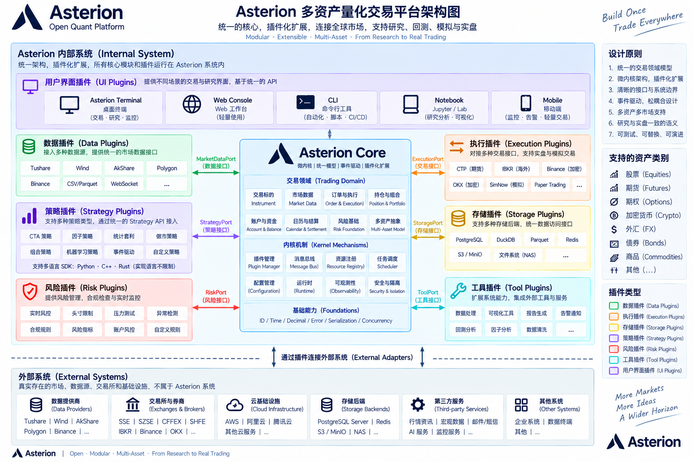

# Asterion Terminal

面向中国期货的 macOS 量化交易终端。C++20 核心与独立服务进程，Electron + React 桌面界面。

当前范围：**只开发 macOS Terminal，只做期货。**



## 能做什么

- **行情**：CTP 实时行情（全市场合约目录、期货全景、自选、五档、分时、分钟 K 线）；Tushare 历史分钟线与日线下载及图表查看。
- **研究**：持久化任务服务，SMA 回测、单合约动量因子评价、数据发布与结算表。
- **交易**：历史数据驱动的模拟交易（账户、持仓、冻结、手续费、手动结算、交易前限额），可信 SMA 策略授权运行。实盘未开放。
- **服务管理**：随桌面提供的 Node Agent 托管本机服务；可通过 SSH 引导部署到远程 Linux x86_64。

## 快速开始

依赖：Node.js 22+、pnpm 10、Python 3、Conan 2、CMake 3.25+、Ninja、Xcode Command Line Tools（Apple Clang）。

```sh
python3 scripts/prepare_ctp.py      # 下载并校验 CTP SDK
pnpm install --frozen-lockfile
pnpm desktop                        # 构建并启动桌面开发窗口
```

| 命令 | 用途 |
| --- | --- |
| `pnpm desktop` | 构建 Debug C++、Node-API、界面，启动 Electron |
| `pnpm desktop:check` | 构建并验证桌面链路，不打开窗口 |
| `pnpm desktop:build` | 生成 Release `.dmg` 到 `build/desktop/` |
| `pnpm run test:e2e` | 隔离环境下的界面端到端测试 |
| `ctest --test-dir build/Debug` | C++ 测试 |

构建、测试和发布细节见 [开发指南](docs/development.md)。

## 目录

| 路径 | 内容 |
| --- | --- |
| `core/` | C++ 基础（Decimal、ID、时间、错误）、内核（插件、IPC、进程、日志）、期货领域模型 |
| `plugins/` | 数据（CTP、Tushare、CSV、交易时段）、执行（模拟、CTP）、存储、策略、风控、工具插件 |
| `protocol/` | Protobuf 契约与校验 |
| `apps/services/` | 独立服务：node-agent、market-data、trading、task-service、backtest、factor、data-pipeline、strategy |
| `apps/clients/terminal/` | 桌面终端：Electron 主进程、React 宿主与工作区插件、C++ 应用编排 |
| `bindings/` | C ABI 与 Node-API 绑定 |
| `packages/client-ui/` | 终端使用的图表组件 |
| `tests/` | C++ 单元与进程集成测试 |

## 文档

- [架构](docs/architecture.md)
- [开发指南](docs/development.md)
- [终端界面](docs/terminal.md)
- [行情与数据](docs/market-data.md)
- [模拟交易与风控](docs/trading.md)
- [研究任务](docs/research.md)
- [服务与部署](docs/services.md)
- [现状与下一步](docs/status.md)
- [贡献约束](AGENTS.md)
