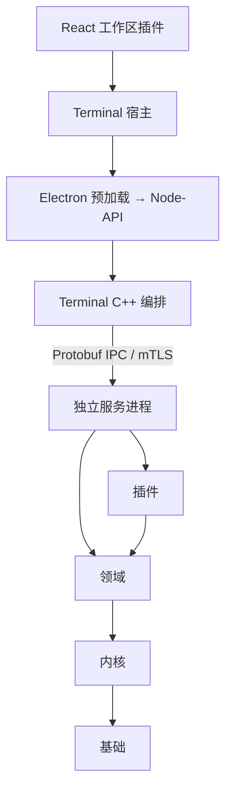
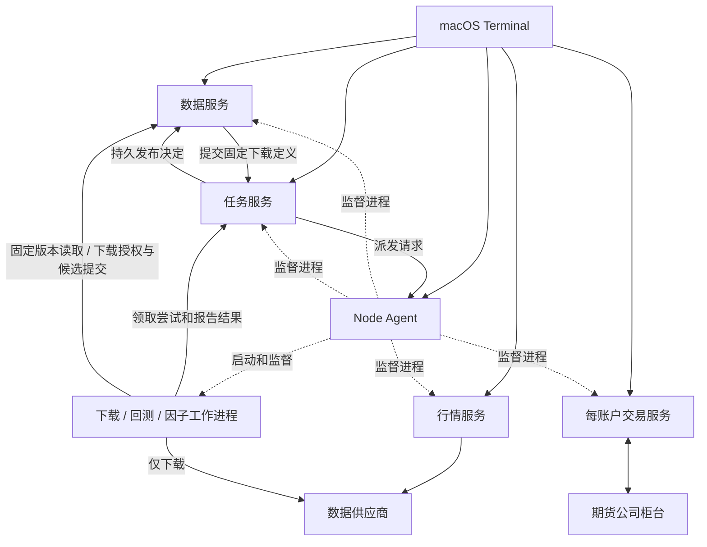

# 架构

当前产品为 macOS 期货 Terminal，本机服务运行于 macOS，远程节点服务仅支持 Linux x86_64。
本文描述当前代码；架构改造的逐项实现、验收证据及运行限制见[实施记录](reviews/architecture-implementation.md)。

## 分层

| 层 | 目标 | 内容 |
| --- | --- | --- |
| 基础 | `asterion_foundation` | `Decimal`（8 位小数定点）、ID、时钟、错误码、序列化 |
| 内核 | `asterion_kernel` | 插件生命周期、本机 IPC 与 TCP+mTLS 通道、服务宿主、子进程与文件锁、持久文件写入、线程池、日志与追踪 |
| 领域 | `asterion_domain` | 合约与订单、组合期货账本、交易时段、当日分钟线、执行/风险/策略/因子端口 |

领域依赖内核，内核依赖基础，不能反向依赖。
Terminal 的 JSON 命令注册与分派属于 Native 应用边界，核心库不提供 UI 命令宿主。

## 进程

所有服务由 Node Agent 启动和监督。安装版 Terminal 关闭后服务继续运行；开发入口退出时自动停止本机开发服务，保留数据，详见开发指南。

| 程序 | 职责 |
| --- | --- |
| `asterion-node-agent` | 部署、启停、健康探测、有限重启、程序升级 |
| `asterion-market-data` | CTP 实时行情、合约目录、事件流、当日分钟线与 1 分钟涨速 |
| `asterion-trading` | CTP 交易账户会话（授权、风控、执行链与持久记录） |
| `asterion-data-service` | 历史版本仓库、具名数据集、查询、下载授权与供应商预算、候选准备和版本发布 |
| `asterion-task-service` | 任务定义、排队与执行尝试、取消与完成裁决、固定输入及结果保管；协调下载发布，不执行算法或拥有历史目录 |
| `asterion-backtest` / `asterion-factor` / `asterion-data-pipeline` | 按任务启动的工作程序 |

本机通信使用 Unix Socket，远程使用 TCP + 双向 TLS，消息都是 `protocol/proto/asterion/v1/` 中的 Protobuf。

一个运行中的服务实例对应一个独立进程；停止保留实例与数据，重启只改变运行代次。
交易服务按账户隔离，Task 与 Data 在同一节点固定配对；worker 各执行一次尝试后退出。

柜台拥有成交、资金与持仓事实；交易服务拥有本账户的执行许可、风险占用和本地投影。
Data 拥有历史版本和来源证据；Task 拥有固定任务、尝试及结果。Agent 只管理程序、进程和
资源准入，Terminal 只提交意图和展示这些拥有者发布的状态。关闭窗口不改变服务端事实。

## 插件

| 类别 | 实现 |
| --- | --- |
| 数据 | `data/ctp`（行情与合约目录）、`data/tushare`（分钟线、日线）、`data/registry`（历史数据源组合与目录入口） |
| 执行 | `execution/paper`（回测撮合）、`execution/ctp`（CTP 交易接口） |
| 存储 | `storage/sqlite`（交易记录与任务的有序日志和索引）、`storage/filesystem`（历史数据版本目录） |
| 策略 | `strategy/cta`（SMA） |
| 风控 | `risk/order-limits`（交易前限额） |
| 工具 | `tools/chart_indicators`（均线、MACD）、`tools/factor_analysis` |

Domain 的风险、策略、因子、执行、行情和历史端口只暴露业务能力，不继承 Kernel 的 `Plugin` 生命周期。具体插件可以同时实现业务端口和生命周期接口；原生历史适配器由自身持有的 `NativeInstance` 完成启停，工厂返回可用端口，释放端口即释放实例。

历史数据与交易前风控通过原生 ABI 动态装载，其余业务插件仍使用仓库内 C++ 接口和静态目标。UI 插件在构建时注册。所有插件均为宿主进程内的可信代码；能力范围见 [原生插件 SDK](native-plugins.md)。

## Terminal

| 位置 | 职责 |
| --- | --- |
| `apps/clients/terminal/electron/` | 主进程、预加载、窗口 |
| `bindings/node/`、`bindings/c/` | Node-API 与 C ABI |
| `apps/clients/terminal/native/` | C++ 编排：服务客户端、命令、状态快照 |
| `apps/clients/terminal/src/` | React 宿主：工作台、设置、启动、多语言、桥接 |
| `apps/clients/terminal/plugins/` | 工作区插件：自选、合约、市场、数据、回测与因子、交易 |
| `apps/clients/terminal/dev/` | 浏览器开发桥（`pnpm dev` 与 e2e 使用） |

### 状态同步

C++ 后台每 0.5–2 秒汇总各服务状态并发布带修订号的快照。界面按修订号轮询：修订号未变则不返回内容；行情部分只返回自持有版本以来变化的报价行，合约目录未变则不重复发送。界面把增量合并回完整快照，插件看到的数据形状不变。

Native 使用一个状态与 I/O owner、两条批量读取线程、一条响应线程和两条管理线程。
命令和观察在 owner 上推进，等待 RPC、文件或管理结果时挂起；不持有全局操作锁等待外部工作。
节点管理操作显式串行接纳，设置与钥匙串工作另有单一拥有者；慢工作不占交易控制的接纳容量。

服务客户端共享 owner，各自保留连接、控制与观察状态。发布修订在 owner 上固定；节点、行情、
账户、任务页和设置通过不可变引用交接，响应线程在同一个工作中展开并编码 UI 快照。
Node-API 直接接纳异步请求并将完成交回 JS，不再建请求线程等待同步 C ABI；C ABI 供原生调用者使用。
载荷预算、队列和超额语义见 [Terminal](terminal.md)，不把序列化字节额度当作进程 RSS 上限。

## 状态与线程所有权

| 进程 | 应用管理的线程与职责 |
| --- | --- |
| 交易服务 | 状态单写入者、I/O、持久日志、SDK 调用各一条；SDK 回调复制入有界队列，账户线程裁决执行许可 |
| 行情服务 | 状态与 I/O、观测聚合、SDK 调用各一条；行情回调不拥有公开投影 |
| 数据服务 | 状态与 I/O、一条串行持久写入线程、固定文件池；候选验证与发布裁决分离 |
| 任务服务 | 状态与 I/O、一条日志线程、固定文件池；算法只在 worker 执行 |
| Node Agent | 管理与 I/O、一条配置写入线程、固定管理池；监督与资源准入属于同一 owner |
| 下载 / 回测 / 因子 worker | 主控制线程与执行线程各一条；I/O、心跳、取消和父进程检查在主线程推进 |

固定池大小来自节点预算，不随请求数增加；当前 Data/Task 文件池由 Agent 分配一或两条线程。
SDK、DuckDB、Chromium、V8 与 libuv 的内部线程仍消耗真实资源，上表不是 OS 总线程数。
Agent 按节点 CPU、内存和磁盘工作量接纳服务和 worker；资源不足保持等待或明确拒绝。
各进程的健康、停止次序和具体容量见 [服务与部署](services.md)、[交易](trading.md) 与 [任务](tasks.md)。

## 历史数据边界

统一身份与来源语义位于 Domain；Tushare 通过原生插件注册入口动态加载。Terminal 的 DataClient
直接访问 Data 的历史目录与查询协议，TaskClient 访问任务和结果；Task 不打开 Data 的仓库文件。
下载请求使用完整合约身份、明确来源与供应商映射；Data 保管授权快照，worker 按尝试取得凭据
和共享额度，完成后由 Task 持久决定发布，Data 验证原决定并公开原版本。

文件插件保管数据块、摘要、来源取得证据和版本索引。取得时间不冒充历史公布时间，未知历史
可知性的来源明确标为事后分析。计算输入固定数据版本与算法摘要，后续下载不改写旧输入。
计算 worker 从 Task 领取小型执行定义，在执行线程直接读取绑定 Data 的固定版本，
重建输入并核对 Task 保存的完整摘要。Task 保管原输入证据供结果验收和离线结果读取；
Data 不在线时新计算留在队列，不切换仓库或改从 Task 取得行情。
详见 [行情与数据](market-data.md) 和 [原生插件 SDK](native-plugins.md)。
