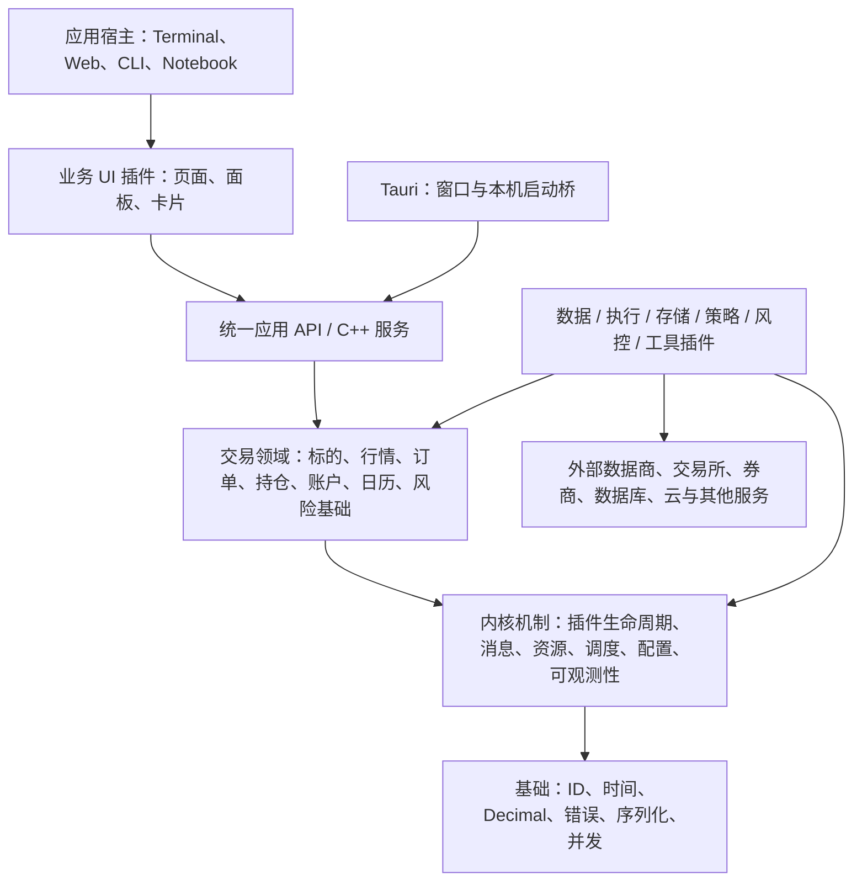

# Asterion 多资产架构

本设计落实维护者 2026-09-26 提供的架构图，以及随后确认的“保留 Tauri 外壳，核心全部改为 C++”。图中的产品和插件名称代表目标能力，不代表已经接入。

当前交付顺序以维护者最新决定为准：**第一种资产为期货，第一种产品为 Asterion Terminal，界面保持 `rust` 分支设计一致**。多资产及其他 UI 仍是架构目标，先完成期货桌面垂直链路。

此图是本仓库的架构基准，固定路径为 `docs/assets/architecture.png`，仅保存最新文件，历史使用 Git 查询。下方 Mermaid 只是依赖关系说明，不是另一个架构版本。

进程默认部署在本机，也可经 Terminal 管理部署到不同机器。架构图表示逻辑职责，不要求所有组件位于同一台机器。所有承载业务服务的机器均运行 Node Agent；本机随 Terminal 自动引导用户级 Agent，远端目标机通过 Terminal 的 SSH 引导安装 Agent，随后使用统一管理协议；见 [服务管理](service-management.md)。

## 系统边界

箭头表示使用关系。插件实现公开端口，内核不依赖某个具体插件；产品装配选择具体实现。统一领域模型保持研究、回测、模拟与实盘的身份、数量、订单和账户语义一致。不同资产的结算和交易规则不能靠一个无语义的属性字典掩盖差异，应逐个用例设计明确模型。

## 目录与职责

| 位置 | 职责 | 当前状态 |
| --- | --- | --- |
| `core/` | C++ 基础、领域、内核机制；运行时属于内核 | Decimal/ID/时间/错误码、插件生命周期、Runtime、IPC 与 TCP+mTLS、子进程与持久文件写入；期货合约、订单、单合约账本、交易时段与风险端口 |
| `plugins/` | 跨应用复用的具体能力插件 | 数据（CSV 逐笔/结算表、CTP 行情）、执行（Paper）、存储（文件日志）、策略（CTA SMA）、风控（订单限额）、工具（runtime-info、因子分析） |
| `apps/terminal/plugins/contract.ts` | Terminal 插件接口定义 | 宿主能力、插件身份、版本、工作区与卡片贡献 |
| `apps/terminal/src/ui/` | Terminal 内置 UI 库，不是业务插件 | 原主题、外观偏好 |
| `apps/terminal/src/` | Terminal 内置宿主与产品装配 | 窗口、工作台、设置、桥接、插件选择 |
| `apps/terminal/plugins/` | Terminal 专属 UI 插件 | 总览、期货行情、数据、研究与交易工作区 |
| `apps/terminal/native/` | Terminal 专属 C++ 应用编排 | 状态读取、CSV 完整校验后发布会话预览 |
| `protocol/` | 跨进程/跨机器 Protobuf 契约、消息校验与表示转换；生成代码位于构建目录 | 不包含传输机制或业务执行 |
| `bindings/c/` | C ABI 句柄、内存与异常边界封装 | 当前导出 Terminal 应用 API，不含 CSV 算法 |
| `apps/strategy/` | 策略执行宿主，复用具体策略插件 | 有序事件与持久化意图、IPC/TCP mTLS、重启恢复；Agent 管理已接入；模拟授权交接已实现；自动历史回放已接入；Terminal 本机配置、授权与撤销已接入；程序已纳入分发；托管服务显式更新已实现；Agent 自身升级待完成 |
| `apps/backtest/` | 历史回测任务宿主 | 单日 SMA 回测与 Agent 监管的任务工作进程 |
| `apps/factor/` | 因子计算、挖掘与评估任务宿主 | 事件动量分析、持久化任务、Agent 派发与 Terminal 结果展示 |
| `apps/data-pipeline/` | 历史数据处理任务宿主 | CSV 快照任务、来源校验、不可覆盖发布与 Terminal 版本选择 |
| `apps/task-service/` | 持久化任务与执行尝试管理 | 类型化服务、恢复、取消与结果校验；自动调度待接入 |
| `apps/cli/` | CLI 产品入口与装配 | CSV 校验 |
| `apps/terminal/dev/` | Terminal 浏览器开发与测试桥接 | JSON-lines 调用真实 C++ Terminal API，不是独立服务产品 |
| `tests/`、`apps/terminal/e2e/` | 核心、契约、边界与界面验收 | CTest 与 Playwright |

是否为插件与是否可复用是独立维度。Terminal 专属插件通过 `apps/terminal/plugins/contract.ts` 获取应用能力；注册校验位于 `apps/terminal/src/host/plugin-registry.ts`，产品装配位于 `apps/terminal/src/plugins.ts`。只有独立于 Terminal 布局及应用能力的面板才适合提取到顶层 `plugins/ui/`，当前不创建空目录。交易与研究是同一 Terminal 的工作区，不为它们创建独立应用。

宿主选取插件，插件贡献工作区与卡片；宿主不再根据业务名称分支渲染面板。注册先检查插件身份、契约版本、工作区身份冲突，再生成导航。面板通过 React lazy 按需加载，React 负责挂载和 effect 清理。这是可信内置插件机制，不支持动态安装、热卸载、依赖解析或不可信插件隔离。交易插件已接入历史模拟账户与交易面板；研究插件仍显示明确的未接入页面。

`runtime.snapshot` 是 API 方法名，表示查询应用状态，并不要求建立顶层 runtime 目录。C++ 内核生命周期仍在 `core/src/kernel/`。当前 Terminal 编排装配 CSV 数据、Paper 执行与文件日志存储插件；通用业务命令注册与工具插件用例分离尚未实现，不能将目录整理视为整个后端插件化完成。

当前主题、样式与外观偏好仅服务 Terminal，归属应用内。待第二个应用出现实际复用需求后再提取共享库；React 组件不能直接用于 CLI 或所有界面技术。当前插件接口仅服务 Terminal，不设顶层 SDK。待出现明确使用者与稳定边界后，再提取跨应用或语言 SDK。

CMake 目标按职责命名为 `asterion_foundation`、`asterion_kernel`、`asterion_domain`；允许 `domain → kernel → foundation` 的依赖方向，内核不反向依赖领域。Core 指三者组成的整体，不单指 kernel。

除维护者明确授权建立的上述应用工程入口外，尚未实现的目录不创建空壳。仍未实现业务的入口只提供帮助与版本并拒绝执行；首条研究服务链路的实际范围见 [研究任务](research-tasks.md)，其中研究服务已加入本机启动流程，回测按任务启动；其余未实现业务的入口不分发。Conan 负责外部依赖，CMake target 表达模块依赖；Rust/Cargo 只用于 Tauri 桌面外壳，不能承载第二套核心。

## 插件与端口

| 插件类型 | 目标公开边界 | 插件负责 |
| --- | --- | --- |
| Data | MarketDataPort | 供应商认证、请求、字段转换与数据获取 |
| Execution | ExecutionPort | 经授权的交易请求和回报、券商协议 |
| Storage | StoragePort | PostgreSQL、DuckDB、文件等持久化实现 |
| Strategy | StrategyPort | 基于明确输入输出信号或交易意图 |
| Risk | RiskPort | 风险评估与合规规则，不能绕过执行链的强制校验 |
| Tool | ToolPort | 分析、报告、通知与工作流 |
| UI | 统一应用 API 与 UI contribution 契约 | 页面与交互，不持有权威业务状态 |

已落地的端口按首个期货用例建立，是“期货 v1 端口”，不是多资产抽象：RiskPort 的上下文直接读取单合约 `FuturesAccount`，ExecutionPort 使用期货开平标志 `Offset`，StrategyPort 只输出单合约非负目标持仓。第二种资产接入时应按其用例扩展或新增端口，而不是把这些签名当作通用模型。

这些端口是设计边界；MarketDataPort 已落地为历史逐笔读取接口，LiveMarketDataPort 提供实时报价、订阅状态及合并前有界事件分页，ExecutionPort 支持规范化下单/撤单/状态，存储用例以通用 JournalPort 支持有序持久提交与恢复。其余端口尚未为未设计的请求生成空接口。UI 的贡献契约与原生插件 ABI 分开，七类插件不意味着全部需要同一种二进制格式。

首个可运行切片使用显式注册的可信 C++ 插件，具有描述符、精确契约版本、依赖图、启动回滚和逆序停止。同一工具链编译，当前不支持动态库发现、安装、热卸载或第三方二进制 ABI。之后若实现动态插件，边界采用显式版本的 C ABI 或进程协议，不暴露 STL、C++ 异常或跨模块所有权。

`PluginManager` 在单线程控制面运行。先验证完整依赖图，再调用 start；启动失败的插件自行释放部分资源，宿主逆序停止此前成功启动的插件。stop 不抛异常。注册期间验证重复身份、契约、类型和依赖格式；运行中禁止注册。统一 Runtime 现已组合有界工作线程、消息队列、资源作用域、调度泵、配置、权限和调用观测；Terminal 已接入命令入口。当前仍无持久消息或不可信代码隔离，详细语义见 [Core 基础设施](core-infrastructure.md)。

安全隔离不是插件类别的附带属性。进程内插件拥有进程权限；用户策略和不可信代码需要独立工作进程与能力限制，尚未实现前不能加载不可信代码。图中的 Python / C++ / Rust 策略代表未来 SDK 选择，不表示恢复 Rust 核心。

最新图按 CTA、因子、统计套利、做市、组合、机器学习、事件驱动和自定义划分策略能力；通过统一 Strategy API 接入，语言 SDK 独立于策略类型。数据输入包括 CSV/Parquet 与 WebSocket，存储包括文件系统/NAS；Paper Trading 是明确的模拟执行插件，不冒充实盘连接。Notebook 与工具插件也覆盖研究可视化、回测分析、因子分析与数据清洗。

## 原界面复用

原主题保存在 `apps/terminal/src/ui/`，Workbench 与 WindowFrame 在 `apps/terminal/src/host/`，Dashboard 在 `apps/terminal/plugins/overview/`。沿用 `rust` 分支视觉与交互设计，不恢复旧业务请求、账户状态、Python 服务或 Rust 领域实现。

当前桌面链路为 **React → Tauri invoke → Rust 薄桥 → C++ Terminal 编排 → Protobuf（本机 IPC / TCP + mTLS）→ 独立交易进程**。CSV 预览与界面状态留在 Terminal；账户账本、Paper 执行和文件日志由 `apps/trading/` 会话持有。C ABI 仍负责进程内跨语言调用；它本身不是 IPC。

C ABI 可并发调用：C++ 编排内部串行化所有触及服务的命令。后台刷新线程按业务部分（交易、研究、策略、行情、节点）逐个读取服务状态，每次只在一次客户端调用期间持锁，命令最多等待一次 RPC；刷新与命令交错时丢弃该轮结果，避免发布旧状态。发布的快照带 `revision` 与 `refreshed_at_ms`：界面轮询携带 `since`，状态未变时只返回 `unchanged`，从不触发服务 RPC；不带 `since` 的读取是显式探测，空闲时现场读取，忙时返回已发布快照并标记 `stale`。刷新周期在行情连接时为 500 ms，否则 2 s。Tauri 薄桥不持有全局锁。交易状态读取期限为 3 秒，变更保留 10 秒（超时即结果未知）。

内核的 MessageBus、Scheduler、AccessPolicy 与 Observability 目前只经 Runtime 在 Terminal 编排中使用，且只有单一本机调用主体 `terminal.local`，能力检查尚不构成多主体授权；各独立服务进程使用内核的 IPC、线程池与进程机制，但各自实现请求循环，尚未采用 Runtime。“事件驱动”在当前实现中指单进程内的同步事件与有序持久事件（策略宿主、交易日志），不是跨进程事件总线。

实际交易进程协议定义在 `protocol/proto/`，通用通道与子进程机制在 Core kernel，业务路由在应用。本机使用 Unix Socket / Windows Named Pipe；跨机器使用 TCP + mTLS。Terminal 设置保存服务地址与证书路径，本机和远程交易服务均由 Agent 管理、独立于桌面存活，账本保存在服务端。实盘/模拟作为同一交易程序的独立实例，当前实盘模式拒绝启动，不以模拟替代。实时行情宿主命名为 `market-data`，已接入只读 CTP 数据插件，历史模拟不依赖它。完整职责、工程归属、CLI11 与验收边界见 [进程架构](process-architecture.md)。

浏览器开发仍由 Vite 中间件经 `asterion_terminal_dev_bridge` 调用同一界面 API；其交易操作同样启动并访问独立交易进程，不恢复旧服务或保留另一套交易后端。

已复用原终端主题、Workbench、WindowFrame、Dashboard 布局交互；数据、市场、设置面板直接消费新的 C++ 状态。交易面板已经接入单合约历史模拟账户、委托、成交与持仓，研究与实盘功能仍未接入。没有复制旧账户/API 协议。UI 的完整迁移仍需后续业务接入与验收，当前包含可恢复的首条期货历史模拟交易链路，精确范围见 [期货模拟交易](paper-trading.md)。

## 构建参考

采用 Conan 官方的 [CMake 集成](https://docs.conan.io/2/integrations/cmake.html) 与 [CMakeToolchain](https://docs.conan.io/2/reference/tools/cmake/cmaketoolchain.html) 生成工具链和本地 presets。终端 API 使用 nlohmann_json 并锁定依赖。Tauri 本机调用遵循 [官方 command 接口](https://v2.tauri.app/develop/calling-rust/)，窗口权限限制在本地终端窗口。

## 平台边界

Linux、Windows、macOS 为一等支持目标，复用同一套核心与业务插件。`bindings/` 保留顶层。平台差异收敛到编译配置、系统桥接与打包，详情和当前验收范围见 [平台说明](platforms.md)。

防火墙管理归属 Node Agent 与 Terminal 部署编排：SSH 首次检查、已部署服务通过 Protobuf/mTLS 检查，来源 IP 与端口预览后明确确认。Linux UFW / Windows 规则适配已接入，macOS 返回手动配置状态；当前权限与验收边界见 [服务管理](service-management.md)。Core 仅提供进程和通信机制。

## 部署范围（2026-09-27 最新决定）

本机部署支持 Linux、Windows、macOS，使用当前用户的系统托管机制和本机 IPC，不需要 SSH、私钥或目标机器初始化。远程部署目标仅支持 Linux，使用专用 asterion 账户、独立初始化脚本及 SSH 引导，后续通过 mTLS 管理。不再提供远程 macOS/Windows 安装流程；不影响三平台 Terminal、Agent 与业务服务的本机运行。设置中的“本机部署”和“远程 Linux”分开显示，默认本机。

桌面分发内置同版本的本机服务、Linux x86_64 远程服务及 Linux 初始化脚本。Terminal 提供脚本导出，自动探测远端架构并选择内置程序；不要求用户下载部署材料或选择可执行文件。Linux x86_64 构建产物由 CI 汇集，校验版本、架构和摘要后打入每种桌面安装包。

## Terminal 多语言

中英文属于内置宿主基础设施，语言切换、持久化和资源校验归 `apps/terminal/src/i18n/`。各 UI 插件拥有自己的语言资源，通过公开契约注册到插件 ID 命名空间。Core 保持语言无关，界面按错误码显示本地化摘要。见 [中英文实现与边界](localization.md)。

## 实时行情服务

`apps/market-data/` 已提供独立只读行情宿主，由 Agent 管理，与交易进程分别部署。连接、订阅、快照推送和心跳使用 `protocol/proto/asterion/v1/market.proto`，支持本机 IPC 与 TCP/mTLS。CTP 供应商代码在数据插件中，详见 [CTP 行情及验收边界](ctp-market-data.md)。
