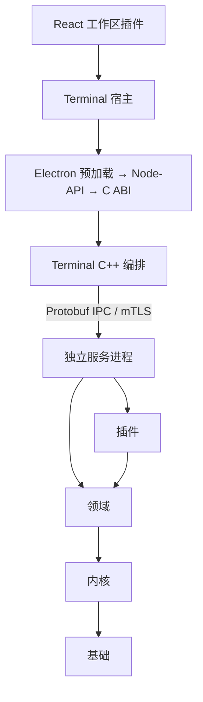

# 架构

架构图固定为 `docs/assets/architecture.png`，更新时覆盖同一文件。

## 分层

| 层 | 目标 | 内容 |
| --- | --- | --- |
| 基础 | `asterion_foundation` | `Decimal`（8 位小数定点）、ID、时钟、错误码、序列化 |
| 内核 | `asterion_kernel` | 插件生命周期、本机 IPC 与 TCP+mTLS 通道、服务宿主、子进程与文件锁、持久文件写入、线程池、日志、Terminal 命令运行时 |
| 领域 | `asterion_domain` | 合约与订单、单合约期货账本、交易时段、当日分钟线、执行/风险/策略/因子端口 |

领域依赖内核，内核依赖基础，不能反向依赖。

## 进程

所有服务由 Node Agent 启动和监督。Terminal 是客户端，关闭不影响服务。

| 程序 | 职责 |
| --- | --- |
| `asterion-node-agent` | 部署、启停、健康探测、有限重启、程序升级 |
| `asterion-market-data` | CTP 实时行情、合约目录、事件流、当日分钟线与 1 分钟涨速 |
| `asterion-trading` | 模拟交易会话（账本、撮合、风控、持久日志） |
| `asterion-task-service` | 研究任务与执行尝试的持久化队列 |
| `asterion-backtest` / `asterion-factor` / `asterion-data-pipeline` | 按任务启动的工作程序 |
| `asterion-strategy` | 可信策略宿主，输出目标持仓意图 |

本机通信使用 Unix Socket，远程使用 TCP + 双向 TLS，消息都是 `protocol/proto/asterion/v1/` 中的 Protobuf。

## 插件

| 类别 | 实现 |
| --- | --- |
| 数据 | `data/ctp`（行情与合约目录）、`data/tushare`（分钟线、日线）、`data/csv`（成交数据集与结算表解析）、`data/sessions`（交易时段） |
| 执行 | `execution/paper`（历史撮合）、`execution/ctp`（交易接口，未开放） |
| 存储 | `storage/filesystem`（有序文件日志） |
| 策略 | `strategy/cta`（SMA） |
| 风控 | `risk/order-limits`（交易前限额） |
| 工具 | `tools/chart_indicators`（均线、MACD）、`tools/factor_analysis`、`tools/runtime_info` |

插件在编译期注册，运行在宿主进程内，是可信代码。

## Terminal

| 位置 | 职责 |
| --- | --- |
| `apps/clients/terminal/electron/` | 主进程、预加载、窗口 |
| `bindings/node/`、`bindings/c/` | Node-API 与 C ABI |
| `apps/clients/terminal/native/` | C++ 编排：服务客户端、命令、状态快照 |
| `apps/clients/terminal/src/` | React 宿主：工作台、设置、启动、多语言、桥接 |
| `apps/clients/terminal/plugins/` | 工作区插件：市场、自选、合约、总览、数据、研究、交易 |
| `apps/clients/terminal/dev/` | 浏览器开发桥（`pnpm dev` 与 e2e 使用） |

### 状态同步

C++ 后台每 0.5–2 秒汇总各服务状态并发布带修订号的快照。界面按修订号轮询：修订号未变则不返回内容；行情部分只返回自持有版本以来变化的报价行，合约目录未变则不重复发送。界面把增量合并回完整快照，插件看到的数据形状不变。

命令通过同一个操作锁串行执行；只读查询（历史分页、分钟线）在锁外执行服务调用。
