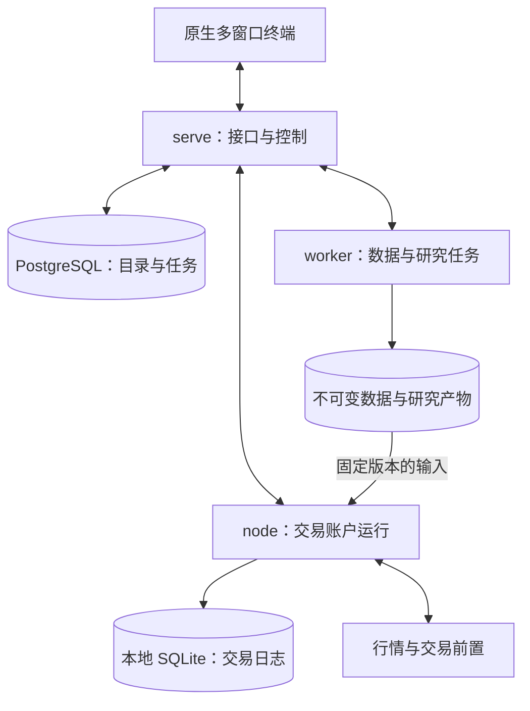

# ASTERION · 星枢

## 期货研究与交易综合终端｜架构与工程组织方案

设计版本：1.1。更新日期：2026-09-16。本文定义目标架构与验收要求，尚未实施。工作名称尚未核验商标、域名及软件包名称可用性。

**产品定位：在一个终端里完成期货市场观察、数据管理、量化研究、策略验证、模拟与实盘交易，以及运行维护。**

建议采用一个 monorepo、一套原生多窗口桌面终端、一个 Python 业务包、四个业务模块、三类后台业务运行角色。业务模块负责规则和状态；运行角色负责不同的任务生命周期和故障隔离。

**默认所有服务部署在运行终端的同一台机器。用户可以在终端内添加机器、选择服务的部署位置、配置存储与资源、执行部署并查看运行状态。原生多窗口与多屏工作区属于首版基础能力。**

首个目标版本以国内中低频期货为设计基线，同时支持趋势、截面、期限结构、跨期和机器学习研究。海外期货通过交易场所和经纪商适配扩展；期权、股票、加密资产暂不进入首版范围。这是本方案建议的实施顺序。

## 1. 名称与产品气质

- 英文产品名：**Asterion Terminal**；品牌展示：**ASTERION**。
- 中文名：**星枢**。星代表观察与探索，枢代表连接研究、数据与交易的核心枢纽。
- 仓库名建议：`asterion` 或 `asterion-terminal`。
- Python 命名空间建议：`asterion`；CLI 示例：`asterion serve`。
- 产品描述：**An integrated terminal for futures research and trading.**

视觉意象是一条简洁的轨道与一个刻度交点。图标、命令栏、图表游标使用同一种几何语言。科技感来自精密的排版、即时反馈和一致交互。

## 2. 三个参考项目分别提供什么

| 参考项目 | 已核对的特征 | 对星枢的启发 | 星枢自己的设计决定 |
|---|---|---|---|
| Fincept Terminal | 当前公开架构为 C++20/Qt6 桌面终端，结合 Python 分析，具有工作区、行情、研究和 AI 等能力 | 统一入口、可保存布局、面板联动、丰富信息在同一产品中可达 | 自行构建原生多窗口桌面终端，共享前端渲染层，按期货对象组织信息 |
| Qlib | 配置驱动的数据、训练、推理、评估流程，以及实验记录 | 将一次研究变成可复现的运行，保存输入、参数、模型和结果 | 自定义期货数据、标签、换月和执行假设；通过可选 adapter 使用已有模型 |
| NautilusTrader | 事件驱动交易内核；回测与实盘共享核心；独立数据、执行、风控与组合职责 | 明确状态归属，同一策略逻辑运行于不同环境，隔离交易节点 | 以国内期货语义定义接口，单独设计 CTP 接入、开平处理和账户对账 |

参考：[Fincept 架构](https://github.com/Fincept-Corporation/FinceptTerminal/blob/main/docs/ARCHITECTURE.md)、[Qlib Workflow](https://qlib.readthedocs.io/en/latest/component/workflow.html)、[Nautilus 架构](https://nautilustrader.io/docs/latest/concepts/architecture/)。

Nautilus 当前官方集成列表没有列出 CTP，因此本方案不把其现成 CTP 能力作为前提。[官方集成列表](https://nautilustrader.io/docs/latest/integrations/)

本方案以独立实现为主，已有第三方算法可在清晰的接口处复用。Qlib 和 Nautilus 的对象、数据格式或生命周期不成为整个产品的公共契约。

## 3. 产品结构：六个工作区

| 工作区 | 用户在这里完成什么 | 核心视图 |
|---|---|---|
| 总览 Overview | 确认今天需要关注什么、任务是否正常、账户是否异常 | 市场摘要、风险提示、数据新鲜度、进行中的任务 |
| 市场 Markets | 观察品种和真实合约，分析期限结构与价差 | 自选、合约链、K 线、曲线、跨期价差、产业指标 |
| 数据 Data | 管理数据来源、采集、覆盖、质量与发布 | 数据集、覆盖矩阵、异常记录、快照浏览器、同步任务 |
| 研究 Research | 从假设、代码和因子到模型、回测与候选策略 | 编辑器、交互式研究、实验列表、对比、归因、策略版本 |
| 交易 Trading | 管理模拟及实盘，查看委托成交和组合风险 | 账户、策略、持仓、订单、成交、保证金、对账、控制台 |
| 情报 Intelligence | 将宏观、产业、报告和事件关联到品种及研究 | 事件时间线、经济日历、报告、可追溯 AI 摘要 |

系统设置、机器与服务管理、连接管理和任务中心为全局入口。Markets 与 Overview 是跨模块组合视图，不为每个菜单建立一个后台业务模块。

### 统一交互

- 顶部始终展示工作区、当前对象、时间范围、环境和数据时间。
- 全局搜索可以定位品种、合约、数据集、实验、策略、账户；命令面板调用同一套命令登记表。
- 每个面板声明对象类型与订阅，例如某个合约或账户。同一联动组内选中 `RB`，K 线、期限结构和新闻同步；面板也可锁定自己的对象。
- 右侧检查器展示当前选中对象的详情，避免到处弹出不同风格的窗口。
- 底部任务中心统一展示采集、查询、训练、回测和导出，刷新终端后可以重新附着到任务。
- 常用操作都能在终端完成，包括编辑策略、运行研究、安装受支持的数据连接、添加部署机器、分配服务、配置任务、启停模拟与实盘、查看错误和备份状态。
- 安装后默认选择“本机”，终端引导完成本地运行环境与存储初始化。多个桌面窗口共享同一个后台环境，新增窗口不会重复启动服务。
- 操作可以追踪到 command_id、job_id 或 run_id；按钮反馈“请求已接收”“执行中”“已完成”，明确区分。
- Notebook 后期使用独立内核运行，终端展示单元格和结果；脚本文件及版本是可复现输入。初版先提供脚本编辑器与运行面板。

### 视觉规范

默认深石墨色主题，可切换浅色；文字与数字对比清晰。仅对选择、涨跌、风险和运行状态使用强调色。建议基色 `#0B1016`、面板 `#111923`、线条 `#243140`、正文 `#E5EDF5`、次要文字 `#9AABBD`、交互强调 `#79CCD0`。

采用 4/8 像素间距体系，正文 13–14px，密集数据最低 12px，数字等宽且小数对齐。边角克制，布局以对齐与留白区分层次。图表和表格占据工作区主体；关键状态用文字和颜色同时表达。涨跌颜色提供中国市场习惯与国际习惯两个配置。

布局从首版支持原生独立窗口、多显示器、窗口内停靠、面板拆出与归并、布局保存和恢复。桌面端是完整工作台；浏览器和 iPad 复用前端作为补充访问入口，多屏窗口管理由桌面端提供。

### 原生多屏体验

| 能力 | 目标行为 |
|---|---|
| 独立窗口 | 一个面板或面板组可以拆出为操作系统窗口，支持任务栏、最大化、全屏和系统快捷键 |
| 跨屏布局 | 窗口可移动到任意显示器，也可通过“移至显示器”直接定位；横屏、竖屏和不同缩放比例可混用 |
| 面板停靠 | 在窗口内调整分屏和标签；面板可移动到其他窗口，移动时保留对象、时间范围和视图状态 |
| 多屏工作区 | 一个命名布局同时保存所有窗口、屏幕分配、面板树和联动组，一次恢复整个工作环境 |
| 跨窗联动 | 同一联动组共享品种、时间范围或游标位置；每个面板可锁定对象，账户与交易环境保持显式绑定 |
| 插拔恢复 | 显示器断开时将窗口收回可见屏幕；重连后可以恢复原布局，避免窗口永久落在屏幕外 |
| 统一命令 | 任意窗口可打开全局搜索和任务中心；快捷键作用于当前焦点窗口和面板 |

多屏示例：屏幕一观察品种与期限结构，屏幕二运行研究和比较实验，屏幕三显示账户、订单和风险。单屏使用相同面板与布局模型。

## 4. 总体架构



图中表示逻辑运行关系，默认全部位于同一台机器。终端内配置机器与服务的绑定后，可以将指定角色部署到远程机器；单机和多机使用同一套业务接口及数据契约。`worker` 可以有多个实例，`node` 按账户与环境分别运行。

桌面窗口管理与后台服务部署分别建模。增加显示器或桌面窗口只改变视图；增加机器才改变服务运行位置。主机代理负责受控安装、服务启停和状态采集，是部署支撑程序，不新增业务模块。

### 三类运行角色

| 角色 | 生命周期与责任 | 不可越过的约束 |
|---|---|---|
| `serve` | 提供终端静态资源、HTTP/WS、认证、任务目录、工作区、调度与交易节点控制 | 请求线程不执行长时间训练或历史回测，不持有权威交易账户状态 |
| `worker` | 领取采集、清洗、特征、训练、回测、导出任务；在隔离任务进程执行 | 每个任务固定输入版本和资源限额，通过结果提交协议发布产物 |
| `node` | 消费实时数据、运行策略、执行本地风控、提交委托、记账与对账 | 每个账户/环境只有一个订单写入者，不因终端关闭而结束 |

### 默认本机启动

安装桌面终端后，由初始化向导选择本地数据目录，安装匹配平台的受控运行包，初始化 PostgreSQL，注册本机代理并启动 `serve` 与默认 `worker`。`node` 在配置账户并启动模拟或实盘时创建。默认无需额外机器、共享存储或 Docker。

本机支持能力由预检确定：操作系统、架构、连接器、GPU 与磁盘条件均需匹配对应运行包；不支持的连接器在终端中明确显示原因，并允许为该服务选择兼容机器。

正常使用通过终端完成部署与操作。以下命令作为开发与运维接口示例，当前尚未实现：

```bash
asterion serve --config config/local.toml
asterion worker --config config/local.toml
asterion node --config config/simnow.toml
```

业务进程的守护和自动重启交给操作系统后台服务机制；主机代理提供统一管理接口，使用平台适配实现安装、启动、停止和状态采集。本地后台运行独立于桌面窗口，关闭最后一个窗口默认保留后台服务；“退出终端”“停止后台服务”是两个明确操作。

### 故障行为

- 终端退出或网络中断：已经启动的采集、研究和交易任务继续；再次连接恢复视图。
- `serve` 不可用：交易节点执行已加载策略和本地风控；新的集中操作不可用。离线时允许什么动作由预先配置的策略决定。
- 行情陈旧、关键状态不一致：节点根据显式策略限制新开仓；并不保证在交易连接失效时还能撤单或平仓。
- 远程存储不可用：已有本地完整输入的任务可继续，需新文件的任务等待；节点保留已经验证的运行包和规则。
- 承载服务的机器关机或睡眠：该机器上的任务和交易运行会中断；后台服务独立于窗口不代表独立于机器电源和网络。远程主机离线不自动触发第二个账户写入者。
- 节点重启：先恢复日志，再向经纪商查询和对账，状态一致后恢复发单；不通过重发历史委托来猜测是否成交。

## 5. 四个业务模块及状态归属

| 模块 | 拥有的状态与规则 | 代表性 Interface | 依赖方向 |
|---|---|---|---|
| `data` | 品种合约元数据、日历、时段、数据采集、质量、快照、连续序列、换月映射 | `ensure_coverage`、`publish_snapshot`、`query`、`resolve_contract` | 依赖少量共享值类型与自身 adapters |
| `research` | 特征标签、实验、模型、参数搜索、验证报告、候选发布记录 | `submit_run`、`compare_runs`、`build_release` | 通过公开 Interface 读取 data，调用 trading 的历史运行能力 |
| `trading` | 策略生命周期、订单、成交、持仓、结算、执行、账户风险和恢复 | `run_simulation`、`deploy_release`、`submit_command`、`get_account_snapshot` | 使用规则快照和数据契约；不导入 research |
| `intelligence` | 文档、来源、事件关联、检索、摘要与研究提案 | `ingest_document`、`query_evidence`、`draft_experiment` | 通过公开 Interface 查询 data/research，不能绕过交易命令入口 |

`platform` 只负责配置、身份、机器登记、部署计划、任务协议、产物索引、审计、日志与消息传输。它不知道“主力合约”“平今手续费”“夏普率”之类业务规则。

### 组织约束

1. 一个状态只有一个业务所有者。其他模块通过接口读取它、提交命令或维护可重建的视图。
2. 模块 Interface 同时定义输入输出、前置条件、失败方式、幂等性和版本；不能只写几个抽象方法。
3. `public.py` 暴露对外数据类型和操作，其余实现只在模块内部使用。CI 检查越界导入。
4. 共享 `model` 只保留 ID、价格、数量、时间、快照引用等小型值类型。订单状态机归 trading，数据覆盖规则归 data。
5. 同一进程内以显式函数调用和类型化事件为主；跨进程才增加传输。每个节点自己的事件分发器只处理本节点消息。
6. 不把交易节点的核心事件逐条经过中央 API。终端接收的行情可以合并刷新，订单和成交使用带序号、可恢复的事件流。
7. 仅在真正可替换的位置定义 adapter：数据来源、真实/模拟时钟、撮合/经纪商、模型后端。普通内部类不强制套一层接口。

## 6. 期货模型必须从第一版成立

| 概念 | 设计规则 |
|---|---|
| `Product` | 品种是研究、分类和配置对象，例如 RB；不作为可成交证券 |
| `Contract` | 真实上市合约拥有稳定 ID、交易场所、交割年月、乘数、价格步长、上市及最后交易时间 |
| `ContinuousSeries` | 派生的研究序列，保存构建方法、调整方式及映射版本；不能直接下单 |
| `RollSchedule` | 显式记录何时、依据哪些当时可获得的数据，从哪个合约换到哪个合约 |
| `SessionCalendar` | 维护交易场所与品种时段、休市、夜盘归属、特殊交易日，独立于普通自然日历 |
| `ContractRules` | 保证金、费用、限价、开平约束等按生效时间版本化，支持账户层实际费率覆盖 |
| `Position` | 按账户、合约、方向及需要的今昨分项记录，同时跟踪冻结量及可平量 |
| `Settlement` | 分开维护成交、每日结算、逐日盈亏、现金和保证金变化，区分研究收益与账户权益 |
| `Spread` | 保存各腿、比例和可交易映射；组合报单或分腿执行的能力由 adapter 声明 |

### 时间、价格和可见性

`event_time` 描述事件发生时间；`received_at` 描述本系统接收时间；`available_at` 描述研究时可以获知的时间；`trading_day` 描述所属交易日。使用 UTC 时间戳存储时间点，保留交易场所时区与交易日语义。不能把夜盘交易日用简单日期偏移硬编码。

金额、价格、数量使用固定精度的值类型；行情展示和部分数值计算可转浮点，交易验证与账务不能依赖浮点相等比较。

当日完整成交量、持仓量用于选择后续主力时，规则必须说明信息何时可用、映射何时生效。连续价格、标准化和标签处理都必须按当时信息构造；训练窗口以外的信息不能影响训练拟合。

### 三类研究对象都支持

- 品种时间序列：趋势、反转、波动率状态。
- 多品种截面：动量、期限结构、价值与组合配置。
- 真实合约及合约对：跨期、近远月结构、换月与流动性分析。

数据模型同时保留这三个层次。单品种主连只是一个研究视图。

## 7. 数据与持久化

| 存储 | 权威内容 | 写入所有者 | 部署位置 |
|---|---|---|---|
| PostgreSQL | 元数据、覆盖、质量、任务、实验索引、配置版本、发布目录 | serve 中对应业务模块 | 默认本机磁盘；终端可配置数据库主机或已有实例 |
| Parquet 与文件产物 | 原始/标准化行情、版本化数据快照、特征、模型、报告 | worker 生成，发布接口确认 | 默认本机数据目录；可配置远程文件存储及计算主机缓存 |
| DuckDB | 对固定输入的列式查询和分析 | 使用它的任务进程 | worker 本地；不是多机共享的数据库服务器 |
| SQLite | 单交易节点的订单意图、事件、检查点与恢复状态 | node 单写者 | 所选交易主机的本地磁盘 |

Parquet 是数据格式，快照目录清单才定义某一次研究读到哪些文件。DuckDB 可直接读 Parquet，读取接口和传输方式根据部署选择。[DuckDB Parquet 文档](https://duckdb.org/docs/stable/data/parquet/overview)

SQLite WAL 数据库保持在交易节点所在机器的本地磁盘；远程存储只接收一致性备份，不被多个机器当作在线数据库共同打开。[SQLite WAL 限制](https://www.sqlite.org/wal.html)

### 发布协议

1. `worker` 获得带租约、尝试编号与 fencing token 的任务，下载或计算到本次尝试专属暂存路径。
2. 校验行数、主键、时间范围、质量、schema 与 checksum。发现冲突时保留来源与判定，不静默覆盖。
3. 文件进入唯一的不可变路径，确认可读取及校验一致。生成引用文件的 manifest。
4. `serve` 校验当前租约和 token，事务性登记 manifest 与快照状态为 `PUBLISHED`；消费者只消费已发布快照。
5. 任务崩溃可留下未引用文件；后续回收。失败尝试和过期 worker 不能覆盖已发布快照。

文件系统与 PostgreSQL 之间不存在跨系统事务，本协议通过“文件先完整、目录后可见”避免发布半成品。相同任务可以被重复执行，结果发布必须幂等。

### 本地存储与跨机读取

默认使用终端初始化时选择的数据根目录，保存 `sources/`、`published/`、`artifacts/` 和一致性备份。PostgreSQL、节点 SQLite 及任务暂存区使用各服务的独立状态目录，不与可浏览的历史数据目录混用。

用户在“机器与服务 → 存储”中配置每个存储位置的主机、目录、访问方式、容量和允许使用的服务。单机采用本地路径；多机可以选择认证文件传输、已配置的共享文件系统或受支持的对象存储。远程计算主机可按 manifest 将所需输入缓存到本地。

`SnapshotRef` 使用逻辑 URI、ID 和内容 hash，物理路径由主机上的存储映射解析。服务位置改变后，数据标识与研究记录保持不变。部署预检验证读取、发布和缓存权限，禁止把一个只在原机器有效的绝对路径直接发给远程任务。

不可变数据只由受控发布流程写入，研究访问默认只读。配置存储迁移时需要复制、校验和切换引用；修改目录设置不会自动证明数据已经搬迁完成。

### 数据采集闭环

启动时比较目标覆盖、已有发布清单、数据源权限和可用范围，产生补齐任务；每日继续增量采集。数据源的空响应、权限不足、未开放时间段、确实无成交必须区分。覆盖单位建议为来源、合约、频率、交易日或合理时间分片，并保留请求参数和响应摘要。

## 8. 研究与交易共享什么

研究运行保存 `RunSpec`：数据快照、研究对象、特征和标签版本、代码提交、环境锁文件、参数、随机种子、训练验证测试切分、费用与滑点规则。

`RunResult` 保存指标、逐笔/逐日结果、归因、图表、产物引用和质量标记。未能满足完全确定性的 GPU 任务明确记录复现容差。

### 两种速度层级

- **快速筛选**：向量化计算、IC、分层收益和粗略成本，用来淘汰假设；结果标记为研究估计。
- **正式验证**：复用 trading 的策略生命周期、订单状态机、风控和账务规则，以历史时钟、行情回放与模拟经纪商执行。

策略由研究生成信号或目标仓位，再由组合分配和执行逻辑转换为合约订单。纯事件策略同样通过 trading 的公开上下文操作。模拟、仿真和实盘都使用这套策略接口，改变时钟、数据输入和执行 adapter。

共享接口不保证真实成交与模拟成交一致。正式报告必须展示撮合粒度、下单延迟、手续费、涨跌停、部分成交、换月和资金约束的假设。

### 发布为可运行策略

运行包 `StrategyRelease` 包含代码 hash、模型、特征契约、依赖锁定信息、配置 schema、适用市场/频率、数据依赖、风控参数和验证报告引用。在线可用的特征计算必须与研究定义一致；训练框架和大批量研究依赖不打进节点的最小运行环境。

发布顺序为研究候选、历史验证、实时行情模拟、SimNow 验证、实盘。SimNow 是交易连接的一种环境；本地 paper 是模拟经纪商环境，两者在界面上明确区分。

## 9. 交易正确性与运行性能

- 一个账户/交易环境由一个 node 管理，多个策略在该节点内分配仓位和共享账户风控。首版不提供跨主机自动账户故障切换；先停止并确认旧实例退出，再迁移。
- 核心状态在一个有序事件循环中更新；数据解码和 IO 可以并发，将事件排队提交给核心。
- 委托必须先通过字段、数量、开平、可平、保证金、额度、限价与频率检查。需要冻结的风险额度随订单生命周期更新。
- 提交意图与 command_id 持久化后再发送。经纪商响应超时进入未知状态；通过订单及成交查询对账，不能假定 command_id 能在经纪商端自动去重。
- 数据库耐久策略按交易恢复要求选择，关键委托与成交记录关注断电耐久；行情不逐条同步写交易数据库。
- 重要事件使用序号与检查点恢复。回连可补发持久事件或提供新快照，前端不能以漏掉的 WebSocket 消息推导账户真相。
- 行情 UI 订阅按面板生命周期管理、去重并合并刷新；交易内部接收完整的必需事件。显示节流不能改变策略输入。
- 将风险状态中的“停止新开仓”“撤销挂单”“请求平仓”定义为不同命令，各自返回真实结果。
- 节点记录数据延迟、排队时延、处理耗时、订单往返和序列缺口。只在实测瓶颈处增加 C++ 实现。

目标为个人中低频研究与交易。首版使用 Python 组织逻辑，列式/数值计算使用成熟原生库。CTP 原生绑定与后续性能热点可以放在 C++ 扩展中，接口保持不变。原生优化以实际测量为依据，保持策略与业务接口稳定。

## 10. AI 与情报的地位

AI 是终端内的助手入口，可解释图表、检索本地文档、追踪宏观事件、提议特征、草拟策略代码、组织实验和比较结果。

AI 的回答必须能关联来源、发布时间、数据快照和实验运行。外部文档内容只作为数据，不能改变工具权限。生成代码进入隔离研究环境，模型调用记录提供方、版本与成本。

AI 和普通界面使用同一套业务命令，不直接修改交易数据库。实盘发布和影响账户的操作走终端明确的账户与环境确认；实时风控独立执行。首版做基于来源的检索与摘要，后续增加实验辅助，暂不建设独立的多代理调度平台。

## 11. 技术路线

| 范围 | 建议选型 | 目的 |
|---|---|---|
| 桌面终端 | Tauri 2 + React + TypeScript + Vite | 首版提供 macOS/Windows/Linux 原生窗口、多屏与一致工作区体验 |
| 桌面宿主 | 精简 Rust 层 | 窗口管理、屏幕适配、系统集成、凭据存取与本地引导 |
| 补充访问 | 复用 React 前端的 Web 入口 | 浏览器与平板访问，保留核心工作流 |
| 页面结构 | 按功能组织的前端模块；共享设计 token 和基础控件 | 将视觉和操作规则集中维护 |
| 行情图表 | Lightweight Charts | K 线、成交量和交易标记；数据自行提供 |
| 分析图表 | Apache ECharts | 期限结构、分布、热力图、净值与归因 |
| 数据表 | TanStack Table + Virtual | 列管理、排序、虚拟滚动和大量数据浏览 |
| 编辑器 | Monaco Editor | 终端内策略与配置编辑 |
| 后台接口 | Python + FastAPI + Pydantic | HTTP、WebSocket、参数验证及契约生成 |
| 研究计算 | NumPy、Polars、DuckDB；按需 PyTorch/LightGBM | 批处理与机器学习 |
| 持久化 | PostgreSQL + Parquet + 节点 SQLite | 目录、批量数据和交易状态各有所属 |
| 开发管理 | uv、pnpm、Ruff、Pyright、pytest、Vitest、Playwright | 明确依赖与分层质量验证 |
| 部署管理 | 终端管理界面 + Python 主机代理 + 操作系统服务适配 | 默认单机、远程机器接入、服务分配、启停、升级和状态反馈 |

FastAPI 提供 OpenAPI 与 WebSocket 能力，适合本方案的接口层。Tauri 的独立 WebviewWindow 和窗口/显示器接口用于实现原生窗口容器，窗口内容由 React 渲染；跨窗面板迁移、联动与工作区恢复由星枢自己实现。[FastAPI](https://fastapi.tiangolo.com/features/)、[Tauri WebviewWindow](https://v2.tauri.app/reference/javascript/api/namespacewebviewwindow/)、[Tauri Window](https://v2.tauri.app/reference/javascript/api/namespacewindow/)

Monaco 提供浏览器代码编辑，Lightweight Charts 提供金融图形基础；本方案不假定图表库附带行情。[Monaco](https://github.com/microsoft/monaco-editor)、[Lightweight Charts](https://tradingview.github.io/lightweight-charts/)

首版以 TypeScript 负责界面、Python 负责业务，配套小规模 Rust 桌面宿主。Rust 层只负责窗口与系统能力，不复制研究和交易逻辑；C++ 扩展按连接器与性能需要引入。桌面多屏与部署管理随基础架构交付。

## 12. Monorepo 工程目录

```text
asterion/
├── apps/
│   └── terminal/
│       ├── src/
│       │   ├── app/                  # 路由、启动、工作区
│       │   ├── workspace/            # 窗口树、面板停靠、联动与布局版本
│       │   ├── deployment/           # 机器、服务、存储与部署计划界面
│       │   ├── features/             # overview/markets/data/research/trading/intelligence
│       │   ├── panels/               # 可组合的品种、图表、实验、账户面板
│       │   ├── components/           # 基础控件
│       │   ├── api/                  # 生成客户端、实时消息和重连
│       │   └── theme/                # token、排版、图表主题
│       ├── src-tauri/
│       │   ├── src/                  # 原生窗口、屏幕适配、凭据与本地引导
│       │   ├── capabilities/         # 原生调用的权限声明
│       │   ├── Cargo.toml
│       │   └── tauri.conf.json
│       └── package.json
├── src/
│   └── asterion/
│       ├── model/                    # 极小的共享值类型
│       ├── data/
│       │   ├── public.py
│       │   ├── catalog/              # 合约、规则、日历和元数据
│       │   ├── ingest/               # 补齐、下载、去重和质检
│       │   ├── snapshots/            # 版本、manifest 和发布
│       │   ├── series/               # 连续序列与换月
│       │   └── adapters/             # Tushare、AkShare、文件导入
│       ├── research/
│       │   ├── public.py
│       │   ├── features/
│       │   ├── experiments/
│       │   ├── evaluation/
│       │   ├── releases/
│       │   └── adapters/             # Qlib、模型训练后端
│       ├── trading/
│       │   ├── public.py
│       │   ├── kernel/               # 时钟、调度、局部事件分发
│       │   ├── strategies/           # 策略协议和生命周期
│       │   ├── execution/            # 订单状态机、映射、对账
│       │   ├── portfolio/            # 账户、结算、仓位分配
│       │   ├── risk/                 # 本地同步风控
│       │   ├── simulation/           # 回放、撮合及历史运行
│       │   └── adapters/             # CTP、paper、节点存储
│       ├── intelligence/
│       │   ├── public.py
│       │   ├── documents/
│       │   ├── events/
│       │   └── assistant/
│       ├── platform/
│       │   ├── hosts/                # 机器登记、能力、在线状态
│       │   ├── deployments/          # 服务绑定、版本、计划与操作结果
│       │   ├── tasks/                # 任务租约、状态与取消
│       │   └── identity/             # 认证、凭据引用与审计
│       ├── api/                      # HTTP/WS 传输层
│       └── runtime/
│           ├── serve/
│           ├── worker/
│           ├── node/
│           └── host_agent/           # 主机管理支撑程序与平台适配
├── strategies/                       # 独立版本的策略源码与示例
├── tests/
│   ├── unit/
│   ├── contract/
│   ├── integration/
│   ├── replay/
│   └── e2e/
├── config/                           # 不含密钥的配置样例
├── migrations/                       # PostgreSQL/SQLite 各自迁移
├── deploy/                           # 运行包清单、系统服务模板、备份和升级
├── docs/                             # 架构、领域、协议、运行手册与决策
├── pyproject.toml
├── uv.lock
├── pnpm-workspace.yaml
├── pnpm-lock.yaml
└── README.md
```

这是目标目录，不要求首个提交创建所有空目录。按实际纵向功能建立。后端先保持一个 Python distribution，通过可选依赖集合区分接口、计算和交易运行环境；模块不分别发布为多个内部软件包。

前端普通查询和命令的 TypeScript 类型由服务端 schema 生成；实时事件使用显式版本化 schema。ID、枚举、数值精度及错误格式在协议里统一，避免前后端分别猜测。

### CI 的验证重点

格式与类型、模块导入方向、协议兼容、数据与交易不变量、代表性回放、核心用户流程。不同模块改动触发对应验证；快照协议、风控、撮合和恢复协议变更必须运行相关集成与回放场景。

关键验收场景包括夜盘跨日、休市、换月前后、平今/平昨、限价与部分成交、重复回报、断线未知委托、进程崩溃、任务租约过期，以及发布过程中断。部署方面验证全新安装单机启动、远程机器接入、部署中断恢复、服务版本兼容和账户单写者约束；桌面方面验证多窗口、跨屏缩放、显示器热插拔、布局恢复和跨窗订阅释放。测试围绕外部行为和业务不变量，不复制内部实现。

## 13. 终端内的机器与服务部署

### 默认单机

首次启动自动建立名为“本机”的 Host。`serve`、默认 `worker`、PostgreSQL、数据目录和按需启动的 `node` 均绑定该 Host。机器数量、窗口数量、显示器数量彼此独立；一个后台环境可以服务多个窗口和终端客户端。

部署设置默认保持折叠。用户可以先完成本机初始化并使用产品，之后随时打开“设置 → 机器与服务”调整部署。

### 配置对象

| 对象 | 必需信息 | 用途 |
|---|---|---|
| `Host` | 稳定 host_id、显示名、地址、操作系统/架构、CPU/内存/GPU、连接状态、凭据引用 | 标识一台可部署机器；名称与角色分离 |
| `ServiceInstance` | service_id、角色、目标 host_id、版本、配置引用、资源限制、期望与实际状态 | 表达某个服务在哪里、以什么配置运行 |
| `StorageLocation` | 逻辑存储 ID、所在主机或存储端点、目录、访问方式、缓存策略 | 让相同快照可在不同机器读取 |
| `DeploymentPlan` | 配置修订、受影响实例、预检结果、分步操作、恢复检查点 | 让一次部署可查看进度、可恢复并可审计 |
| `CredentialRef` | 凭据标识、适用主机/服务和用途 | 配置只保存引用，密钥不写进普通文件或前端状态 |

服务绑定到机器；同一台机器可承担多个角色。任务提交默认自动选择匹配的 worker，也允许在研究运行中指定已配置的计算主机。账户运行实例绑定到明确的交易主机，不在调度器中任意漂移。

### 机器与服务界面

“机器”页列出本机和远程机器，显示连接状态、能力、资源和已部署服务；“服务”页显示角色、版本、运行机器、健康、日志和启停操作；“存储”页设置数据目录与缓存；“部署记录”页展示预检、步骤、结果与失败原因。

用户流程：

1. 点击“添加机器”，输入显示名和地址，选择受支持的连接方式并配置凭据。
2. 首次接入可以通过终端内 SSH 引导安装代理，也可配对已安装代理；SSH 主机身份或配对身份在界面明确确认。缺少远程登录能力时，界面给出最小安装步骤并等待代理上线。
3. 检测 OS/架构、可用磁盘、运行包支持、端口、GPU/驱动和存储访问，展示可部署的服务。
4. 为接口、计算、交易或托管数据库选择目标机器、版本、目录和资源配额；默认值仍为本机。
5. 终端生成部署计划，显示需要安装、启动、停止、迁移或重启的内容。用户应用计划后，后台执行并持续反馈进度。
6. 部署完成后，终端通过逻辑服务地址继续操作，研究和交易界面的入口保持一致。

这里的机器配置代表真实的部署和生命周期操作，不只是保存一个连接地址。托管数据库可以由代理安装维护，也可接入用户提供的数据库端点；外部数据库只做连接与兼容性检查，不接管其生命周期。

### 主机代理与控制关系

- 每台受管机器运行一个轻量主机代理。代理提供运行包安装、配置应用、服务启停、日志读取、资源检测和健康报告。
- `serve` 保存主机目录、服务绑定及部署修订，向代理提交带操作 ID 的计划。代理只执行支持且经过授权的部署操作。
- 本地安装器先建立主机代理并启动 `serve`，解决首次启动依赖；代理可以从已保存配置启动服务，不依赖 `serve` 在线才能存活。
- 平台适配使用适合该操作系统的后台服务机制。业务进程拥有独立生命周期，桌面窗口和代理重连都不自动重复启动实例。
- 远程通信使用认证及加密连接，凭据通过系统安全存储或服务端受控密钥存储管理。Webview 仅持有操作所需的会话与凭据引用。
- 代理安装、运行包和业务协议都有版本。部署前检查兼容性与包完整性；任务限额和连接器支持是能力信息的一部分。
- 主机离线时标记为未知或不可达，保留最后观测时间；不能把离线自动当作服务已停止。

### 更换部署机器

| 服务 | 切换步骤 |
|---|---|
| worker | 新主机通过能力与存储预检，旧实例停止领新任务；任务完成或保存有效检查点后切换 |
| node | 停止新开仓，按计划处理在途委托，确认旧实例停止，转移一致性状态与运行包；新实例恢复并向经纪商对账后才可发单 |
| serve | 预检新实例与现有目录数据库的兼容性，停止旧实例的调度/写入职责后启动新实例，更新客户端和代理端点；默认只有一个活动控制实例 |
| PostgreSQL | 执行明确的停写、备份/恢复、校验和连接切换计划；需要维护窗口时在界面显示 |
| 数据存储 | 按内容清单复制并校验不可变文件，切换逻辑存储映射，处理进行中的发布与引用 |

切换失败保留状态和操作记录，恢复步骤根据已完成阶段执行。含不可逆数据库迁移的升级不能宣称可以自动回退。交易账户不通过自动重试或主机失联触发并行发单实例。

默认单机也应用相同的资源约束：计算任务限制并发、CPU/GPU 和内存，给界面、目录数据库和交易运行保留余量。

## 14. 原生多窗口与多屏工程设计

### 窗口和工作区模型

| 对象 | 状态与责任 |
|---|---|
| `Workspace` | 一套命名工作环境，包含窗口集合、面板布局和联动组 |
| `Window` | 稳定 window_id、所属工作区、窗口类型、面板树、显示器偏好和窗口状态 |
| `Panel` | 稳定 panel_id、业务视图、选中对象、时间范围、联动组和局部视图状态 |
| `LinkGroup` | 允许同步的品种、时间范围或游标；可锁定，避免无意改变独立面板 |
| `DisplayPlacement` | 显示器匹配提示、逻辑坐标、大小、缩放信息及最大化/全屏偏好 |

工作区与面板逻辑配置可同步到服务端；物理显示器布局按客户端设备分别保存。另一台设备打开同一工作区时复用内容，并根据当地屏幕重新安排，不能直接套用原设备的绝对坐标。

### 桌面宿主职责

Tauri 宿主提供原生窗口的创建、关闭、焦点、位置、缩放事件及系统能力；React 负责窗口内的停靠、标签、面板渲染和交互。显示器枚举、窗口位置与缩放接口作为底层基础；完整多屏工作区由应用实现。[Tauri 窗口接口](https://v2.tauri.app/reference/javascript/api/namespacewindow/)

宿主维护窗口登记和桌面会话。同一桌面会话内，通过本地消息协调器同步面板联动与订阅引用计数，统一复用实时数据连接。新窗口按需要申请数据；关闭窗口释放自己的订阅，最后一个消费者离开时取消上游订阅。UI 数据可合并刷新，订单与账户视图仍依据服务端权威快照和有序事件恢复。

面板移至另一窗口时先保存可序列化状态，新窗口成功挂载后才释放旧视图；失败则保留原视图。原生跨窗口拖拽通过宿主和窗口间协议实现，同时提供“移至窗口/显示器”的明确操作。传递状态引用与版本，不通过移动 DOM 或共享可变对象维持一致性。

### 一致性与恢复

- 同一桌面会话由宿主协调工作区变更，使用修订号防止多个窗口互相覆盖布局。
- 联动消息包含来源窗口和事件 ID，避免窗口之间形成循环更新。联动只改变视图，不自动执行交易命令。
- 每个交易面板固定显示账户、环境和策略。全局切换品种不能暗中切换账户或实盘/模拟环境。
- 窗口位置以逻辑尺寸保存，结合当前缩放与工作区域恢复；允许虚拟桌面中的负坐标，但最终窗口必须落在可见区域。
- 显示器匹配优先使用平台可获得的稳定标识，再结合名称与几何信息；匹配失败时安全回退到可见主屏。
- 拔屏、分辨率改变和睡眠唤醒后重新检测显示器布局，防抖保存状态；临时拔屏不立即覆盖用户保存的完整多屏预设。
- 单窗口崩溃可重新创建并恢复对应面板。关闭或重建窗口不会重新运行实验或重复下单。
- 无焦点或最小化窗口降低渲染频率，保留必要的状态消费；重新显示时刷新权威快照。

### 首版验收

1. 单屏、双屏和三屏均能打开独立行情、研究和交易窗口，支持窗口跨屏移动与全屏。
2. 面板可拆出、跨窗移动和归并，切换后保持对象与时间范围；联动只作用于选定组。
3. 4K 与普通分辨率、不同 DPI、横竖屏混用时文字清晰，图表重绘正确，窗口位置有效。
4. 保存并恢复整个工作区；显示器拔插或数量减少后，窗口仍可找回。
5. 多个窗口订阅同一品种时不重复创建上游行情订阅，不重复启动后台任务。
6. Windows、macOS、Linux 分别验收窗口管理行为；Linux 记录并测试受支持的显示会话及窗口系统差异。
7. 桌面原生权限只向可信应用页面开放；外部新闻和报告不能获得主机部署或系统凭据能力。

## 15. 实施顺序与退出条件

| 阶段 | 可交付内容 | 验收依据 |
|---|---|---|
| M0 统一骨架 | 原生桌面终端、多屏窗口与布局、本机初始化、机器与服务管理、主机代理、serve/worker、任务与快照契约、最小 CI | 新安装默认单机运行；终端内接入一台远程机器并部署 worker；多屏布局可恢复；任务不随窗口关闭结束 |
| M1 数据与市场 | 真实合约、交易日历、历史/增量同步、质量、快照、图表、合约链 | 一小组品种的数据可补齐、续传、追踪来源；图表显示实际版本 |
| M2 研究闭环 | 因子、实验记录、一个基线策略、共享交易规则的正式回测、对比报告 | 固定快照和代码得到可解释结果，换月与费用计入 |
| M3 模拟交易 | 实时行情、paper/SimNow、订单回报、对账、节点控制与部署位置选择 | 故障回放和断线恢复通过，历史/模拟的策略接口一致；本机和远程交易节点遵守同一账户单写者约束 |
| M4 实盘运行 | CTP 生产配置、风控、版本部署、账户运行手册、监控 | 完成可控规模试运行的技术验收，无未解释的账户差异 |
| M5 研究增强 | ML 模型、组合验证、情报、AI | 新能力复用已有任务、数据、策略和多屏终端结构 |

最先实现的纵向切片建议：**在数据工作区选择一个品种，生成真实采集任务，发布快照，在市场工作区查看真实合约，再运行一个简单趋势策略并查看含换月及费用的回测报告。**

这个切片验证整个产品的数据与任务协议，也形成后续机器学习、组合和交易的基础。每阶段按实际交付结束，不以创建多少目录或抽象类衡量进度。

## 16. 需要由实现阶段量化的性能目标

先以典型使用规模制定基准：关注约 10–20 个品种，同时看若干图表，研究分钟到日频，多组实验在用户选定的计算主机执行。具体阈值在真实数据集上确定。

测量终端常用查询的 p95 延迟、图表交互流畅度、冷/热查询、快照发布耗时、worker 内存、历史回放吞吐、节点事件排队与订单响应。用户界面刷新率、行情输入速率与策略处理频率分别统计。

分别测量默认单机并行运行与远程计算场景，以及单屏、双屏、三屏的窗口内存、渲染开销、订阅数和布局恢复耗时。增加窗口不能成倍增加相同行情的上游连接；同机研究任务的资源限制不得使交易节点长期排队。

必须具备的性能策略是分页和虚拟滚动、图表分辨率查询、列裁剪与谓词过滤、后台计算、不可变输入缓存和订阅生命周期管理。只有这些措施之后的真实热点才值得投入原生加速。

## 17. 参考来源

- [Fincept Terminal 仓库](https://github.com/Fincept-Corporation/FinceptTerminal)
- [Fincept Terminal 架构](https://github.com/Fincept-Corporation/FinceptTerminal/blob/main/docs/ARCHITECTURE.md)
- [Qlib Workflow](https://qlib.readthedocs.io/en/latest/component/workflow.html)
- [Qlib Data](https://qlib.readthedocs.io/en/latest/component/data.html)
- [NautilusTrader Architecture](https://nautilustrader.io/docs/latest/concepts/architecture/)
- [NautilusTrader Integrations](https://nautilustrader.io/docs/latest/integrations/)
- [FastAPI Features](https://fastapi.tiangolo.com/features/)
- [Tauri](https://v2.tauri.app/)
- [Tauri WebviewWindow](https://v2.tauri.app/reference/javascript/api/namespacewebviewwindow/)
- [Tauri Window](https://v2.tauri.app/reference/javascript/api/namespacewindow/)
- [DuckDB Parquet](https://duckdb.org/docs/stable/data/parquet/overview)
- [SQLite WAL](https://www.sqlite.org/wal.html)
- [Lightweight Charts](https://tradingview.github.io/lightweight-charts/)
- [Monaco Editor](https://github.com/microsoft/monaco-editor)
