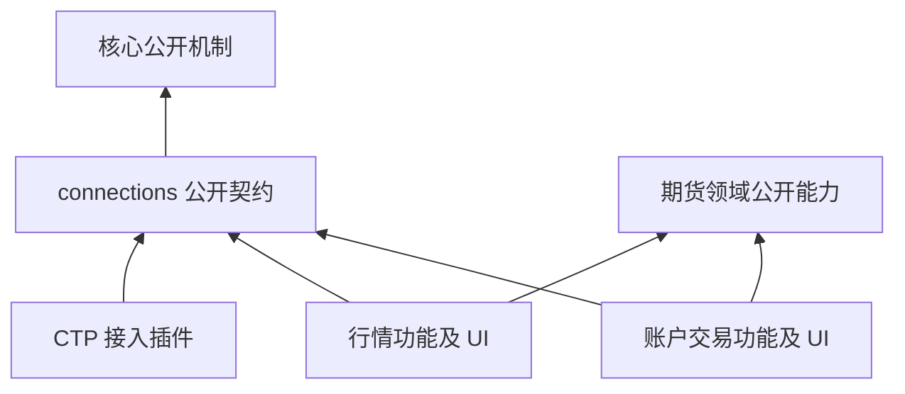

# 账户连接与行情接入插件设计

日期：2026-09-22。状态：只读连接契约、CTP 接入、市场/账户消费及统一 UI 已实施；真实券商联调和交易写能力未验收。本文不代表真实账户接入或交易执行已可用。遵循 [AGENTS.md](../AGENTS.md)、[期货领域基线](futures-domain.md) 和 [插件系统](plugin-system.md)。本次范围先覆盖 SimNow 与真实 CTP 账户的只读接入；交易写能力仍受领域基础和独立准入验收约束。

## 1. 决策

业务 UI 由功能插件提供；连接实现由接入插件提供；核心只提供机制。同一种协议下的不同券商与环境是不同连接配置，不为每家券商复制插件、工作区或 UI。SimNow 是 CTP 接入的仿真环境，不是市场功能本身。

接入插件提供协议行为、所需配置描述、能力及规范化观测，不能只给一组地址和字段，也不能接管业务状态机。同一后台只能启用一份连接配置。用户统一连接和断开；内部行情与账户状态分开观测，但不提供分通道操作入口。账户查询不以行情认证成功为前提。

功能拆分不要求每个插件一个进程。初版内置 CTP 插件保持受信任运行；独立进程隔离须有单独实现和验证，不能用插件接口冒充安全沙箱。

## 2. 职责及唯一状态所有者

| 所有者 | 拥有的职责和状态 | 不得承担 |
|---|---|---|
| 机制核心 | 插件装配、声明依赖、资源授权、任务和事务、窗口布局、通用控件与凭据加密机制 | CTP 字段、券商选择、交易规则、业务面板 |
| `asterion.connections` 功能插件（新增） | 连接档案、秘密引用、会话及通道生命周期、接入能力目录；统一连接设置 UI | 合约命名、自选、资金账、风险计算、供应商 SDK 调用 |
| `asterion.connector.ctp` 接入插件（新增） | CTP 认证与登录、前置配置约束、原生回调和限流、查询批次完整性、SDK 资源释放、源字段规范化 | 自选管理、业务 UI、账户风控和订单准入 |
| `asterion.market` 功能插件 | 行情订阅需求、自选、报价时效、来源合约候选缓存、合约显示名称；行情和自选 UI | 保存券商密码、识别 SimNow 来分派、账户 SDK 查询 |
| `asterion.trading` 功能插件 | 账户与持仓观测、快照新鲜度、风险指标及后续执行规则；账户、持仓和风险 UI | 导入 CTP SDK、依赖行情登录、为每个券商复制流程 |
| 既有期货领域插件 | 发布的实际合约身份、生命周期、时段、交易规则及可追溯来源 | 将接入候选目录当作已经发布和验收的规则 |

来源候选缓存服务于观察和选择，不另建可绕过领域目录的交易身份系统。供应商代码与领域合约 ID 通过显式映射关联；映射缺失时可以观察来源报价，不能用于正式订单执行。UI 简称不是任何身份键。

## 3. 依赖和装配

图表示代码依赖。运行时 connections 按已登记的工厂创建接入会话；通过接口调用接入实现不等于静态导入接入模块。行情和交易仅依赖 connections 的公开业务能力，不互相借道获取账户数据。

当前 `Capability` 绑定唯一提供者，不把每个券商直接注册为同一个核心 Capability。由 connections 导出单一、类型明确的连接访问能力，内部按 connector_id 分派，这是功能插件中的业务登记，不是核心特殊分支。

首片使用现有命名 hooks 登记接入贡献：connections 声明观察 `connections.connectors`，接入插件声明对 connections 的依赖并贡献返回 `ConnectorContribution` 的工厂。所有插件激活后、连接路由开始服务前，connections 生命周期统一读取、类型校验并冻结目录。不得在 connections 激活时提前读取尚未激活的接入贡献。注册集合和贡献归属按发行版显式装配清单检查；重复 ID、契约版本不支持、字段或能力非法时启动失败，不覆盖登记。

初版不实现热安装与热替换；启用/禁用插件后重启装配。所选接入插件缺失时保留配置、显示不可用，不能自动选另一家券商或环境。关闭时 connections 停止新请求并取消/等待会话，再释放 SDK；所有 close 均幂等。接入插件不在自身激活时创建账户连接，避免逆序销毁时出现悬空会话。

不修改核心能力解析器、工作台路由或任务调度。若实现发现现有生命周期不足，先说明不可由扩展点表达的通用需求，再另行评审；不提前设计通用热插拔框架。

## 4. 命名配置、连接身份和秘密

连接档案包含：`connection_id`（稳定不透明 ID）、`connector_id`、用户显示名、`config_revision`、经契约校验的非秘密配置，以及独立秘密引用。

CTP 配置包含 BrokerID、行情/交易前置、UserID，认证流程需要的 AppID/AuthCode 等由接入描述准确声明。SimNow 的固定参数属于 CTP 仿真配置，不散落在行情或交易插件。实盘参数由实际券商提供，不能沿用 SimNow 测试值。界面不要求选择仿真或实盘，同协议均填写服务方参数；账户或券商身份改变时保存另一份命名配置，不能覆盖原连接下的事实。

账户键使用 `(connection_id, source_account_id)`，合约来源键使用 `(connection_id, exchange, source_symbol)`；持仓另含方向、套保类别及今昨所需维度。所有查询、缓存、事件和用户选择均携带 connection_id。自选列表按连接隔离；跨来源复制自选必须重新解析、验证身份，禁止仅凭相同简称自动合并。

核心 SecretPort 提供加密和授权机制，connections 拥有保存策略。秘密按连接身份及配置版本绑定；接入会话只在启动认证时获得该连接必需的秘密，普通查询结果、前端读接口、诊断和日志均不得包含明文或密文。保存操作明确区分保留、替换、清除，不依靠空字符串猜测。端点变更使现有会话失效，须重新确认凭据提交目标后认证，不能把已存密码自动发送给任意新端点。

当前插件同进程受信任，不能防御恶意代码读取内存。未来外部 Broker 插件需要独立信任、凭据授权与故障隔离验收，普通 UI 插件没有凭据访问权。

## 5. 接入契约

所有类型属于 connections 的公开业务契约，不放进 platform。实现时使用明确模型替换裸 dict，并同步 API schema、调用方和测试；本表是要实现的语义，不是已发布 SDK。

| 契约 | 必须表达的内容 |
|---|---|
| `ConnectorContribution` | 唯一 ID、契约版本、显示名、配置字段描述、能力声明、会话工厂 |
| `ConnectionSession` | 不可变连接身份和配置版本、会话代次；内部行情与查询状态；统一启用、取消及释放 |
| `ChannelState` | disconnected/connecting/authenticating/ready/reconnecting/error；通道、原因、观测时间、会话代次 |
| `InstrumentBatch` | 来源合约/品种、交割年月、生命周期、来源名称、完整性、请求及会话身份；仅完整批次可发布替换 |
| `QuoteEvent` | 来源身份、字段值、来源日期/交易日/时间、接收时间、会话代次；未知时间不得补成当前时间 |
| `AccountObservation` | 来源账户、币种、交易日、资金、可用、占用及盈亏；金额十进制、明确未知字段 |
| `PositionObservation` | 来源合约、多空、套保类别、今昨、手数、来源占用及盈亏；不把净仓当双向持仓 |
| `ReadBatch` | 单次查询起止时间、complete 标记、批次 ID、会话代次；资金和持仓顺序查询不宣称原子快照 |
| `ConnectorError` | 稳定类别、可重试性、安全说明、可披露的来源错误码；不传播原生请求对象或凭据 |

能力分别声明 `market_quotes`、`instrument_catalog`、`account_snapshot`、`positions`。静态支持、用户授权和当前可用是三件事，UI 与命令处理均检查，不能只靠按钮禁用。未知能力拒绝；不支持持仓不显示“空仓”，不支持资金查询不显示零。

同一会话内查询请求由接入插件串行限流，消费者不能各自创建无约束查询循环。大批次受数量和时限约束；超时、断线、取消、错误或不完整末包不得当成功空集。CTP 原生对象在回调内复制为契约值，不外泄给功能插件。

错误类别至少区分配置非法、认证失败、网络不可用、限流、超时、数据不完整、不支持、会话已失效。连接插件管理退避与取消；功能插件控制业务刷新需求，避免多层重试放大。只读失败可重试但不能忙循环。

## 6. 会话及数据一致性

- 每次重连、身份或配置切换推进会话代次。回调和查询结果携带代次；迟到结果必须丢弃，不覆盖当前连接快照。
- 行情订阅由市场插件维护期望集合；接入重连后对当前代次恢复该集合。成功登录不等于全部合约订阅成功，按合约呈现拒绝原因。
- 账户刷新与行情通道独立，多个面板复用同一账户刷新任务。连接故障后保留同一身份下的历史快照并标陈旧，切换账户不得瞬间展示上个账户的资金。
- 资金与持仓分别携带查询时点及完成状态。只有确认完整且为空的持仓批次才能显示“无持仓”；解析失败、币种不支持或未知字段必须显式表达。
- 后台领域维护不依赖窗口打开。自选到期清理只使用已验证生命周期证据，来源短暂遗漏或查询失败不等于到期。
- 保存连接配置、更新缓存采用所属存储的原子操作。取消或失败不能破坏最后完整数据；备份保留连接引用及匹配秘密恢复条件。

## 7. UI 和用户操作

连接设置由 connections 功能插件贡献到已有设置入口：填写连接名称和所需字段、保存配置、连接；有多个协议插件时才选择接入协议；统一展示通道状态和错误恢复。接入插件以受限字段描述声明类型、必填条件、秘密属性和说明，统一组件渲染；不得提供任意脚本、HTML 或独立登录工作台。第一片只支持 CTP 实际所需字段类型，不预建万能表单引擎。未来确需特殊认证交互时单独定义受约束扩展点。

行情、自选、账户和风险 UI 仍分别由对应功能插件贡献，核心只提供容器与通用控件。选择连接后调用同一接口和交互流程，不写 `if SimNow` 或券商分支。命名配置和账户数据时间在面板上下文中清楚显示；合约行沿用已确认的简称展示，不增加名称悬停或重复代码。

允许保存多份命名配置，但只有一个当前连接。后台原子保存 `selected_id`，所有窗口与面板读取它，不在浏览器保存独立选择。离线选择仅改变当前配置；在线切换先取消旧查询、推进代次并释放旧会话，再连接新配置支持的行情及查询能力。旧会话释放失败时阻止新会话启动。新会话失败保留所选配置供重试，不暗中恢复旧连接。重启恢复配置和选择，不自动联网。统一连接不产生结算确认、下单或撤单。

## 8. 交易写能力的边界

第一片不定义可调用的提交订单入口，也不把 SDK 方法暴露到 UI。后续由交易插件在账户 node 上执行授权、单写者、规则和风控校验、意图持久化、发送及对账；接入插件只执行已通过业务准入的协议请求并回传事实。

新增交易写能力需要独立声明和授权，不能随只读插件安装或行情连接自动获得。结算确认是有副作用的独立动作，不夹带在账户读取。发送结果未知进入待查询/对账状态，不按只读查询的重试策略重发订单。仿真验证通过不等于实盘准入。

## 9. 当前代码替换清单

| 当前代码 | 替换目标 |
|---|---|
| `market/public.py` 的 `SimNowAccountAccess`、`market.simnow_account_observer` | 删除，改用 connections 的公开类型化连接能力；trading 不依赖 market 提供账户连接 |
| `market/ctp.py`、`market/instruments.py` 的 SDK 调用 | 移至 CTP 接入插件，归并会话内查询调度；市场/交易代码不能导入 SDK |
| `market/service.py` 的连接档案、密码与账户会话逻辑 | 转归 connections；保留行情业务、自选和时效，删除对行情登录的账户门槛 |
| `market/contracts.py` | 保留市场候选及显示规则，改用连接能力获得规范批次；按来源连接分区 |
| `trading/observation.py` | 消费规范观测，保留账户视图与风险指标；CTP 字段解码转入接入插件 |
| 前端 `market/ConnectionSettings.tsx` | 由 connections 插件贡献统一设置，行情与交易导航到同一入口 |
| market/trading 路由及前端请求 | 显式携带 connection_id；更新权限、所有调用方、生成类型及错误处理 |
| `distribution.py`、资源绑定、插件描述 | 显式装配 connections 和 CTP；移除 market 专用凭据资源和 SimNow 账户能力 |
| 测试、文档、诊断、备份清单 | 更新唯一当前契约，不保留旧配置入口、字段别名或备用执行路径 |

现有持久化不做自动迁移。新存储用自身命名空间，旧文件保留原样；遇到旧连接配置明确提示当前版本不支持，用户在新入口重新配置。不能读取旧秘密偷偷复制成新身份，也不能删除原自选或缓存来伪装初始化成功。API 不维持双路径。

## 10. 实施顺序与验收

1. **当前契约和装配**：实现 connections 类型、能力目录和插件装配，验证重复/未知贡献拒绝、缺失插件不可用、启动关闭顺序与资源回收。不修改核心分派。
2. **完整替换 SimNow 调用链**：同一切片完成前后端、存储、查询和诊断替换，删除旧入口。验证统一连接/断开、命名配置切换、唯一活动会话和重启恢复。开发中不发布两套正式入口。
3. **隔离和故障验收**：用仅存在于测试中的第二接入实现验证不修改 UI 即可切换；同代码不同来源不串数据、迟到回调拒绝、查询末包丢失、限流、取消、重复回调、凭据不泄露及缺能力呈现。
4. **真实 CTP 只读联调**：取得用户选择券商的实际接入参数后验证该券商认证、合约、资金、持仓、重连和缓存身份。资料缺失时只报告未验证，不凭配置字段存在宣称支持所有券商。
5. **独立交易准入**：遵循期货领域基线 F4–F6，完成规则、恢复、模拟及真实环境准入证据后再实现并开放写操作。

每片分开报告实现、已接入调用链、自动测试、真实来源验证与未完成范围。一次 SimNow 测试不代替跨券商协议验证；测试接入实现不进入生产装配或用户设置。

## 11. 本次交付边界

本轮已完成第 1–3 项的只读实现：连接管理和 CTP 插件、类型化观测、单活动连接、分配置缓存与统一设置、第二测试来源与故障验证。市场专用连接配置和账户能力已移除，核心调度器没有接入特例。交易插件仍依赖 market 的只读名称投影（不依赖其行情会话）；正式身份目录及交易规则绑定尚未接通观察合约。

实现选择：账户通道启用定时只读认证/查询，CTP 每批查询后释放原生实例，按连接串行，不宣称是交易执行长连接。密文与非秘密档案在同一原子文件保存并绑定配置版本；不使用额外秘密引用文件，避免两份文件更新不一致。记录此具体存储实现不降低凭据接口隔离要求。

真实 SimNow 新调用链、不同券商认证差异、完整备份恢复和实盘准入仍需独立验证。未将旧秘密复制到新连接。下一步由用户在新设置配置连接后开展真实只读联调，完成来源身份/交易规则绑定后再推进交易写能力。

当前档案为 `connections/profiles.json` version 2，包含 `selected_id` 和档案列表；`active_id` 仅来自内存会话。公开变更接口只有保存配置、`/{id}/select`、`/{id}/connect`、`/{id}/disconnect`、`/{id}/delete`。分通道变更入口及环境字段已删除；功能消费者只获得只读状态、订阅与查询能力。未知存储格式拒绝并保持原文件不变。

连接配置支持编辑与删除：断开后可重命名、修改非身份参数和替换/清除密码；原密码默认保留，目标地址改变必须重新输入凭据。账户身份仍固定，更换账户保存另一份配置，避免改写历史归属。删除通过命名确认框提交配置版本；在线配置及版本冲突拒绝删除。成功后原子移除档案及密文，清空被删配置的当前选择，不自动选中或连接其他账户。保留该 ID 下的自选缓存、合约资料和历史数据。缺失接入插件的离线配置仍可删除。后台清理已删配置的内存消费者，迟到行情回调丢弃。

凭据表单不向用户显示保留/替换/清除操作枚举。已有凭据展示固定掩码占位与“修改”，取消修改保留旧值；未配置直接输入。后台显式秘密操作契约不变，掩码永不提交或用于推断真实密码长度。
