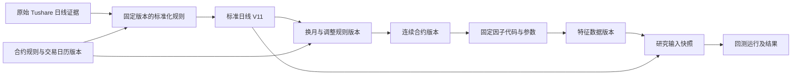

# Asterion 数据生命周期设计

状态：总体设计，类型插件及统一目录首版已实现，2026-09-17；2026-09-20 对齐架构 v2.1 与当前契约政策。基于 architecture.md 第 6–7 节及 [Fincept 源码核对](fincept-data-audit.md)。不是当前能力清单，不声明现有 Tushare 切片已经实现下述全部机制。外部扩展遵守 [插件系统](plugin-system.md)，受引用数据与升级恢复要求见 [总体架构](architecture.md)。

## 1. 设计目标与一个修正

终端必须能回答：有哪些数据、来源是什么、覆盖哪里、哪些记录有问题、经过什么处理、哪次研究使用了哪一版，以及哪些数据可以安全归档或删除。

采用三个数据层级：RAW 原始、STANDARD 标准、DERIVED 加工。**发布是版本状态，不是再复制一套文件的第四层。** 标准/加工数据的已发布版本供研究和业务查询；原始层供审计与重处理。缓存、任务暂存和日志独立于三个层级，不算权威数据版本。

连接器负责取数据，数据模块负责生命周期。更换 Tushare 或增加文件来源，不改变版本、发布和引用保护规则。

## 2. 核心对象

| 对象 | 身份和职责 | 必需的信息 |
|---|---|---|
| Source | 数据来源的配置引用，不是某次采集 | provider、能力、配置版本、凭据引用 |
| Dataset | 长期存在的逻辑数据集 | 稳定 ID、层级、领域、频率、schema、单位、主键、分区规则、来源/融合策略 |
| IngestionRun | 一次采集尝试 | 请求范围、插件/配置版本、任务/租约、每段结果、原始产物引用、观测时间 |
| Artifact | 不可变物理文件 | hash、字节数、格式、schema 引用、逻辑 URI、存储位置引用 |
| DatasetVersion | 数据集一次确定的版本 | dataset_id、父版本、完整 manifest、schema/规则版本、质量与覆盖报告、发布状态 |
| PartitionRevision | 一个逻辑分区的修订 | 合约/日期范围、频率、产物引用、替代关系、来源、行数/校验和 |
| TransformSpec | 不可变的处理定义 | 算法、代码版本、规范化参数、环境标识、输出 schema、可见性规则 |
| TransformRun | 执行一次处理 | 固定输入版本与分区、spec 版本、运行状态、输出版本、日志引用 |
| QualityReport / Coverage | 版本或分区的可用性证据 | 检查规则版本、错误明细、期望/实际覆盖、缺口及不可确认原因 |
| DataReference | 消费者对输入的持久引用 | 研究/模型/报告 ID、dataset_version_id、使用范围、保留原因 |

一个“标准日线数据集”会持续更新，不会每采集一次就变成一个新的数据集。来源明确，例如 `futures.daily.standard.tushare.v1`；跨来源融合另建派生数据集并保存冲突裁决策略，不能只因合约与时间相同就互相覆盖。

显示名可以修改，ID 和已发布版本不能修改。schema 语义变化形成新的数据系列，禁止把不同字段含义混入同一版本。重试同一个命令不得生成重复发布记录；同一请求的主动重新采集可以产生新观测证据。

## 3. 存储与模块所有权

沿用已有架构：PostgreSQL 管目录、版本、覆盖、质量、任务、血缘和引用；Parquet/对象文件管大体量数据；DuckDB 作为 worker 的固定输入查询引擎。缓存可以重建，不能作为研究的唯一输入。

模块建议：

- `data/providers`：外部接口协议、请求分段与安全的错误分类。
- `data/ingestion`：原始采集及分段检查点，保留空响应和失败证据。
- `data/catalog`：Dataset、Version、Artifact、PartitionRevision 的权威目录。
- `data/normalization`：代码、单位、时间与 schema 映射；定义本身版本化。
- `data/quality`：确定性的字段/主键/范围校验和覆盖检查。
- `data/transforms`：聚合、连续序列、复权和特征等处理运行。
- `data/lineage`：输入输出关系与研究引用登记。
- `data/query`：按固定版本读取；行情界面可显式跟随 latest，研究必须解析并固定具体 ID。
- `data/lifecycle`：存储统计、归档、保留、垃圾回收和恢复验证。

这是模块职责划分，不要求立即拆成多个服务。worker 通过数据模块公开接口工作；发布目录仍由 serve 单一所有者写入。普通组件不另造插件框架，只有提供方及可替换处理器需要扩展边界。

文件组织示意：

```text
sources/<source_id>/<run_id>/<partition_attempt>/  原始证据及采集结果
staging/<job_id>/<attempt>/                       尚不可消费的处理产物
published/<dataset_id>/<version_id>/manifest.json 固定版本清单
artifacts/<artifact_id>/                          标准/加工 Parquet 等不可变文件
cache/                                           可删除的查询/传输缓存
```

消费者按逻辑 URI 和 hash 定位，不能把物理绝对路径嵌入研究定义。实际位置延续存储映射，允许未来迁移到远端。凭据在受控密钥目录，不进入原始请求、日志或 manifest。

**逻辑分区与物理文件分离。** 覆盖可精确到合约/交易日；物理文件可合并多个小分区，避免“每个合约每天一个小文件”。先根据实测体积按交易所/品种/月份或年份组织，不现在硬定所有数据共用一个切分大小。压实写新文件和新 manifest，不能修改被旧版本引用的文件。

## 4. 从采集到发布

1. 创建采集计划：固定 Source 配置/插件版本、请求范围及 partition key，取得任务租约。
2. 每段响应先保存原始产物和 Observation。HTTP 成功但空响应也有独立记录；接口失败留下安全的错误类别。请求证据移除 Token，不能将整个认证请求原封不动写入文件。
3. 标准化任务引用已保留的原始产物，固定 mapping/schema/code 版本。标准化失败保留原始输入及质量报告，不丢掉重新处理的依据。
4. 核对字段、主键、单位、价格边界、交易日、范围及时间可见性。异常进入 QUARANTINED，不供正式研究消费。
5. 写不可变文件并校验，在持有有效 fencing token 的事务中登记 manifest、质量/覆盖结果、输入输出血缘和 PUBLISHED 状态，再更新 latest 指针。
6. latest 的更新必须比较预期父版本，或按数据集串行合并；两个并发任务不能各自发布后把另一个任务的分区从最新版本中抹掉。
7. 通知工作区；研究创建时在事务中固定版本并登记引用。窗口关闭、网络重试和服务重启不改变已发布结果。

版本状态：STAGING → VALIDATING → PUBLISHED，失败可为 REJECTED/QUARANTINED；旧版可以 SUPERSEDED，但仍可被固定 ID 读取。物理文件先完整后目录可见；未引用文件延迟回收，不靠“文件在目录里”判断是否可用。

原始数据覆盖、标准数据覆盖分别管理。原始层采集成功不等于标准数据已可用。

## 5. 版本、增量与修订的例子

标准日线数据集 V10 引用 1–8 月分区 A…H。增加 9 月数据后，V11 复用 A…H，增加 I。若提供方修订了 6 月某合约的价格，V12 引用新的 F2，而 V10/V11 继续引用 F。

研究 R1 已固定 V11，所以不会自动读到 F2。可以显式创建 R2 改用 V12，并比较结果。连续合约或因子若依赖 F，血缘检查会将其标为“存在上游新版本”，不会悄悄替换已经发布的派生数据。

处理重跑必须记录：输入快照、分区、参数 hash、代码版本、schema、运行环境；随机处理记录种子及确定性边界。幂等键至少包含这些决定输出的因素，而不仅是文件名或任务名称。

## 6. 质量、覆盖与时间

覆盖状态至少区分：UNREQUESTED、FETCH_FAILED、PERMISSION_DENIED、RATE_LIMITED、EMPTY_UNCONFIRMED、PRESENT、GAP、QUARANTINED。确认休市或无成交需独立证据，不能用空响应替代证明。起止日期和行数只是摘要，不能据此宣称中间无缺口。

使用明确版本的交易日历和合约上市范围来判断期望覆盖。日内频率还要依赖 交易时间插件的 TimeVersion，不能用每天固定分钟数计算中国期货夜盘缺口。质量报告本身绑定检查器版本；再次检查产生新报告，不改写当时的检查结论。

分开记录：事件时间/交易日、提供方发布时间（若可信且可得）、本机 received_at/ingested_at、研究 available_at。历史回填今天才获得的数据不能伪装成当年本机已拥有的数据。若研究采用提供方公开时间作为可用性假设，要显式记录证据及策略；没有证据就保留未知，不自行估计。

## 7. 加工与血缘



血缘以 Version/Artifact/Run 的稳定 ID 存储，支持向上追来源、向下查影响。连续合约是派生研究序列，保存换月映射和生效时间，不作为真实可交易合约。任何“当日成交量选主力”的规则必须说明数据何时可知、何时换月。

## 8. 数据管理界面

保留现有“数据同步 / 数据集 / 合约资料”，将数据集从“任务结果列表”升级为管理中心。

- 左侧筛选：行情、基础资料、因子/特征等领域，以及原始/标准/加工层级、来源、频率、质量状态。
- 主表一行一个逻辑 Dataset：范围、当前发布版本、覆盖/缺口、质量、体积及最近更新时间。
- 详情页：概览、预览、覆盖、质量、版本、血缘；存储归档等低频操作收在管理菜单。
- “数据同步”负责计划和任务，不重复承担全部目录浏览；“合约资料”是标准合约数据的业务视图，共用同一版本和查询接口。
- 普通用户不需要理解物理目录；原始/标准/加工是可解释的筛选和关系，而不是要求手动搬文件。

## 9. 生命周期与删除保护

将大小和行数统计区分为：被多个版本共享的物理占用、版本逻辑大小、缓存、暂存和孤儿文件，避免重复计算。

被研究、模型、报告及已保留派生版本引用的数据，连同其必要输入祖先，必须受保护。删除/归档是显式状态变更：先检查引用，在事务中撤销可见引用或建立保护，再由后台按保留期做可重试回收。删除检查与新增研究引用必须有并发约束，不能先查“无人使用”再无锁删文件。

缓存可以过期清理；失败暂存/孤儿按宽限期回收；有效数据版本不按缓存 TTL 清理。归档后保留元数据、manifest、hash 和位置，可验证地恢复。备份包括一致的目录与所引用文件，验收必须实际恢复并查询，而非只检查压缩包存在。

## 10. 历史开发切片与当前实现

持久化格式只接受当前契约，保留历史业务记录与固定引用；不自动转换旧格式，不以设计更新为由删除用户数据。

开发阶段不做旧设计、接口、目录或数据兼容，不建立 LEGACY_IMPORT 或旧 ID 映射。移除 `/data/releases`，目录改用 `/data/catalog`、固定版本改用 `/data/versions/{id}`。不自动清理已有用户目录、数据、账户或凭据；不受支持的内容明确报错。

已实现 `data/types` 的独立类型注册表：合约、交易日历、期货日线、CSV 行情。每种类型声明业务类别、数据形态、字段和单位、主键、频率、时间语义、类型校验；日历覆盖和日线图表投影由类型插件提供。Provider 的 capability 显式引用 type_id，来源适配器保留协议解析、代码映射及请求范围检查。

已实现 `data_collections` / `data_versions`：稳定身份按来源、类型、层级、schema、频率和对象范围生成；同一数据集的重复采集登记为独立不可变版本。Tushare 与 CSV 发布事务共同登记 RAW / STANDARD 及固定原始输入边。类型说明随版本冻结，界面从版本获取字段说明。文件保存 checksum、格式和字节数，预览先校验 hash；目录、版本、记录均分页。目录按业务类别、类型、来源、加工阶段及对象搜索。

2026-09-19 已增加逐段观测留存、断点续传，以及日线/日历 STANDARD 的完整累积月分区 manifest。RAW 版本、合约资料与 CSV 仍为一次采集范围。累积系列与历史采集范围系列分开；历史记录须符合当前 manifest 契约，不自动推断、迁移或转换旧结构。数据集锁内读取父版本并发布；按主键的原始观测时间择新，迟到旧响应不能回滚已接收修订，缺失记录不推断删除。

月分区文件可跨版本共享，行内保留观测时间和 RAW 来源，版本保存父版本、月分区及修订统计，界面可查看日历缺口、父版本和逐行来源。已支持固定同源日历/合约资料的逐日日线核对报告与手动缺口补齐；报告不覆盖发布时的质量结论。尚未完成官方来源权威性验收、自动补齐调度、处理器执行及 DERIVED 产出、磁盘容量治理、物理回收与备份恢复。失败任务的分段观测可查，但不冒充已发布 RAW 数据集；RAW 仍是声明字段证据（CSV 为服务接收的原文），不是 HTTP 完整字节归档。图表快照是由类型插件生成的业务投影，不额外冒充一种逻辑数据集。

业务类型、加工层级和文件格式是独立维度。未来仓单、持仓排名、财务、宏观、新闻分别注册类型；文档、关系和模型二进制不强制转为行情表。当前只开放已实现的四种类型，不放置未实现的业务入口。

## 11. 实施顺序与验收

| 阶段 | 交付 | 可检验条件 |
|---|---|---|
| A 原始留存与目录 | Dataset/Version/Artifact、逐段原始证据 | 同步中断或规范化失败后仍可找到对应已采集证据；重试不重复发布 |
| B 标准化与覆盖 | 规则版本、质量报告、分区与完整 manifest、增量规划 | 多次同步归入一个 Dataset；重叠更新不静默覆盖；并发发布无分区丢失；缺口可定位 |
| C 加工与血缘 | TransformSpec/Run，先做一种确定性日线加工 | 相同固定输入可重算；输出能追到原始证据与规则；上游修订不改变旧研究 |
| D 消费与保留 | 固定研究输入、引用保护、容量、归档、回收与备份 | 被引用版本删除被阻止；删除与引用并发安全；清缓存不影响研究；备份实际恢复通过 |

优先 A 和 B，不再通过增加导航标签或更多提供方来代替数据底座建设。先以 Tushare 三类数据与 CSV 验证，再扩大到分钟、实时落盘、更多来源和特征。


## 2026-09-19：可恢复归档与直接引用汇总

已实现 `data_version_states`，独立保存版本的 archived/revision/updated_at；不改写不可变 manifest、hash、数据文件或研究输入。数据详情“引用保护与归档”展示数据血缘、覆盖报告、研究运行（含排队/失败）、未删除草稿/模板和已导入复现包的直接引用数量。研究域通过 public 接口提供只读统计，由 API 组合层注入 data lifecycle，不在数据模块导入研究表；后续可信模块可追加引用读取器。统计包含所有账户但不披露账户、文档名或运行 ID。它是当前已登记模块的直接引用摘要，不是完整传递依赖图或可删除证明。

归档使用 revision CAS 和事务，响应丢失后相同请求可幂等重试；旧窗口不能覆盖更新状态。所有数据版本均保留，引用为零也不开放永久删除。物理分区可能跨版本共享，尚未实现文件引用计数、引用登记与清理并发协调、宽限期垃圾回收或一致备份恢复，因此没有删除接口，也不宣称能回收磁盘。

默认目录在选出各数据集真正最新版本后过滤已归档版本，不回退旧版本假装最新；“显示归档版本”可找回并恢复。历史列表保留全部版本与归档标记；按固定 ID 的读取、研究原输入重跑、日历依据解析与后续同步累积不受归档影响。新采集版本默认未归档，可以让该数据集重新出现在目录。归档用于目录整理，不是停用连接或禁止数据消费。

此次采用增量新表并由现有初始化器创建，不删除/重建旧表。引用统计当前按需读取已有元数据；大规模数据下需增加可验证的引用索引，不能直接以界面计数作为未来删除授权。


## 2026-09-19：一致备份与隔离恢复

运行时层新增离线物理备份，不由数据插件直接调用服务管理器。数据库与 immutable 文件在后台停止并取得启动/监督锁后一起复制，保留账户、引用、归档状态和凭据主密钥；恢复限于新目录，隔离启动数据库后验证文件、共享分区、研究结果复算与凭据解密。恢复记录在新目录落盘，未完成任务隔离，当前环境不被替换。正式切换/回滚由运行时宿主协调：先对原环境创建并验证保护备份，再复验目标、隔离未完成任务、验证 API/worker 就绪，最后提交活动环境记录；中断时恢复原环境。目录不覆盖，回滚不合并新增记录。尚不包含跨平台迁移、备份加密或物理垃圾回收。参见 [备份与恢复](backup-and-restore.md)。
