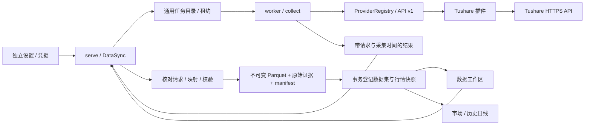

# 数据源插件与 Tushare 首个切片

2026-09-17。该切片交付手动同步、校验、不可变发布、预览和历史日线图表，不代表 M1 的自动补齐、交易规则或实时行情已经完成。

## 使用

1. 点击应用设置，进入「数据源」，保存 Tushare Pro Token。可测试已保存凭据；测试仅验证交易日历接口，不推断其他接口权限。
2. 数据工作区仅保留「数据同步、数据集、合约资料」三个入口。进入「数据 → 数据同步」。首个内置插件为 Tushare，选择交易所和数据类型。
3. 合约资料按交易所获取普通合约。交易日历按日期区间获取。历史日线还需要实际合约代码，例如 `RB2610.SHF`，不接受主力或连续代码。
4. 任务中心显示已完成分段/总分段，可取消；失败或取消后可「重新同步」。重试产生新任务，保留原失败记录，重新采集全部请求区间。
5. 在已发布数据集中查看版本、采集时间、记录数、覆盖说明与分页预览；日线数据集可「查看历史图表」。本地文件导入位于「数据同步 → 数据源 → 本地文件」；Tushare 与文件结果统一显示在「数据集」。

Token 不应粘贴到对话中。凭据通过本机受控服务写入 `.credentials/<provider>.enc`，Fernet 加密，密钥从本机随机运行凭据按独立用途派生，目录权限 0700、文件权限 0600。任务仅包含 provider ID（凭据引用），不含密钥。界面保存后清空输入，不写 localStorage/sessionStorage。运行密钥丢失或轮换时需重新保存 Token。此本机实现不宣称能抵御已取得当前系统用户权限的攻击，也不冒充 macOS Keychain；未来可替换凭据存储实现。

「合约资料」是统一目录的合约类型视图；完整规则 JSON 仍在「规则版本」。开发期不保留旧入口映射或旧数据迁移，需重新同步或导入。

统一目录按业务类别、数据类型、来源、加工阶段筛选。当前类型为合约资料、交易日历、日线及 CSV 行情。点击数据集后可选择采集版本、预览、检查主键及时间语义，并追溯原始输入。每个版本只包含本次采集范围，不自动合并历史。

## 边界

- `providers/public.py`：版本化 `Provider` 协议、能力声明、同步请求与分段计划。
- `providers/__init__.py`：显式注册可信插件；拒绝重复 ID、不兼容 API 版本、未知 provider。当前只注册 Tushare。桌面冻结包采用编译时注册，不加载任意下载脚本；增加插件时实现协议并注册、重建运行包，无需修改任务队列和工作区表单。
- `providers/tushare.py`：接口选择、日期分段、HTTPS 请求、上游错误分类与字段映射；插件不能写数据库或发布目录。
- `sync.py`：凭据引用解析、worker 采集、任务进度、重试及发布协调。发布由 serve 完成，worker 不直接写目录数据库。
- `types/`：独立数据类型插件、字段/单位/主键/时间语义、标准数据校验、日历覆盖与行情投影。新增类型需实现校验并显式注册；提供方能力通过 type_id 引用，不能仅增加一个界面名称。
- `library.py`：数据集与版本目录、原始输入边、文件校验及分页查询。Tushare 和文件导入共用发布登记；版本固定类型描述及源插件版本。
- `routes.py`：账号/PIN 保护用户操作，租约保护内部结果提交。机器内数据与数据源凭据为该终端共享配置，不是云端多租户服务。

每次采集按任务 UUID 独立存储 `evidence.json`、`data.parquet`、`rows.json`、`manifest.json`。保留完整的所请求字段、参数、分段及实际采集时间。数据值精度以十进制字符串保留；图表快照沿用 Decimal128 OHLC 模型。规范化记录和原始证据分别留存，所有有效发布引用都在文件 fsync 后事务登记；失败/过期/取消任务不能发布。发布重试必须与原证据 checksum 一致。失败可能遗留未引用文件，自动回收仍待实现。

## 语义和限制

- 当前 `fut_basic` 仅获取普通合约。基础资料不能自动升级成完整 `ContractRules`：手续费、最小价位、日内时段尚未补齐，预览标记规则“待补充”。不同品种的 `multiplier` 和 `per_unit` 不混用，原值保留在证据中。
- 交易日历不等同于日内 SessionCalendar；当前只开放官方文档明确列出的五个交易所，不猜测 GFEX 日历支持。
- 日线按单个实际合约、31 个自然日分段请求；日历同样分段。合约资料单次获取，到达服务端上限则拒绝发布，不能把被截断的目录当作完整目录。
- 日线 `event_time` 为交易日的 UTC 零点标签，manifest 明确 `frequency=1d`、`time_semantics=trading_day_label`，不是收盘时间或逐笔发生时间。`available_at` 为本次完整采集的最后观测时间，不回填为历史日期来假装当时已知。
- 成交量与持仓量单位为手、成交额单位为万元；结算、前结算、持仓等保留在数据集，图表快照只使用 OHLCV。非法数值、重复键、越界日期/合约、OHLC 不一致会拒绝发布。当前图表契约只支持正价格和整数手；不满足该契约的日线会拒绝发布。
- 日历校验区间每个自然日均存在。合约和日线仅声明“返回记录已校验”，不声称完整目录/无行情缺口。部分空分段留在 manifest，全部为空标记 `EMPTY_UNCONFIRMED` 并失败；不将空返回臆测为休市或无成交。
- Token、权限、频率、网络或结构错误用受控信息展示，不回显上游消息（其中可能夹带敏感输入）。暂时网络故障/HTTP 429/5xx 最多三次请求；数据接口额度不足仍须稍后人工重试。
- 单次最多十年、上传上限 8 MB，worker 提前在 7.5 MB 提示缩小区间。一次结果完整采集后发布；当前不支持分段检查点续传、每日调度、目标覆盖自动补齐、大文件上传及孤儿回收。预览每页 100 行，最多 500；图表沿用最多 1,000 行的现有查询约束。
- Token 尚未配置时不创建任务，不显示虚假的已连接状态。离线夹具测试不能证明真实账号有接口权限；实际 Tushare 凭据联调需配置后执行。

## 官方接口依据

- [合约资料 fut_basic](https://tushare.pro/document/2?doc_id=135)
- [期货交易日历 fut_trade_cal](https://tushare.pro/document/2?doc_id=467)
- [历史日线 fut_daily](https://tushare.pro/document/2?doc_id=138)

实际积分、权限和调用限制由提供方控制；不在客户端固定宣称某个账号一定可用。
