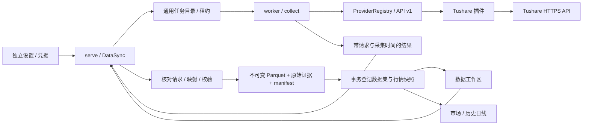

# 数据源配置与 Tushare

更新于 2026-09-19。已交付配置表单、离线示例、手动同步、校验、不可变发布、预览和历史日线图表，不代表 M1 的自动补齐、交易规则或实时行情已经完成。

本文说明当前可信内置扩展。2026-09-19 制定的外部插件目标协议、权限与 SDK 演进见 [插件系统](plugin-system.md)；两者不能混同。

## 使用

1. 点击应用设置，进入「数据源」，填写 Tushare Pro Token 并保存配置。可先测试当前草稿，测试不保存；Tushare 仅验证交易日历接口，不推断其他接口权限。
2. 数据工作区仅保留「数据同步、数据集、合约资料」三个入口。进入「数据 → 数据同步」。正式内置插件为 Tushare，选择交易所和数据类型。
3. 合约资料按交易所获取普通合约。交易日历按日期区间获取。历史日线还需要实际合约代码，例如 `RB2610.SHF`，不接受主力或连续代码。
4. 任务中心显示已完成分段/总分段，可取消；失败或取消后可「继续同步」或「全部重新同步」。两者均产生新任务并保留原失败记录；继续同步复用已检查的有效分段，全部重新同步重新采集整个请求区间。任务行的「采集详情」可查看分段与原始数据。
5. 在已发布数据集中查看版本、采集时间、记录数、覆盖说明与分页预览；日线数据集可「查看历史图表」，累积日线版本还可展开「日线覆盖核对与补齐」。本地文件导入位于「数据同步 → 数据源 → 本地文件」；Tushare 与文件结果统一显示在「数据集」。

Token 不应粘贴到对话中。当前配置加密保存在 `.credentials/configurations/<ref>.enc`，目录权限 0700、文件权限 0600，数据库保存修订与引用。`ref` 是使用本机密钥对配置及修订计算的 HMAC。任务只含配置引用/修订/schema，不含明文。界面保存后清空秘密输入，不写 localStorage/sessionStorage。不读取旧单 Token 文件，不在领取任务时补配置。任务缺少提交时固定配置则执行失败，需按当前规范重新提交。此本机实现不抵御已取得当前系统用户权限的代码，也不冒充 macOS Keychain。

配置快照包含秘密，因此不进入公开产物。变更或移除当前凭据不会删除旧任务固定的加密快照；停止旧任务须显式取消。运行密钥丢失会使旧快照无法解密，不能自动改用当前凭据。完整密钥恢复/轮换仍待专用流程；设置允许重新填写全部字段建立新修订，但不会修复旧任务的不可读快照，也不应直接删除这些文件清理空间。

「合约资料」是统一目录的合约类型视图；完整规则 JSON 仍在「规则版本」。只保留当前目录和固定版本接口；不提供旧入口映射或持久化格式迁移，无法读取时明确拒绝并保留原记录。

统一目录按业务类别、数据类型、来源、加工阶段筛选。当前类型为合约资料、交易日历、日线及 CSV 行情。点击数据集后可选择采集版本、预览、检查主键及时间语义，并追溯原始输入。日线与交易日历的标准数据使用累积版本；RAW、合约资料及 CSV 保留本次采集范围。

## 边界

- `providers/public.py`：Provider API v2，探测和采集接收已校验配置字典；能力声明包含同步默认值，配置声明支持字符串、整数、布尔和秘密字段。
- `providers/__init__.py`：显式注册可信插件；拒绝重复 ID、不兼容 API 版本、未知 provider。正式运行时只注册 Tushare，桌面冻结包仍采用编译时注册，不加载任意下载脚本。受支持字段可直接生成设置表单，无需新增提供方专属表单。
- `configuration.py`：配置校验、普通值/秘密分离、草稿测试、修订比较更新与任务配置冻结。它是受限字段契约，尚不是完整 JSON Schema 解释器。
- `providers/tushare.py`：接口选择、日期分段、HTTPS 请求、上游错误分类与字段映射；插件不能写数据库或发布目录。
- `sync.py`：凭据引用解析、worker 采集、任务进度、重试及发布协调。发布由 serve 完成，worker 不直接写目录数据库。
- `ingestion.py`：独立于标准发布的分段观测目录。worker 每段提交后才继续下一段；文件先持久化，再在有效租约事务内登记，按任务/领取次数/分段隔离。
- `types/`：独立数据类型插件、字段/单位/主键/时间语义、标准数据校验、日历覆盖与行情投影。新增类型需实现校验并显式注册；提供方能力通过 type_id 引用，不能仅增加一个界面名称。
- `library.py`：数据集与版本目录、原始输入边、文件校验及分页查询。Tushare 和文件导入共用发布登记；版本固定类型描述及源插件版本。
- `routes.py`：账号/PIN 保护用户操作，租约保护内部结果提交。机器内数据与数据源凭据为该终端共享配置，不是云端多租户服务。

`data/worker.py` 声明数据任务执行函数、发布路径与响应校验，`runtime/handlers.py` 装配领域贡献；worker 的租约循环不再按业务类型分支。处理器必须在模块组合入口登记，使 spawn 子进程重建相同注册表。它仍不是动态加载器、插件安装器或安全沙箱。

## 开发测试与演示数据标识

合成数据生成器仅保留在 `tests/synthetic_provider.py`。需要它的后端测试显式使用 `development_providers` fixture；前端测试可使用独立 mock。生产注册表、设置列表、同步入口和桌面包均不包含该提供方，不提供产品演示开关。

已发布历史示例数据保留 `demo=true` 与非真实行情标记；旧示例连接不进入可选列表，不会导致真实数据源列表失效。旧示例任务不能继续采集，用户可查看历史结果或取消任务。测试数据不会自动转换为真实市场数据。

## 采集证据与续传

每次采集按任务 UUID 独立存储 `evidence.json`、`data.parquet`、`rows.json`、`manifest.json`。保留完整的所请求字段、参数、分段及实际采集时间。数据值精度以十进制字符串保留；图表快照沿用 Decimal128 OHLC 模型。规范化记录和原始证据分别留存，所有有效发布引用都在文件 fsync 后事务登记；失败/过期/取消任务不能发布。发布重试必须与原证据 checksum 一致。失败可能遗留未引用文件，自动回收仍待实现。

自 2026-09-19 起，worker 在发布前将每段观测保存至 `sources/<job_id>/<attempt>/<index>/<checksum>.json`。成功接收标为 `RECEIVED`（不表示质量或覆盖通过），空响应标为 `EMPTY_UNCONFIRMED`；提供方失败只保存受控错误类别，不保存远端错误文本或凭据。后续失败、取消和标准化拒绝不删除已保存记录；被取消时尚未确认写入的响应不保证留存。租约接管会检查并复用同任务先前尝试的有效分段，保留旧领取次数的证据。发布内容必须与当前领取次数已登记的证据一致。

查询接口（需要运行会话，启用账号时还需已解锁账号）：

- `GET /api/v1/data/jobs/{job_id}/observations?offset=0&limit=50`：各领取次数的分段、状态、采集时间和校验和。
- `GET /api/v1/data/jobs/{job_id}/observations/{attempt}/{index}?offset=0&limit=100`：校验文件后的原始行分页预览。
- worker 使用 `POST /api/v1/jobs/{job_id}/observations/{index}`，以 `X-Lease-Token` 提交；同段重传必须内容一致，每段最多 8 MB。

这些记录在任务中心「采集详情」展示，支持分段与原始行分页、运行中自动刷新；不属于已发布数据集，不供研究直接消费。当前保留插件协议返回的声明字段和最终错误类别，未保留完整 HTTP 报文、插件拒绝的异常响应体及每次内部网络重试。

### 续传规则

「继续同步」使用原失败/取消任务作为明确输入。服务端在有效租约内检查源文件校验和、请求范围、插件及类型版本，重新进行分段规范化、数据类型校验和适用的覆盖检查，再登记新的观测记录。记录保存 `reused_from`（源任务、尝试、分段、校验和），保留原始 `observed_at`，不将今天复用的数据改写成今天采集。完整结果仍须整体校验后发布。空响应、失败、截断、文件缺失/损坏或不兼容分段会重新采集；日历缺日期不能复用。日线仍只证明已返回行通过检查，不证明无缺口。

已保存的历史响应不会自动变成数据源的最新修订；需要刷新已有数据时选择「全部重新同步」。续传只复用指定旧任务或同任务先前尝试；完成采集后的日线/日历标准发布再按下述累积规则合并。worker 通过 `POST /api/v1/jobs/{job_id}/resume` 获取服务端确认的分段，使用租约令牌；用户重试接口 `POST /api/v1/data/jobs/{job_id}/retry` 增加 `resume` 布尔参数，默认 false。

### 累积版本与分区

日线和交易日历的 STANDARD 使用 `monthly-observed-v1` 累积系列，同一来源、类型/schema、频率、交易所/合约归入同一逻辑数据集。RAW、合约资料和文件数据保持各次采集范围。旧开发数据的采集范围系列不自动转成累积历史，也不删除；在界面按“累积版本/采集范围”区分，需要的历史范围须重新同步到新系列。

每次发布在 PostgreSQL 中锁定数据集，再读取最新父版本。按月生成完整分区清单，未变化月份继续引用旧文件，变化月份写新的内容寻址 Parquet，文件完整落盘后在租约事务内登记版本。并发任务顺序合并到前一个已提交版本，不能把另一任务的新月份从最新版本中抹掉。旧版本固定清单和文件，不随 latest 改动。失败文件暂留为孤儿，不供目录消费，自动回收仍待实现。

同一主键按原始采集时间择新；相同时间、不同数值拒绝自动裁决。原样重观测计为“同值刷新”，数值变化计为“修订”，迟到旧响应计为“忽略较旧响应”。未返回的记录不视作删除，全部空响应仍拒绝发布；目前没有显式撤销/删除修订协议。逐行保存采集时间和 RAW 版本 ID，图表不会把旧记录的可获知时间改成新发布的时间。

数据集详情展示累积版本号、本次采集与累积行数、变更统计、月分区、父版本和原始来源。日历列出累积首末日期间的自然日缺口，补齐后形成新版本；日线发布清单仍显示“仅已返回记录”；可另行按固定日历及上市区间生成覆盖报告，不改写发布清单。引用文件大小是版本的逻辑大小，跨版本共享，不等于新增物理占用。

### 日线覆盖核对与手动补齐

在日线累积版本详情展开「日线覆盖核对与补齐」，填写期望日期范围（最多十年，不能超过今天）。可核对当前固定版本，或核对同一数据集的最新行情版本。默认选同来源、同交易所的最新交易日历及合约资料；也可以显式填写两个依据版本 ID。报告固定全部输入和核对日期，后续重新同步不会修改旧报告。

逐日结果区分已有记录、缺口、休市、上市区间外、依据不足、当日未完成及冲突。缺少日历日期、找不到合约或缺少到期日期时不推断缺口；当日交易尚未结束，不作为历史缺口补取。休市或上市区间外却存在行情时标为冲突，阻止该报告的补齐。结论只相对于固定来源版本，不证明官方权威性或未返回日期无成交。

「补齐确认缺口」只提交原报告已确认的历史缺口。提交时使用原报告固定的日历/合约依据重查最新行情，并跳过已经补上的日期；不会因日期推进而顺带补取原报告未批准的当日数据。相邻缺口只跨明确休市日合并，不跨已有记录和未知日期。整个批次和命令幂等登记在同一事务中；网络失败重发同一命令返回原任务，不创建部分批次或重复任务。

任务仍通过通用 worker、分段留存和累积发布执行。返回空数据、权限或网络失败不会变成“已补齐”；任务中心可查看、取消和重试，重试保留报告引用。完成后点击「核对最新行情版本」产生新报告。当前不后台轮询补齐、不自动调度或自动复核，不含批次级取消及研究输入删除保护。

## 语义和限制

- 当前 `fut_basic` 仅获取普通合约。基础资料不能自动升级成完整 `RuleVersion`：手续费、最小价位、日内时段尚未补齐，预览标记规则“待补充”。不同品种的 `multiplier` 和 `per_unit` 不混用，原值保留在证据中。
- 交易日历不等同于日内 交易时间插件的 TimeVersion；当前只开放官方文档明确列出的五个交易所，不猜测 GFEX 日历支持。
- 日线按单个实际合约、31 个自然日分段请求；日历同样分段。合约资料单次获取，到达服务端上限则拒绝发布，不能把被截断的目录当作完整目录。
- 日线 `event_time` 为交易日的 UTC 零点标签，manifest 明确 `frequency=1d`、`time_semantics=trading_day_label`，不是收盘时间或逐笔发生时间。`available_at` 为本次完整采集的最后观测时间，不回填为历史日期来假装当时已知。
- 成交量与持仓量单位为手、成交额单位为万元；结算、前结算、持仓等保留在数据集，图表快照只使用 OHLCV。非法数值、重复键、越界日期/合约、OHLC 不一致会拒绝发布。当前图表契约只支持正价格和整数手；不满足该契约的日线会拒绝发布。
- 日历校验区间每个自然日均存在。合约和日线仅声明“返回记录已校验”，不声称完整目录/无行情缺口。部分空分段留在 manifest，全部为空标记 `EMPTY_UNCONFIRMED` 并失败；不将空返回臆测为休市或无成交。
- Token、权限、频率、网络或结构错误用受控信息展示，不回显上游消息（其中可能夹带敏感输入）。暂时网络故障/HTTP 429/5xx 最多三次请求；数据接口额度不足仍须稍后人工重试。
- 单次最多十年、上传上限 8 MB，worker 提前在 7.5 MB 提示缩小区间。一次结果完整采集后发布；当前支持已有有效分段的续传，尚不支持每日调度、目标覆盖自动补齐、大文件上传及孤儿回收。预览每页 100 行，最多 500；图表沿用最多 1,000 行的现有查询约束。
- Token 尚未配置时不创建任务，不显示虚假的已连接状态。离线夹具测试不能证明真实账号有接口权限；实际 Tushare 凭据联调需配置后执行。

## 官方接口依据

- [合约资料 fut_basic](https://tushare.pro/document/2?doc_id=135)
- [期货交易日历 fut_trade_cal](https://tushare.pro/document/2?doc_id=467)
- [历史日线 fut_daily](https://tushare.pro/document/2?doc_id=138)

实际积分、权限和调用限制由提供方控制；不在客户端固定宣称某个账号一定可用。

文件导入与多连接实例的已实现接口、字段单位、来源身份与契约边界见 [数据规范、文件导入与连接实例](data-import-and-connections.md)。

连接支持重命名、停用、归档和恢复；已保存配置的验证记录与草稿测试分开。具体状态语义见 [数据与连接管理](data-import-and-connections.md#连接状态和验证记录)。

## 一次准备研究数据

在「数据 → 数据同步」选择实际合约日线、连接、交易所与日期，勾选「同时准备研究依据（日历与合约资料）」，点击「准备研究数据」。服务端按类型能力解析日线、交易日历和合约资料，不绑定 Tushare 的接口 ID；要求所选交易所的三类能力都明确可用，不支持时继续使用单项同步。

一次提交在同一事务登记准备批次、待执行日线计划、日历与合约资料两项任务。日线此时不可领取。三项工作共用一次冻结的连接配置；日历使用日线日期范围，合约资料按插件声明的范围获取。合约资料发布后，从这一确切版本生成身份目录；资料发布、目录证据固定和日线入队处于同一租约事务，失败一并回滚。没有后台扫描或“找最新资料”的补偿路径。

资料本身合法但缺少完整身份时，保留其发布结果，批次标记“身份校验失败”，不提交日线；修正代码或来源资料后新建批次。日线发布逐行校验来源代码、品种/月码、生命周期及固定信息截止时间，单次研究准备只接受一个实际合约生命周期。发布清单保存 `contract_identity`，数据集范围包含实际合约 ID。日线重试和后续缺口补齐保留该证据，不能重新解释原身份。

响应丢失后相同命令可安全重试，配置或连接状态后来改变也不会重新创建已接受命令。新准备命令要求连接启用且配置完整；已接受批次的自动后续任务使用原配置。

页面展示最近 10 批研究数据准备，包含连接名称、合约、区间、每项状态、进度和失败原因。刷新/重开后从数据库重新读取，不自动重发。数据源权限和限流仍以三项实际任务结果为准；只通过日历连接测试不代表日线或合约接口已有权限。

失败/取消任务可单独「继续同步」，保留原请求、配置快照、身份依据与批次 ID。相同重试命令幂等；同一尝试只允许一个后继，禁止并行分支争抢批次依据。更新连接配置后若要使用新配置，应新建准备批次。成功数据不会回滚或重复请求。查看最多 200 次尝试，超限或状态读取失败暂停重试与核对。

三项均成功且各有唯一结果时，「核对覆盖并查看数据」绑定本批实际发布的日线、日历、合约资料版本和原请求区间，明确不选择最新行情。生成报告后定位到对应数据集和报告；可能仍存在缺口、依据不足或冲突，成功采集不等于覆盖完整。后续补齐和回测沿用既有显式操作，不自动运行策略，也不会把这一批替换进已有研究草稿。

本机数据任务与准备记录按现有共享数据域管理，接口要求登录及 PIN 解锁；研究草稿仍按账户隔离。此入口不是自动定时调度，也不提供跨供应商混合、跨连接借用依据、批次自动取消或第三方插件安全沙箱。

### Tushare 合约资料与研究规则

合约资料当前 schema 4 包含标准 `contract`、`suggested_multiplier` 和 `multiplier_note`，并保留 `multiplier`（提供方合约乘数）及 `quote_unit_desc`（最小报价说明），Tushare 适配器为 1.4.0。研究规则插件通过固定资料版本映射草稿并保留来源证据，不将资料完整性标记改为完整交易规则。界面及边界见 [合约规则](contract-rules.md)。

## Tushare 每日结算参数

提供方 1.2.0 新增 `settlement → futures.settlement`，按单个实际合约及日期范围同步 `fut_settle`。标准版本为本次日期范围快照，与原始证据一同保留；不是行情，不生成图表快照，也不声称交易日覆盖完整。费用/保证金保留供应商数值，单位与生效时间由规则插件显式确认。具体语义见 [合约规则](contract-rules.md#每日结算参数与明确研究假设)。

### 固定合约身份目录

合约资料 schema 4 明确保留 `currency`、`delivery_month` 与 `last_delivery_on`。Tushare 从 `d_month` 读取完整年份，不从短代码或当前时间推断；品种及代码月份与来源完整年月冲突时拒绝。缺少完整交割年月的资料可以作为未完整的来源观察保存，但不能据此发布实际身份目录。

资料按 `exchange + symbol + listed` 区分记录，避免同一短代码跨生命周期复用时合并。通过“合约资料 → 合约目录”选择固定版本发布身份，见 [目录契约](reference-data.md)。覆盖报告冻结从固定资料生成的目录证据，研究及复现强制引用；原始行情同步发布阶段的身份准入仍待接入。

研究准备日志使用当前完整数据库结构保存待执行计划与依赖状态。存储预检不接受缺失字段的表；不自动迁移或改写现有数据库。工作台显示等待合约身份、身份校验失败和固定目录信息，不能把前置任务成功显示为全部数据已就绪。

## 单独日线与结算同步的固定身份准入

`POST /data/sync` 使用数据管理插件的 `SyncSubmission`：采集字段与供应商 `SyncRequest` 一致，另有 `contracts_version_id`。当能力类型为 `futures.daily` 或 `futures.settlement` 时必须提供该字段；其他类型不接受非空值。供应商接收到的请求不含这个宿主字段，外部和内置来源共用同一入口，不按供应商 ID 分支。

界面「合约依据」列出同一来源连接、交易所的标准合约资料及历史版本，用户明确选择。改变连接、能力、交易所或来源代码会清空选择；不自动选择最新资料，也不将代码转成大写。资料不存在时可先同步合约资料，或勾选研究数据准备。

入队前完整读取固定资料并验证文件校验和，构造唯一同源目录，验证连接和交易所，要求请求起止日期属于同一实际合约。目录内容及指纹进入任务 `contract_identity`；不符合条件时不创建日线任务。发布再按每条交易日验证，数据集范围保存规范合约 ID，重试沿用已固定身份。

日线与结算数据的低层提交、重试、Worker 采集、发布和备份恢复均强制携带身份。Worker 按供应商能力核对任务类型，不能修改任务类型字段绕过校验；提交/发布再从固定资料重建目录并比对内容，不能在保留输入校验和的同时伪造目录。日线内部重试/补齐也走同一身份检查，缺失身份不创建后继任务。

日线与结算任务都不支持缺失身份的执行路径。准备阶段的 `submission_payload` 只是未入队模板，资料发布后才能构造可执行任务；它不能直接通过 Worker 或发布检查。当前契约校验失败时保留记录，不自动补身份或改变数据集范围。文件导入使用其独立的 `ImportIdentity` 映射契约。规则对象的规范身份引用仍需收敛，F1 尚未完成。

主力映射能力 `mapping` 输出标准表格 `futures.role_mapping`，支持固定快照及 RAW 证据，不是行情数据或连续价格序列；角色发布及真实验证见 [合约角色](contract-roles.md)。

## SimNow 实时行情

实时行情属于 `asterion.market` 行情插件，通过「设置 → 连接 → SimNow」配置账户，在「总览 → 实时行情 → 自选合约」管理实时订阅；不经过历史同步与数据集发布流程。当前实现与联调边界见 [SimNow 行情接入](simnow.md)。
