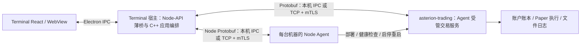

# 进程、工程与通信边界

进程按生命周期、故障隔离和计算负载划分；七类插件不各建一个进程。Core 是库，apps 下的可执行程序装配 Core 与插件。实时行情宿主命名为 `market-data`，不使用含义过宽的 `data`。

## 当前已经运行的进程



- Terminal 窗口、主题与 UI 插件保持原设计。C++ 宿主仍负责 CSV 预览、应用状态和服务连接；不再直接拥有 PaperSession 或链接模拟执行/文件日志实现。
- 选择本机部署时，本机 Node Agent 创建或恢复独立 `asterion-trading`，关闭会话只断开业务连接，进程继续运行。当前一个 Terminal 实例选中一个模拟会话；同一交易程序可运行多个独立实例，已验证账户和回放进度分离。
- 实盘/模拟采用同一个 C++ 可执行程序的不同实例，启动模式固定，不能运行中切换。当前只有 `paper` 可用；`live` 在创建 IPC 监听和打开账户日志之前以退出码 3 拒绝启动，不加载 Paper 作为替代。
- 交易进程唯一持有会话账本与日志写锁。子进程异常退出不会使桌面宿主一起退出；桌面展示最后确认快照并明确要求恢复，不把缓存当作当前权威状态。
- 选择远程部署时，可由运维直接启动交易服务，标准产品流程由 Terminal 经 SSH 安装 Node Agent 后部署，由 Agent 创建、监督和回收交易进程。连接 EOF、TLS 失败或客户端退出只释放连接，服务继续持有已初始化账户。服务重启时从指定目录恢复；Terminal 可重新附着会话。交易服务使用 8 个接入线程、8 个等待任务的有界线程池接待并发客户端，账本命令仍串行提交；本机支持 OS 用户任务注册，远端 Agent 通过 SSH 引导注册系统托管；Agent 独立探测业务健康、执行有限重启；实盘未开放。
- WebView 及其辅助进程由框架管理，操作系统中看到的数量随平台变化。CLI 与开发桥按需运行，不计入生产常驻进程。

## 应用工程与实现状态

| 进程 / 工程 | 职责 | 当前状态 |
| --- | --- | --- |
| `apps/clients/terminal/` | 桌面宿主、界面、本机交互、交易客户端 | 已实现 |
| `apps/services/node-agent/` | 目标机器上的部署、进程监督和状态服务 | 支持模拟交易程序上传、部署、启动/停止、有限重启 |
| `apps/services/trading/` | 单会话账户、基础风控、订单与执行、恢复 | 本机子进程与 TCP 远程 Paper 服务已实现；实盘拒绝启动 |
| `apps/services/market-data/` | 实时行情源连接、订阅、标准化、时效状态、分发与按配置录制 | 已接入 CTP MdApi，只读一档快照及合并前事件分页/缺口检测；尚未持久录制或接入交易会话 |
| `apps/services/strategy/` | 策略执行宿主，计划向交易会话提交意图，也可由回测协调隔离执行 | 有序事件与持久化意图、IPC/TCP mTLS、重启恢复与 Agent 管理；已有模拟账户授权交接，宿主自动历史回放已接入，Terminal 配置待接入，见 [策略宿主](strategy-host.md) |
| `apps/services/backtest/` | 历史回放、模拟时钟、策略、撮合与绩效的任务编排 | 单日 SMA 回测与独立任务工作进程已实现；本机 Agent/UI 已接入 |
| `apps/services/factor/` | 因子计算、挖掘与评估任务 | 事件动量分析、持久化任务、Agent 派发与 Terminal 结果 |
| `apps/services/data-pipeline/` | 历史下载、导入、清洗、校验与数据集发布任务 | CSV 发布任务、来源校验与 Terminal 版本选择 |
| `apps/services/task-service/` | 持久化任务、认领、取消和结果索引 | 本机 IPC / TCP+mTLS 服务与恢复已实现；本机 Agent 自动分配已接入 |

五个新工程各自通过 `apps/<name>/CMakeLists.txt` 构建 `asterion-<name>`。其中 Backtest 与 Task Service 已实现首条独立进程执行链，详见 [研究任务](research-tasks.md)。Strategy 已有持久化意图、独立进程恢复、可信 SMA 历史回放和可撤销模拟账户授权，见 [策略宿主](strategy-host.md)；Data Pipeline 已接入 CSV 数据发布任务、Agent 和 Terminal；Factor 已有成交动量分析、任务派发与 Terminal 结果展示；可信 SMA 插件已由 Backtest 使用。研究服务已注册为 Agent 服务，本机初始化启动 Task Service，回测、因子和数据发布按任务启动；桌面打包配置已加入四个研究/数据程序，macOS DMG 和 Linux x86_64 容器部署已验证，Windows 原生仍待验收。

Agent 管理程序部署和进程健康，Task Service 管理任务与执行尝试。回测、因子和历史数据工作进程按任务启动、完成后退出；策略实例按需持续运行。Task Service 在后台任务能力启用后常驻，不随每个计算任务创建。进程重启与业务重试不同，不自动重放交易命令或未确认的任务。

market-data 可供 Terminal、实盘会话、实时模拟会话复用行情连接。历史模拟/回测使用固定输入与会话自己的回放时钟，不依赖实时行情进程。历史导入、清洗、数据目录与查询是否独立服务，按后续实际使用者决定，不把这些职责都塞进 market-data。

`plugins/data/` 仍是正确的数据插件类别目录，容纳供应商与历史读取插件；进程名称和插件类别不是同一个维度。不存在并列顶层 runtime，也不引入汇集所有业务的 apps/engine。

## 可执行程序与 CLI11

Conan 管理 `cli11/2.6.0`，CMake 使用 `CLI11::CLI11`。C++ 产品/开发入口统一使用 CLI11，新建应用入口同样通过 Conan 使用该依赖：

```text
asterion_terminal_dev_bridge --help
asterion-node-agent --help
asterion-market-data --help
asterion-strategy --help
asterion-backtest --help
asterion-factor --help
asterion-data-pipeline --help
asterion-task-service --help
asterion-trading --help
asterion-trading --mode paper --session SESSION --endpoint ENDPOINT --directory DIRECTORY
```

帮助、版本、未知参数、缺失参数、枚举与目录检查在创建运行时之前完成。`--endpoint` 启动本机子进程，需在 10 秒内连接；`--bind/--port` 启动独立 TCP 服务，持续等待客户端。两种部署方式显式互斥，不自动降级。入口不是交互式交易 shell。GoogleTest 可执行程序保留测试框架自己的参数解析。market-data 已使用 CLI11，未来策略和研究宿主同样使用。

## IPC 与 Protobuf

| 层次 | 代码归属 | 边界 |
| --- | --- | --- |
| 消息 schema | `protocol/proto/asterion/v1/trading.proto` | 明确合约、固定八位 Decimal、委托、成交、快照、请求与响应 |
| 编解码与表示转换 | `protocol/src/trading.cpp` | Protobuf 与当前应用/领域数据表示之间转换，不计算账本 |
| 通用传输 | `core/include/asterion/kernel/ipc/`、`core/src/kernel/ipc/` | 帧、通道、期限、断线与大小限制，不识别交易命令 |
| 进程所有权 | `core/include/asterion/kernel/process/`、`core/src/kernel/process/` | 无 shell 启动、等待、退出回收 |
| 服务端业务路由 | `apps/services/trading/main.cpp` | 验证协议/会话/模式，调用会话编排 |
| 交易客户端 | `apps/clients/terminal/native/trading_client.*` | 本机或远程业务连接、请求关联、重新附着与故障状态 |

Protobuf 由 Conan 管理，CMake 调用对应的 protoc 生成 C++ 到 `build/<配置>/generated/`。不把生成代码提交到源码树，不临时联网下载生成器。当前是同平台原生构建，未提供交叉编译工具链；生成器与运行库锁定为同一版本。

实际跨交易进程通信是二进制 Protobuf，不在消息中塞 JSON 字符串或 Struct 字典。金额为 `Decimal { sint64 units }`，固定八位小数；纳秒为 int64，类型和单位明确。浏览器界面仍通过 受限预加载 IPC / Node-API / C ABI 或开发桥调用界面 API，这是 UI 适配边界，不是第二种交易进程协议。文件日志继续使用自己的严格版本化持久格式，并不拿 wire schema 代替存储版本。

本机部署使用 Linux/macOS Unix Domain Socket、Windows Named Pipe；跨机器部署使用 TCP + TLS 1.3 双向证书认证。相同应用协议运行在两种传输上。同一连接双向请求/响应，4 字节大端长度前缀，帧限制 16 MiB。请求携带协议版本、会话 ID、固定模式、关联 ID；交易操作另有持久 request_id。未知字段、版本、会话或模式不匹配均拒绝。账本和任务状态的业务变更串行提交，不绕过统一账户语义；网络接收可使用有界工作线程。研究服务将外部连接与私有工作进程连接分配到独立线程池，具体容量与期限见 [研究任务](research-tasks.md#研究服务连接容量与工作通道隔离)。

交易控制面采用请求/响应与完整快照。行情已有 250ms 合并快照推送，以及独立的合并前有界事件分页，带流身份、序号和缺口标记；尚无持久行情归档、缺口补取或订单事件重放服务。共享内存未引入。

客户端连接/握手设置 10 秒期限（系统 DNS 解析取消受操作系统实现影响），发送和接收各最多 10 秒。本机和远程控制连接空闲 30 秒后释放，Terminal C++ 后台每 5 秒发送专用心跳维持连接。第一字节到达后整帧接收限制为 10 秒。系统休眠或后台暂停导致超时后，用户可显式重新连接。部分读写、超限、超时或断线会关闭通道。响应丢失可能发生在日志提交之后，客户端自动重连只读取状态，不自动重放交易命令；恢复后按持久 request_id 去重或核对结果。

## 权限与生命周期

Unix 由宿主原子创建 0700 私有临时目录，socket 权限 0600，并核对对端有效用户。Windows 使用当前用户 DACL、独占命名管道实例与 `PIPE_REJECT_REMOTE_CLIENTS`。这些限制仅用于本机通道；远程模式显式监听配置的 TCP 地址。独立 CLI 使用者同样应选择受自己控制的 Unix 目录。

本机连接身份由系统权限约束，远程连接身份由专用 CA 与双向证书校验约束；消息中的模式/会话 ID 不能赋予实盘权限。当前客户端必须为受信任组件；相同用户权限的恶意代码、不可信策略沙箱、实盘账户授权和资源限额仍需另行实现。没有可用的实盘连接和凭据入口。

本机与远端的交易子进程均由 Node Agent 拥有；Terminal 关闭连接不回收服务。Agent 停止服务时等待并终止自己拥有的进程。父进程被强杀可能遗留私有临时目录/端点，不会自动删除其他实例的目录，也不扫描清理用户账户日志。账户文件锁由操作系统在持有进程退出后释放。

## Terminal 连接配置与跨机器部署

在 **设置 → 连接** 保存具名配置：服务器 DNS/IP、端口、服务端 `session`、服务端 CA、客户端证书、客户端私钥文件路径。当前服务类型是模拟交易；实盘、行情、策略/研究服务在能力实现后各注册配置和客户端，不共用含义模糊的“数据进程”。配置存在本机 WebView 存储，只保存路径与地址，不保存证书/私钥内容；不自动连接未选择的配置；已建立连接的保活和有限重连由 C++ 后台执行。当前一次选择一个交易会话，切换前显式断开。

同一台机器也可以通过 TCP 连接独立服务。跨机器时服务器上的账户目录与 Terminal 本机 CSV、证书路径分别属于各自机器，不共享本机路径，不要求挂载同一文件系统。创建历史模拟会话时 Terminal 传输已经校验的固定输入，日志落在服务端 `--directory` 指定目录。

服务端部署示例（先由管理员准备证书与专用空目录；占位路径需要替换）：

```sh
asterion-trading --mode paper --session paper.research \
  --bind 0.0.0.0 --port 7443 --directory /srv/asterion/paper-research \
  --tls-ca /etc/asterion/client-ca.pem \
  --tls-cert /etc/asterion/server.pem --tls-key /etc/asterion/server.key
```

- `--bind` 为本机网卡 IP，支持 IPv4/IPv6；不要把远端服务地址填进 bind。Terminal 的服务器地址须与服务端证书 SAN 中的 DNS/IP 相符。CA、证书和私钥为所在机器上的 PEM 绝对路径；当前私钥不支持交互式密码解锁，应通过文件权限保护。
- TLS 强制校验双向证书链、有效期和服务端 DNS/IP，无跳过校验或明文选项。服务器信任的客户端 CA 应为该部署专用，签发的客户端证书代表对这个模拟会话的完整控制权限；不使用公共 Web CA 作为客户端授权域。当前没有证书角色映射、在线吊销、热轮换或细粒度多用户授权，不能据此开放实盘。
- `attach` 返回已初始化快照或明确未初始化状态；随后可以创建会话。客户端重新连接只获取权威状态，不自动重发交易命令。服务端不接受远端 shutdown；停止与重启由服务器管理员执行。文件写入失败仍须在服务端排查并重启恢复，仅重新连接不能修复账本故障。
- 当前服务一次处理一个控制连接，其余连接等待/超时，不能宣称多客户端管理。网络中断后最多等待空闲期限释放旧连接再重新连接。Agent 可根据已保存的期望状态在所属机器拉起受管服务；没有分布式共识、集群调度、自动跨机器迁移、服务发现或公网生产可用性承诺。
- 实时行情已提供合并快照推送及有界事件分页，事件读取可检测缺口但尚不能补取；当前交易控制面使用请求/响应与完整快照。均可复用 Core 的 TCP/TLS 通道，业务 Protobuf 契约各自定义。

## 打包与验收

Electron Builder 将本机程序、CTP 库及 Node-API 模块打入 resources/native；主进程只使用相对于应用资源目录的显式路径，不搜索 PATH。开发版使用 build/electron-resources/native。缺少材料时拒绝启动，不退回进程内交易。

Electron 只承担窗口、受限 IPC 与异步调用桥。CMake 将 Conan 依赖链接到 Node-API 模块，C ABI 保留在顶层 bindings/c，不再导出 Cargo 链接清单。

Node-API 桥使用 Core 有界线程池：普通请求 4 个工作线程、最多 16 个未完成调用，`runtime.snapshot` 独立 1 个线程、最多 8 个调用。额度包含尚未送达 JavaScript 的结果；超额明确拒绝，不自动重试命令。桥只按方法选择队列，协议校验仍由 C ABI 负责。结果通过 Node-API 线程安全回调回到 JavaScript，避免共用 libuv 工作池造成状态读取排队。环境强制退出时，逐请求关闭回调并等待生产任务结束，再释放 Runtime；已经执行的 C++ 调用仍受自身 I/O 期限约束，不宣称即时取消。测试慢服务是独立 fixture 模块，不进入桌面资源。

测试覆盖 CLI 参数、Protobuf 精确数值、未知字段、传输大小/期限/断线、协议/模式/会话隔离、双进程独立账本、交易进程被强杀后桌面仍可响应，以及关闭/恢复后的幂等与账本一致性。跨平台源码存在不等于已通过三平台验收；实际结果见 terminal-validation。

实现参考：[CLI11](https://github.com/CLIUtils/CLI11)、[Protobuf C++](https://protobuf.dev/reference/cpp/cpp-generated/)、[Electron 原生模块](https://www.electronjs.org/docs/latest/tutorial/using-native-node-modules)。

TCP/TLS 实现参考：[OpenSSL 身份校验](https://docs.openssl.org/3.6/man3/SSL_set1_host/)、[Asio SSL](https://think-async.com/Asio/asio-1.28.0/doc/asio/overview/ssl.html)。

Node Agent 部署、默认本机行为、后台心跳、有限重启与状态语义见 [服务管理](service-management.md)。

## 实时行情服务

`apps/services/market-data/` 已提供独立只读行情宿主，由 Agent 管理，与交易进程分别部署。连接、订阅、快照推送和心跳使用 `protocol/proto/asterion/v1/market.proto`，支持本机 IPC 与 TCP/mTLS。CTP 供应商代码在数据插件中，详见 [CTP 行情及验收边界](ctp-market-data.md)。
