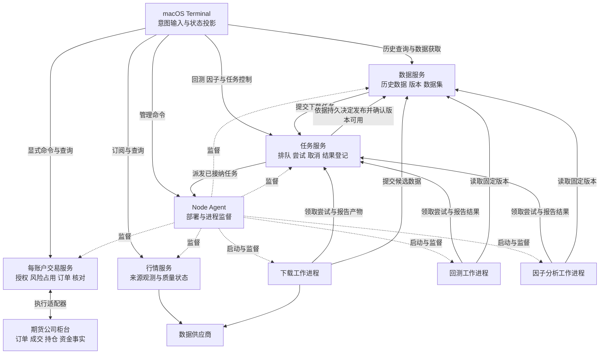
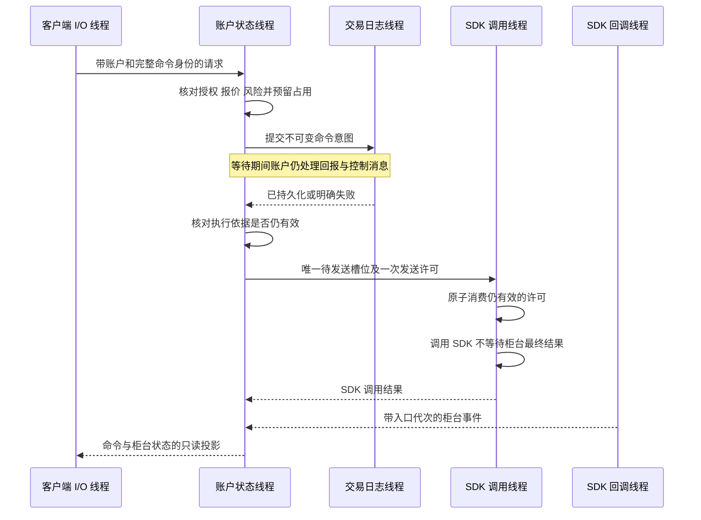

# Asterion 整体架构评估与目标设计

评估日期：2026-10-04。范围：macOS 期货 Terminal，以及为其服务的 Linux x86_64 节点。本文讨论架构目标、领域边界、状态所有权、失败语义和设计取舍，不提出实现补丁。

实施授权：2026-10-04，用户明确批准按本文完整改造。下文的“目标”“建议”和设计时未实施说明
保留其评估语境；当前实施与验证状态以 [架构改造进度](architecture-implementation.md) 为准。

**结论：需要系统性重设计若干核心领域契约，保留现有进程与技术主干。** 当前架构具备正确的安全基础，但长期账户、历史数据与计算产物、执行尝试和运行基础设施的生命周期尚未彻底分开。继续围绕现有边界增加功能，会不断把存储限制、版本变化和服务生命周期暴露成业务限制。

推荐目标是：**行情服务管理实时观测，数据服务管理历史数据与版本，回测和因子工作进程执行计算，交易服务拥有账户执行权，任务服务管理异步任务，Node Agent 管理进程。** Terminal 负责交互与观察。机制集中，算法插件化；每种长期状态只有一个明确拥有者。

## 评估基线与结论强度

本次核对的目录为 `/Users/qiwen/Code/quant/asterion-terminal`，分支为 `main`，HEAD 为 `92280bda6cefc7e755e136d89771914ac2f5e429`。工作树存在大量已合入但未提交的修改，评估对象是读取时的工作树，不是该提交的清洁快照。

已阅读现行 AGENTS、架构、行情、交易、研究、服务、插件、Terminal、开发和状态文档，交叉核对关键领域接口、进程契约与 Protobuf。旧技术审计来自同 HEAD 的另一清洁工作树；当前整改记录明确说明合并及后续验证。因此本文不把旧审计缺陷或旧测试数字当作当前事实。

文中“现有设计”指文档与契约支持的事实；“判断”指架构分析；“目标”指建议，尚未成为获批的现行契约。没有运行服务、交易、性能实验或验收测试，也不据此宣告系统已满足目标。没有修改生产代码、协议或现行架构规则。

## 优秀架构的判断标准

“世界上最优秀”不能脱离工作负载、故障预算和产品约束排名。对当前 Asterion，合理的优先级是：交易正确性、状态所有权、回测与因子结果可信度、失败可解释性、长期使用、交互质量、维护成本，然后才是规模和极端性能。

应当能具体回答：

| 目标 | 架构必须回答的问题 |
| --- | --- |
| 交易正确 | 某个真实账户由谁接纳订单？风险检查与接纳之间，哪个状态版本有效？ |
| 可解释的失败 | 超时后知道什么、不知道什么？用户怎样确认结果而不重复产生副作用？ |
| 长期使用 | 合约到期、风险变化、日志增长，是否迫使用户重建账户或资料库？ |
| 计算可信 | 使用了哪些数据与模型？这些事实在模拟时刻是否已经可知？ |
| 可恢复 | 服务恢复、柜台核对、授权恢复、任务再次执行分别保证到哪里？ |
| 可扩展 | 增加一个实际数据源或算法，是否需要修改调度状态机和账户不变量？ |
| 可操作 | 管理、行情、数据或计算任务故障是否妨碍用户撤单、查看账户和确认风险？ |

尚缺并发账户数、行情峰值与持续速率、交互延迟目标、历史数据规模、允许的恢复时间和数据损失范围。不能据此捏造毫秒指标或吞吐优势。先给结构结论；性能拓扑必须由这些目标决定。

## 目标设计的一致性复核

服务命名与进程划分明确后，仍需检查跨边界操作是否完整。此次复核修正以下六项目标契约，保留当前服务划分；这些是设计修订，不是新发现的实现缺陷或已完成的改造。

| 修正项 | 原设计还不明确的部分 | 本文采用的目标 |
| --- | --- | --- |
| 数据与任务服务的协作 | 两个独立进程之间的身份绑定、提交丢失响应与恢复责任 | 同节点显式绑定；任务服务协调执行与发布流程，数据服务拥有版本；各自先恢复本地状态 |
| 计算产物与备份 | 只写“结果引用”，未指明 worker 退出后谁保管结果字节 | 任务服务长期保管结果及固定定义；数据与任务按引用闭包共同冷备份 |
| 交易操作许可 | 报单发送条件容易被扩大成所有账户控制的共同开关 | 报单、撤单与撤销授权各有条件；停新增报单不自动禁撤单 |
| 交易报价证据 | 行情服务的显示报价是否可以直接用于账户准入 | 目标先保留账户柜台查询证据，显示报价不自动替代 |
| 下载授权与配额 | 多个 worker 的供应商凭据与合计访问限额缺少拥有者 | 数据服务拥有已提交下载的授权快照与共享请求预算 |
| 线程模型的约束强度 | 起始物理线程数量容易被当成永久不变量 | 固定状态所有权、顺序、阻塞隔离与容量边界；数量作为需要负载验证的参考布局 |

长期账户与日志分段、数据可知性、核心与插件边界、版本承诺等此前结论仍然适用。Agent 共同生命周期保留为当前产品范围内的明确选择，不能把它表述成管理故障下交易无中断；本轮不增设自动账户接管；授权与单一策略运行自 2026-10-07 起跨连接和交易日延续（用户决定，见 [交易](../trading.md)），仍不做多策略平台。

## 当前骨架值得保留

| 边界 | 评价 | 当前依据 |
| --- | --- | --- |
| Terminal 与独立服务 | 正确。界面退出不应结束安装版业务，界面不是交易事实拥有者。 | [architecture.md](../architecture.md) 30–42、57–72 行 |
| 每账户独立交易进程 | 正确。一个账户的授权、风险与订单应在同一一致性边界内；账户之间可隔离故障。 | [trading.md](../trading.md) 46–52 行 |
| 实盘与回测事实分离 | 正确。实盘财务事实来自柜台，回测账本提供估计；二者不应冒充同一种事实。 | [trading.md](../trading.md) 3–14 行 |
| 交易不确定性 | 已有持久意图、断线不重发、未知结果占用风险、长期授权（可随时撤销，发送仍核对连接代次）和成交核对。方向正确。 | [trading.md](../trading.md) 58–83 行 |
| 供应商独立数据身份 | 正确。完整交割月、来源映射、单位和时间语义属于明确契约。 | [统一历史数据契约](../market-data.md#统一历史数据契约) |
| 不可变任务输入 | 正确。数据、费用、算法摘要固定；新下载不改写旧实验。 | [数据集输入](../market-data.md#数据集输入)；[回测输入与执行](../backtest.md#输入与执行) |
| Task Service 与 Agent 分工 | 已明确。前者决定任务顺序与尝试，后者拥有进程；不能误判为两个业务调度器。 | [task.proto](../../protocol/proto/asterion/v1/task.proto) 134–147 行 |
| 可信插件 | 信任模型诚实。插件提供供应商、存储、策略及风险算法，不拥有账户提交权。 | [native-plugins.md](../native-plugins.md) 3、118–145 行 |
| 本机与远程通信 | Unix Socket 与 mTLS、类型化协议适合现有需求。换传输框架没有直接架构收益。 | [services.md](../services.md) 61–65 行 |

已有费用生效版本、主力连续按前日持仓量选择、真实月份价格执行、敞口修订固定等设计，均应纳入新目标。它们不是本次发现的缺失项。

## 目标架构与事实所有权

“研究”描述使用者分析数据、评价因子和验证策略的活动，没有足够明确的服务边界。目标架构不用“研究服务”统包这些职责，也不引入另一个含义相同的泛用计算服务。

| 构件 | 明确职责 | 状态所有权与运行形态 |
| --- | --- | --- |
| 行情服务 | 连接实时行情源，订阅报价，提供当前合约目录、行情流与当日观测 | 拥有来源连接与实时观测状态，常驻 |
| 数据服务 | 组织历史数据获取、归一化与质量校验，保存和查询历史版本与具名数据集 | 拥有历史数据目录、版本、发布状态、下载授权与供应商访问预算，常驻；耗时下载由工作进程执行 |
| 回测工作进程 | 用固定数据、策略、撮合、费用和风险配置执行一次历史模拟 | 承载回测引擎及策略、撮合和风险插件，生成回测结果，按任务启动 |
| 因子分析工作进程 | 用固定数据与计算定义生成因子，评价其统计表现 | 承载因子算法并生成评价结果，按任务启动 |
| 交易服务 | 账户登录、授权、风险检查、订单执行与柜台核对 | 每个账户独立拥有执行状态，常驻 |
| 任务服务 | 保存任务定义，排队，控制执行尝试、取消和完成，保管固定输入与计算结果 | 拥有任务状态与持久计算产物；不拥有历史数据目录，不运行回测或因子算法，常驻 |
| Node Agent | 部署程序，启动、停止、监督进程，维护节点资源状态 | 拥有程序与进程；不解释行情、任务结果或交易风险，常驻 |

行情服务回答“现在观测到什么”，数据服务回答“保存了哪些历史事实、属于哪个版本”。行情流和历史档案使用共同的合约身份与来源语义，实时观测不会自动成为已校验的历史数据版本。下载是数据服务的具体业务，任务服务只管理其异步执行。

这修正了把数据和任务装入同一个“研究”盒子的目标设计。保留 Terminal、行情、账户交易、Agent 与按需工作进程的主干；数据和任务则按两个明确的服务边界设计。每个服务仍由 Node Agent 管理独立进程。这里说明目标职责与部署形态，本次不创建进程、接口或数据转换入口。

关键不在箭头数量，在于每条箭头不能转移它不应拥有的权威。

| 状态 | 唯一拥有者 | 其他组件可以做什么 |
| --- | --- | --- |
| 柜台已确认的订单、成交、资金与持仓 | 柜台；账户服务拥有带来源和核对状态的本地投影 | 展示、核对、据此限制风险；不能用 UI 缓存宣布财务事实 |
| Asterion 命令、授权、策略控制权、待确认风险占用 | 对应账户运行时 | 提交意图、查询结果；插件不得绕过它发送 |
| 历史数据版本、来源语义、完整性证据与具名数据集 | 数据服务 | 引用不可变身份；任务和图表不能重写原版本 |
| 下载、回测和因子任务的固定定义 | 任务服务保存；相应业务定义输入语义 | 新任务固定数据及参数，运行时不能偷换输入 |
| 执行尝试、发布许可、完成决定与持久计算结果 | 任务服务 | worker 提交带尝试身份的产物，不能自封成功；数据服务依据有效发布决定公开历史版本 |
| 下载授权快照与供应商共享请求预算 | 数据服务 | 任务服务只引用非秘密授权身份；worker 取得本次尝试获准使用的凭据与额度 |
| 程序、部署配置与进程意愿 | Node Agent | Terminal 请求操作；Agent 不解释交易风险、回测或因子算法 |
| 选中项、编辑草稿、窗口布局 | Terminal | 不影响已提交命令、运行任务和服务端账户身份 |

## 服务 实例 进程与命名

本项目中的“服务”指有独立职责、状态所有权和生命周期的常驻部署单元。普通进程内功能称模块或组件，避免把业务函数、插件和部署单元都称为服务。

**一个运行中的服务实例对应一个独立进程。** 服务类型可以有多个实例；停止的实例保留身份、配置与数据，但没有运行进程；重启产生新的进程和运行代次，不产生新的业务身份。同一拥有者范围内不能同时启动两个进程修改同一账户或仓库。

下载、回测和因子工作进程各执行一次任务尝试，结束后退出，属于任务执行者。它们拥有具体业务算法和协议，不因此需要另建常驻服务。Terminal 主进程、窗口渲染进程也是进程，不能反过来推论所有进程都是业务服务。一个界面可以组合多个服务的数据，界面、模块、服务和进程不要求按数量一一对应。

**目标设计取消 `research` 作为服务、模块、协议命名空间、客户端、命令和页面的统称。** 它混合了历史数据、下载、任务控制、回测和因子分析，无法说明谁拥有状态、谁执行计算。按实际职责采用以下词汇：

| 名称 | 中文职责 | 运行归属 |
| --- | --- | --- |
| `market_data` | 实时行情、订阅与当日观测 | 行情服务 |
| `data` | 历史数据、版本、具名数据集与查询 | 数据服务 |
| `task` | 排队、执行尝试、取消、完成与结果登记 | 任务服务 |
| `download` | 从数据源取得数据并准备候选产物 | 下载工作进程；下载业务由数据服务定义 |
| `backtest` | 策略历史模拟、撮合与结算 | 回测工作进程 |
| `factor` | 因子计算与统计评价 | 因子工作进程 |
| `trading` | 账户、授权、风险与实盘执行 | 每账户交易服务 |
| `node_agent` | 程序部署与进程监督 | Node Agent |

这些是职责词汇，不要求所有代码目录或界面各自变成一个进程。现有泛化名称的目标归属如下：

| 现有名称 | 含义与目标归属 |
| --- | --- |
| `ResearchClient` | 当前同时承担历史查询、具名数据集、任务控制和结果读取；按实际服务端点拆为数据客户端与任务客户端 |
| `research.proto`、协议层 `research.hpp` | 当前混合任务生命周期与多种业务载荷；分别归入任务、数据、回测和因子契约，任务协议引用必要业务输入 |
| `commands_research.cpp`、`research.*` 命令 | 按数据操作、任务控制、回测提交与因子分析归属，分别使用相应职责名称 |
| `NamedDataset` | 表示固定数据选择，采用具名数据集 `NamedDataset` 等准确名称；它不属于某次任务 |
| `workspace.research`、“研究”页面 | 依内容称“回测与因子”或分别呈现“回测”“因子分析”；数据管理与任务管理使用各自名称，页面数量由交互需要决定 |
| 文档入口 | 已按职责整理为任务管理、回测、因子分析、行情与数据四份说明，原综合文档已移除 |

当前职责混合的证据见 [research_client.hpp](../../apps/clients/terminal/native/research_client.hpp)、[task.proto](../../protocol/proto/asterion/v1/task.proto) 和 [plugin.tsx](../../apps/clients/terminal/plugins/research/plugin.tsx)。不能把所有 `research` 统一替换为 `data` 或 `task`，否则只是将同一混合边界换名；也不引入 `analytics`、`compute` 等新的笼统上层所有者。

设计正文使用明确对象，例如“历史数据与计算产物”“回测时钟”“回测引擎”“因子评价结果”。“量化研究”可用于说明人的活动或引用资料，不承担架构身份。既有源码路径、审计原文与历史证据按事实引用；引用旧名称不代表目标保留该抽象。文档已按职责拆分，现行代码和协议标识尚未更名。文档中的实际路径与现行界面标签按当前事实保留。

## 进程部署模型

服务职责必须落实到进程、线程和状态所有权。以下是目标模型，不是当前代码的线程清单；状态所有权、执行顺序和阻塞隔离属于架构契约，线程配置是待负载验证的起始布局，具体库和执行器选择不在本次范围内。

| 进程 | 实例边界 | 生命周期与隔离理由 |
| --- | --- | --- |
| Terminal 主进程 | 每个运行中的 Terminal 应用一个 | 管窗口、原生桥接与客户端连接；安装版退出不停止业务服务 |
| Terminal 渲染进程 | 每个窗口由 Electron 管理 | 管交互和显示；页面失效不改变服务端账户或任务状态 |
| Node Agent | 每个受管理节点环境一个 | 安装版由本机系统服务管理器托管，开发期由统一入口管理；管理该环境的服务与工作进程 |
| 行情进程 | 每个行情服务实例一个 | 隔离供应商 SDK 与实时观测；没有连接时也可提供明确的未就绪状态 |
| 数据进程 | 每个数据仓库服务实例一个 | 长期持有历史版本目录，独立于某次下载或回测 |
| 任务进程 | 每个任务服务实例一个 | 长期持有任务状态与执行记录，不在进程内运行回测和因子算法 |
| 交易进程 | 每个受管理的真实账户一个 | 隔离账户的授权、风险状态、柜台连接和 SDK 故障 |
| 下载、回测、因子工作进程 | 每个正在执行的任务尝试一个 | 工作结束退出；算法崩溃、内存消耗和同步供应商调用不进入调度进程 |

默认不按合约、行情订阅、面板或 RPC 请求创建进程。Node-API、C ABI、核心库和插件均不是独立进程。Terminal 原生模块位于 Electron 主进程内，现有加载位置见 [main.cjs](../../apps/clients/terminal/electron/main.cjs) 305 行；本目标不额外增加一个原生代理进程。Electron 自己管理渲染、GPU 等辅助进程。[Electron 进程模型](https://www.electronjs.org/docs/latest/tutorial/process-model)

远程节点继续限于 Linux x86_64 的行情、数据和计算相关服务，本机账户交易不因这张图变成远程自动接管方案。多个服务实例分别拥有自己的数据范围；同名任务不能跨实例混为一个对象。

进程隔离提供局部故障边界，但同节点仍共享 CPU、内存、磁盘和 Agent。按当前存活契约，Agent 异常退出会结束受管服务，因此它仍是共同故障点；不能把“每账户独立进程”表述成节点级高可用。

## 服务依赖与业务就绪

数据与任务先采用同节点显式绑定的部署方式：可以同在本机，也可以同在一个受支持的远程节点。两者具有独立的实例身份和存储，分别受 Agent 管理；绑定不把任务记录容量变成数据仓库容量。相比允许任意跨节点组合，这避免引入当前没有需求依据的远端访问授权、带宽和独立网络分区组合。

任务输入、数据引用及发布决定绑定稳定服务实例身份；端口、地址、目录和显示名称只用于定位或展示。更换端点不改变所引用的业务身份，进程代次用于识别迟到响应。依赖失联不能自动换成本机或另一个同名实例。

| 依赖情况 | 目标行为 |
| --- | --- |
| 数据与任务服务启动 | 先分别恢复本地权威状态并提供状态查询，再建立依赖能力；不能相互等待“全部就绪”才开放本地状态 |
| 任务服务不可用，数据服务可用 | 已发布历史查询保持可用；新增下载不可接纳，尚无发布决定的候选数据不能公开 |
| 数据服务不可用，任务服务可用 | 可查询已有任务与持久计算结果；不新派发依赖该数据服务的工作。已完整取得固定输入的计算可继续，待数据发布的任务保留原决定 |
| 单个 worker 失败 | 该尝试按任务规则处理，不改变其他任务、行情或交易服务的权威状态；已经交接的数据发布不因 worker 退出而撤回 |
| 行情、数据或任务服务单独故障 | 不停止独立账户交易进程；账户仍依据自己的连接、授权、报价及核对状态裁决操作。Agent 或节点共同故障不在此保证内 |

数据服务发起下载、任务服务推进发布形成双向业务通信，但没有双重协调权：任务服务唯一决定尝试、取消与完成；数据服务唯一决定某个固定版本的准备和公开。双方不在状态锁或状态线程里等待对方执行完整业务流程。服务图中的通信箭头也不等于核心库可以形成循环依赖。

## 线程分工与唯一状态写入者

以下数字描述推荐起始布局中应用明确管理的物理线程。`P` 表示有明确容量的固定工作池，其大小由节点资源预算与实际负载确定，不随请求数增长。Chromium、V8、libuv、CTP SDK 和数据处理库自建线程另行计入资源预算，不能用下表冒充操作系统中全部线程数。

| 进程 | 应用线程配置 | 各自职责 |
| --- | --- | --- |
| Terminal 渲染进程 | 每窗口 1 条 UI 主线程 | 交互、布局和渲染；只修改页面草稿及显示投影，不运行回测或等待服务调用 |
| Terminal 主进程 | 1 条 JS 主线程；1 条原生状态与服务 I/O 线程；有界读取处理池 `P_read`；独立慢操作池 `P_admin` | JS 管窗口和 IPC 鉴权；原生线程唯一修改连接选择、代次和已发布视图，并调度非阻塞服务通信；大结果解析归读取池；SSH、钥匙串、上传和升级归慢操作池 |
| Node Agent | 1 条管理与 I/O 线程；1 条配置持久写线程；有界管理操作池 `P_agent` | 管理线程唯一修改服务登记、期望状态、进程代次和维护状态；写线程提交配置；操作池处理程序校验、文件准备及可能阻塞的进程维护 |
| 行情进程 | 1 条客户端 I/O 线程；1 条行情状态线程；1 条 SDK 调用线程；另有 SDK 自管回调线程 | I/O 传递订阅和视图；行情线程唯一修改标准化报价、序号和当日聚合；SDK 线程负责供应商调用与生命周期；回调只交付事件 |
| 数据进程 | 1 条目录状态与 I/O 线程；1 条目录持久写线程；有界读取与准备池 `P_data` | 状态线程唯一裁决数据版本和发布状态；写线程提交目录元数据；工作池处理分段读取、摘要核验、解析和准备产物 |
| 任务进程 | 1 条任务状态与 I/O 线程；1 条任务日志写线程；有界文件准备池 `P_task` | 状态线程唯一裁决队列、尝试、取消、发布和完成；写线程提交状态记录；文件池处理较大输入与结果文件，不执行算法 |
| 每账户交易进程 | 1 条客户端 I/O 线程；1 条账户状态线程；1 条交易日志写线程；1 条 SDK 调用线程；另有 SDK 自管回调线程 | I/O 接收命令和发布视图；账户线程唯一决定授权、风险占用、订单与核对状态；写线程完成持久屏障；SDK 线程执行柜台调用与生命周期 |
| 每个下载工作进程 | 1 条控制与心跳线程；1 条下载执行线程 | 控制线程处理任务通信、取消和心跳；执行线程调用数据源、限速、取得分段和准备数据产物 |
| 每个回测工作进程 | 1 条控制与心跳线程；1 条顺序模拟线程 | 控制线程负责存活与取消；模拟线程独占本次策略、模拟账户、撮合和结算状态 |
| 每个因子工作进程 | 1 条控制与心跳线程；1 条计算线程 | 控制线程负责存活与取消；计算线程拥有本次特征、标签和评价过程，生成确定顺序的结果 |

这是有意选择的起始布局：行情与账户有持续外部事件，状态线程与客户端传输分开；任务、数据目录和 Agent 的状态转换短小，可与各自非阻塞 I/O 共用一条线程。整批文件读取、文件同步、同步 SDK 调用，以及批量、耗时或含 I/O 的算法计算不得占用状态线程；账户的有界纯风险评估和行情的增量聚合属于状态转换本身，留在各自状态线程。状态表里的一个模块不因此获得一条线程，更不按任务对象各建线程。

架构必须保持的是唯一状态写入顺序、串行持久提交、阻塞调用隔离和有界接纳。四条账户应用线程保留为本方案的具体起点；它及各工作池容量需接受同机账户数、回报峰值、写盘尾延迟和撤单等待时间的验证。不能仅凭线程数称其最优，也不在没有这些证据时增加分片或并发发送槽位。

Terminal 的慢操作不能耗尽账户命令与状态读取的执行容量；JS 主线程也不能等待原生任务完成。后台完成通知返回 JS 线程后再操作 JS 对象。线程池同样需要限制单项工作量和排队容量，不能仅靠“已经异步”证明响应性。[Electron 性能指南](https://www.electronjs.org/docs/latest/tutorial/performance)；[Node.js 事件循环与工作池](https://nodejs.org/en/learn/asynchronous-work/dont-block-the-event-loop)

线程之间传递具备明确所有权的消息、只读快照或不可变数据引用。工作线程返回结果给状态拥有者，由拥有者核对身份和代次后应用。SDK 适配器可以拥有原始请求映射及连接机制，但不能另外维护一份可供风控裁决的权威账户；风险插件只计算决定，不取得账户写入权。

## 交易线程之间的提交与发送

把所有交易工作放到一条线程会使磁盘或 SDK 阻塞同时拖住状态处理；把所有工作扔进通用线程池又会失去清楚的先后关系。目标采用上述四条应用线程，各自只拥有一种责任。

选择独立日志线程，是为了让刷盘期间仍能处理柜台事件、查看状态及关闭后续发送许可。它不能保证磁盘失效时仍可撤单，因为撤单同样必须先记录。不能为保持可用性绕开持久提交要求。

SDK 调用也必须隔离：当前 CTP 请求接口没有给出最大返回时间的保证，适配器明确记录 `Release()` 可能阻塞，见 [ctp_trader.cpp](../../plugins/execution/ctp/ctp_trader.cpp) 738–739 行。不能假设它们天然非阻塞，也不能在持有账户状态锁时等待 SDK。

账户控制不能只有一个含义混杂的“交易已启用”开关。不同操作在统一账户执行路径内采用不同准入条件：

| 操作 | 许可与失败边界 |
| --- | --- |
| 报单，包括平仓委托 | 需要相应交易授权、有效连接、合约与报价证据、适用风险检查和持久提交；平仓仍是新委托，不能绕过统一执行路径 |
| 撤单 | 需要有效账户控制权限、正确账户与订单身份、可用柜台连接及撤单意图持久化；不依赖新报单授权或价格查询，停止新增报单不自动禁止撤单 |
| 撤销报单授权、暂停新增报单 | 由已鉴权的账户控制请求关闭相应报单许可；不会自动撤掉柜台已有委托，也不会关闭账户观察和有权限的撤单入口 |
| 查询与核对 | 依读取权限与可用连接进行；不能因未获报单授权而把已有账户事实隐藏掉 |

这与现行核对期间保留撤单、撤销授权能力的方向一致，[trading.md](../trading.md) 83 行。连接失效、SDK 卡住或无法持久化仍可能使撤单不可用；保留入口与控制容量不构成“任何故障下都能撤单”的保证。撤单也不自动重发。下文的报价与敞口许可专指报单，撤单使用自己的条件；正常停机可以关闭所有新的柜台调用。

**交易报价的证据由账户交易服务负责。** 目标先保留当前账户取得的柜台查询结果，完整绑定来源与账户 ID、合约、交易日、连接代次和查询完成证明。行情服务提供给图表的报价不能因为价格看起来相同就自动替代该证据，也不能把 UI 当前所选行情账户当作交易授权。

查询完成时刻与最后成交时刻分别表达；报价有效期由账户服务自己的单调时钟从成功观察完成后计量，覆盖风险评估、写盘和发送前等待。协议不把未声明共同时间基准的单调时间值直接作为跨服务有效性证明。若以后用持续行情替代逐笔查询，需要先明确来源绑定、断档与新鲜度准入，并验证负载收益；本轮不改变报价来源。

一次报单按以下顺序交接：

账户服务只保留一个正在提交的持久命令事务和一个待调用 SDK 的发送槽位，不建立一条长队列保存已经通过风险判断的订单。这个限制针对本地接纳流水，不限制柜台已有活动订单数。新请求可以在有界准入队列等待或被明确拒绝。

**报单发送许可是唯一的最终交接边界。** 许可关联持久命令、账户、连接与授权代次、政策修订、风险依据及报价期限。连接变化、可能改变敞口的 SDK 事件或已鉴权的撤销报单授权请求到达入口时，可以先关闭报单许可再交付事件；只有账户线程可以在完整处理这些事件后授予许可。

为避免用旧状态重新开门，授予和消费许可都要求账户已处理的相关入口代次与最新入口代次一致，且依据和期限仍有效。入口线程只推进失效标记并投递消息，不计算敞口、不修改账户账本，也不能授予许可。这个少量共享同步状态只负责一次交付，不是第二份账户模型。

SDK 线程成功消费许可后，该次调用进入不可撤回的发送阶段，并立即调用 SDK；其后不得再排队、等待限速或等待持久化。限速等待发生在消费许可之前。后来的撤销只阻止尚未开始的调用，不能声称撤回已开始调用；即使函数尚未返回，也必须保留发送中或未知结果及风险占用。同步调用 SDK 时不持有发送门闩或账户锁。

如果日志完成时连接、授权、政策、敞口依据或报价期限已失效，原命令不得自动重新评估后再发送；记录明确未发送的结果并结束该命令。没有取得未发送证据时保留保守占用。失败不触发自动重发。

SDK 回调无论由一个还是多个线程触发，都必须及时复制需要保留的数据，经适配器进入有界、可确定处理顺序的入口；不能在回调中更新账户、刷盘、调用 UI 或等待其他线程。同步 SDK 调用中发生的回调也只能入队，避免重入账户决策。外部事件顺序不明确时按柜台身份与核对语义处理，不能凭本机线程时间推断真实成交顺序。

柜台回报可能先于 SDK 调用结果到达，图中的两条返回箭头不构成先后保证。账户线程依照同一持久命令身份合并两者；本地超时或迟到的调用返回不能覆盖已经确认的柜台事实。

## 行情处理顺序与计算并行

行情状态线程按有序来源事件生成当前报价与当日聚合；客户端 I/O 线程发送只读投影。面向 UI 的报价可以在一个刷新周期内按合约合并为最后值，但分钟线、涨速和数据质量判断必须使用原始有序观测，不能从已经合并的显示值反推。

暂不按合约分配线程。单状态线程是清楚的起始模型；只有在实际峰值下成为已确认瓶颈，才考虑按互不共享可变状态的来源或合约分片，并重新定义跨分片观察语义。线程池自然完成顺序不能充当行情业务顺序。

单次回测也只有一个模拟状态拥有者。多个合约共享资金和风险时，行情、策略、撮合和结算依照模型规定的顺序执行；同时间戳如何排序属于固定模型语义。并行优先放在彼此独立的回测任务之间，不按合约同时修改共享模拟账户。

因子计算先使用单执行线程。确有独立计算可并行时，也必须固定输入范围、样本顺序与结果归并规则，防止训练可见性或结果依赖线程调度。数据读取、解压以及 DuckDB 等库的内部线程同样消耗节点预算，不能每个任务都默认使用全部 CPU。

## 持久化完成与任务控制

数据目录、任务和 Agent 的状态线程先决定待提交变更，将不可变写入请求交给各自串行写线程；收到持久完成后才确认成功或启动依赖它的动作。同一对象最多一个待落盘变更，后续冲突命令等待其裁决；不能在同一旧状态上并发决定两个终态。

等待磁盘时，状态线程继续处理存活观测、查询和其他对象的请求。接收取消请求与确认取消已经持久生效是不同阶段，界面必须区分。大文件读取、摘要和准备不占用短状态日志的写线程，避免一次大结果拖住全部取消记录。

下载的“发布中”阶段仍由任务服务作持久裁决。进入该阶段后，继续发布的责任转交任务服务与数据服务，下载工作进程停止心跳不能再把任务改成中断。服务恢复只能依据原发布决定继续或查询同一版本，不能重新下载、换输入或重跑算法。只有版本可查询后才确认成功。幂等目录发布的恢复不构成交易命令自动重试。

回测和因子工作进程的控制线程可在计算期间续租、收取取消并报告最后进度；它不能修改模拟账户或因子状态，也不能把自己仍在发心跳等同于计算仍在推进。执行线程在定义好的取消点停止；插件若不返回，不能通过强制结束某一线程安全回收其对象，只能按进程失败处理。

## 队列容量 资源预算与健康

| 消息类别 | 队列满载时的语义 |
| --- | --- |
| 尚未接纳的新请求 | 明确返回容量不足；不创建无界等待和线程，也不代替用户重发交易命令 |
| 已接纳的交易命令与柜台回报 | 不静默丢弃、不按最新值覆盖。无法接纳关键回报时关闭报单许可，进入需要核对的状态；撤单仍按其独立条件裁决 |
| 原始行情事件 | 无法完整保留时标记断档和派生数据不完整；不补造、不继续宣称完整观测 |
| UI 行情与进度投影 | 可在各自身份和代次内合并，慢客户端不能拖住事实处理 |
| 取消 授权撤销 关闭许可 | 保留接纳与处理容量，可优先于尚未接纳的新工作；不能倒置已经确定的业务提交顺序 |
| 数据准备与结果文件 | 队列同时限制条目数和保留字节数，大数据排不可变引用，准备文件与待发布操作另有容量上限 |

各服务和工作进程使用静态、可核对的资源预算。Agent 负责节点 CPU、内存、磁盘工作量与进程准入，任务服务决定自己额度内的任务顺序；资源不足时保持排队或明确拒绝，Agent 不另选业务任务。并行计算总量要包含工作进程、数据读取校验池和依赖库内部线程，不能把每个池都设置成机器核数，也不能仅靠提高线程优先级保证交易响应。

供应商访问配额属于数据业务。数据服务按供应商实际配额范围汇总同一授权或连接下的下载预算，worker 执行分配到的额度，不能每个 worker 各自使用全部上限。初期使用固定并发与额度分配即可，不设通用限流服务。保证范围是该数据实例管理的下载；多个数据实例共用账号时须显式分配各自份额。其他软件使用同一账号造成的额度竞争按来源错误处理，不能承诺控制外部调用。

健康状态至少分别表达进程存活、传输可用、状态线程最近推进、持久化进展及业务就绪。独立心跳只报告这些观察，不替状态线程刷新进展时间；市场没有新报价也不能被当作线程卡死，状态线程需要用自己的轻量调度活动证明仍可推进。界面可读到旧快照时必须标明旧，不可因 I/O 线程仍能应答而宣称账户可交易。

## 线程与进程退出模型

每个进程有一个生命周期协调者，拥有线程、工作池、停止令牌和插件实例。正常停止先关闭新请求、派发及发送许可，保持必要的回报、持久完成和状态查询通道，再停止生产者并收齐回调，处理已接受提交，最后停止消费者、关闭存储和卸载插件。生产者尚可能回调时不能销毁它引用的对象；不以脱离管理的线程绕过退出责任。

交易进程由 SDK 调用线程负责断开与释放 SDK，账户线程在回调停止前仍处理事件；日志线程保持到需要保存的状态完成。SDK 释放卡住时，监督者可以在明确期限后结束整个进程，但已发送而未确认的委托仍按未知结果核对，不能把进程退出解释为撤单成功。

停止一组数据与计算服务时，先让任务服务停止新派发，结束或中断执行中的工作进程，保留数据与任务服务以完成已经确定的发布步骤或保存其未完成状态，再停止这些服务。不能先关数据服务，留下仍在读写的工作进程。Agent 最后退出。

安装版关闭窗口仅终止客户端活动；开发入口退出按现行规则停止所属本机服务与 Agent，保留数据，远程节点不受影响。崩溃恢复以持久记录为准，不依赖正常退出必然执行；线程故障、用户取消、服务停止和任务成功必须分别记录。

## 并发模型的设计验收

上述模型至少应能推演并解释这些场景：写盘很慢时账户仍可观察且不会提前发送；写盘期间撤销授权后旧命令不会获得新许可；柜台回调先进入但尚未应用时不能用旧状态开门；已消费发送许可后撤销明确保留发送中结果；慢 UI 不阻塞行情聚合；任务取消与结果发布有唯一顺序；算法不返回时心跳不会伪装计算健康；SDK 释放未结束时对象不会提前销毁。

这些是需要验证的目标，不是本次已通过的测试。线程数量之外，还必须通过上述交接点、最大排队量、共享资源与停止次序判断架构是否成立。

## 交易账户必须拥有独立于记录文件的生命周期

**现有设计：** 账户开通时把柜台、合约名单、风险配置与算法摘要固定在交易记录头部；封存续用仍原样保留。公开契约没有长期账户的政策修订与合约授权集合变更操作。[trading.md](../trading.md) 48、68–74 行；[trading.proto](../../protocol/proto/asterion/v1/trading.proto) 25–56 行。

**判断：** 对期货，合约到期与新月份加入是正常领域生命周期。把可交易合约、风险政策和长期账户绑定到第一份记录，使未来日常业务只能围绕记录创建或续用来表达。日志分段不应成为账户模型。

**目标：** 明确区分以下概念，仍由同一个账户服务拥有：

| 概念 | 生命周期与职责 |
| --- | --- |
| 账户记录身份 | 使用 Terminal 创建账户时分配的稳定 ID，关联配置、交易服务和账本；重命名不改变 ID。同一 ID 在本机用户范围内仅有一个执行拥有者；不保证自动识别不同 ID 是否对应同一外部资金账户 |
| 连接代次 | 一次认证、登录与柜台同步的上下文；失效后旧命令不能作用于新连接 |
| 政策修订 | 合约授权、风险参数、算法身份与生效条件；变更可审计，历史命令引用当时版本 |
| 授权 | 针对账户、连接、交易日及操作范围的许可；不从日志恢复为已授权 |
| 日志分段 | 容量、恢复和保留的物理边界；不能重置账户身份、未知风险或历史证据 |

政策变更不能覆盖历史，也不能用作旧格式转换入口。仍有未确认委托或存量持仓时，变更需要明确的生效条件；收紧政策不会自动使已有风险消失。日志增长则由存储边界处理。相比继续增加“重开”“续用”“新记录”的业务特殊情况，这个模型更少混淆。

还必须限定单一执行拥有者的保证范围。当前文档明确承认开发与安装环境仍可能操作同一柜台账户，[development.md](../development.md) 84 行。一个目录独占、一个配置一个进程，不足以证明真实账户独占。

目标应在当前支持的本机控制范围内阻止同一真实账户因别名而出现多个风险拥有者，并明确外部客户端交易的核对规则。本机无法约束别的软件或另一台机器；若外部交易持续发生，本地只能基于已经观察并核对的柜台事实控制风险，不能承诺全账户强一致限额。当前没有必要引入跨节点选主。今后若要求接管，必须先证明旧执行者不能继续发单，单凭心跳超时不足以成立。

## 账户内集中执行权 保留外部事实的不确定性

推荐账户服务内部内聚订单编排、授权、风险占用与命令持久化；这些是逻辑职责，不拆成 OMS、Risk、Account 三个网络服务。

账户内的风险判断与命令接纳必须依据一致状态并形成明确顺序；账户之间可并行。风险计算的算法留在插件，风险状态与最终决定归账户。同步有序的业务决策可以简化并发推理，但不意味着整个应用只有一个线程，更不意味着所有 I/O 都在该顺序里阻塞。LMAX 的经验支持这种职责分离；它的工作负载和性能数字不适用于给 Asterion 作性能承诺。[LMAX 架构经验](https://martinfowler.com/articles/lmax.html)

命令与事实至少分清：用户表达意图、服务接纳并持久记录、已尝试发送、柜台确认、最终订单状态、当前是否已核对。网络结果和订单状态是不同维度，不能压成一个成功或失败。

例如撤单响应丢失后，仍可能成交；这既不是自动重试的理由，也不应把已有风险删掉。FIX 的订单状态规范同样明确区分撤单待处理与撤单完成，并覆盖撤单期间继续成交的情况；这里只借鉴语义，不要求改用 FIX 或假设 CTP 支持全部 FIX 行为。[FIX 订单状态规范](https://www.fixtrading.org/wp-content/uploads/download-manager-files/Order-State-Changes.pdf)

本地记录与外部柜台不存在共同原子提交点。合理保证是：同一完整命令身份不会因用户重试或恢复而再次发送；同身份不同内容明确冲突；不能确定的结果保留并核对。完整身份由账户与明确的去重作用域限定，不能只看裸请求编号；日志换段不能把迟到的旧命令变成新命令。不能承诺端到端恰好一次成交。幂等请求标识和冲突语义可参考 AWS 的服务经验，但 Asterion 仍维持断线不重发的交易约束。[幂等 API 的设计](https://aws.amazon.com/builders-library/making-retries-safe-with-idempotent-APIs/)

人工与策略最终都应进入这条账户路径。策略产生目标或意图，不能获得柜台发送权、持有另一份权威风险额度，或绕过授权。第一版实盘策略宜明确单一控制者或互斥控制范围；不预建多策略资金分配平台。停止策略、禁止新增风险、撤销授权、请求撤单、平仓必须各有语义。停止进程不会自动撤销柜台订单。第一版实盘策略按此实现：单一运行独占账户，控制权随授权结束，授权与运行跨连接和交易日延续，见 [交易](../trading.md) 的“策略运行”。

## 历史数据 任务定义 执行尝试需要不同生命周期

**现有设计：** 历史版本已经独立于下载任务 ID，具名数据集引用固定版本；但一个任务库达到 1,000 个记录后的正式路径，是新建独立服务与任务库，重新取得自己的数据。数据资产仍随着任务库边界被分开。[独立历史仓库](../market-data.md#独立历史仓库)；[容量与继续使用](../tasks.md#容量与继续使用)。

**判断：** 长期历史数据与短期执行记录生命周期不一致。第 1,001 次回测不应该让用户面对一个空数据仓库。修改容量常数不能解决这个所有权问题。

**目标：**

- 数据服务保存不可变历史版本、来源、语义与数据集引用，生命周期独立于任务记录分段。
- 任务定义固定具体工作内容；回测任务包含数据版本、策略参数、费用、撮合与时间假设，因子任务包含数据版本与计算评价参数。
- 执行尝试保存这一次运行的状态、进度、授权引用、产物与失败原因；一个任务可有多个尝试。

数据服务和任务服务分别拥有历史资产和执行记录。任务服务通过数据版本身份引用输入，回测和因子工作进程从数据服务取得所需版本；Terminal 不转运整批数据，也不充当二者的业务协调者。数据位置由数据服务解析，物理路径不作为数据身份；这能减少当前“同一绝对路径恢复”的架构耦合，但本次不开放目录搬移或修改现有数据。既不要求多用户云资料平台，也不要求全局跨节点依赖索引。[任务备份与恢复](../tasks.md#备份与恢复)。

任务服务是任务状态的唯一裁决者，attempt token 约束有效 worker，取消与完成在同一权威边界决定。取消先被接受后，该尝试不再允许提交成功结果；已经提交成功的结果也不能被迟到取消改写。供应商调用是否立即中止、已完成分段如何保存，属于数据业务的明确语义。重试产生新尝试，不伪装为原尝试从未失败。

数据服务是历史版本的唯一发布者。下载产物先经数据服务校验并持久准备；任务服务确认尝试有效后，持久进入“发布中”并固定发布决定，数据服务据此公开对应版本。只有数据服务确认版本已可查询，任务才标记完成。取消与进入发布阶段由任务服务排序：取消先被接受则不允许发布；已进入发布阶段则明确返回取消已来不及，不能再把尝试标成已取消。发布期间故障不冒充成功，可根据既有决定继续发布同一版本，不重新下载。这是明确的跨服务发布过程，不是原子事务；它是分开数据与任务服务所需承担的成本。回测与因子结果由任务服务登记其持久引用，不占用历史行情目录。

跨服务操作还需固定完整身份。下载提交身份限定于原数据服务实例，同一身份与同一内容重复确认得到同一任务，内容不同则冲突；任务已接纳但响应丢失不能生成第二个下载任务。数据服务保存必要的提交关联，不另复制一份可自行裁决的任务状态。发布决定绑定原任务服务与数据服务实例、任务、尝试、候选产物摘要和发布身份；数据服务确认已准备时即承担候选产物的持久保管责任。任务服务负责推进原发布决定及查询结果，不依赖 Terminal 或原 worker 继续存活。这种已知幂等操作的确认与恢复不能推广为交易命令自动重发。

由 Terminal 协调准备、执行与发布会使后台工作依赖窗口存活；增加通用工作流服务又会产生第二套任务状态。因此采用现有任务服务作唯一流程协调者、数据服务作版本拥有者，不增加组件。

## 结果保管 保留与一致备份

“保存结果引用”不足以定义生命周期。任务服务通过自己的存储后端长期保管回测与因子的固定定义、结果字节、摘要、执行语义身份和需要保留的算法副本。worker 只持有执行中的暂存产物；必须完成向任务服务的持久交接，任务才能宣布成功并释放对工作进程目录的依赖。大产物交接由有界文件工作池处理，状态线程只裁决，原始历史版本继续由数据服务保管。

任务日志分段和活动列表容量不删除已完成结果、固定输入与数据引用，也不迫使用户新建历史仓库。物理容量不足时拒绝新增工作并保留已有证据，按明确的备份与容量管理流程处理。本目标不提供隐式淘汰、自动物理删除或“找不到就重新下载”的恢复；不需要为此先建立通用产物服务或全局垃圾回收系统。

数据与任务分为两个进程后，冷备份仍必须覆盖它们之间的引用。先冻结新增下载与任务派发、结束或明确中断 worker，完成或持久保留已决定的发布，再停止相关写入。备份集记录双方稳定身份，包含历史版本与候选产物、任务定义和结果、未完成发布决定、必要插件资料及授权引用；确需保留的供应商令牌按独立秘密材料保护。某份任务备份缺少其依赖数据时只能报告不完整，不能把另一实例的同名资料或一次新下载当作原输入。

初期选择同一受管节点上的明确冷备份集。分别在线备份再尝试拼接会引入当前没有需求依据的一致快照协议，不作为默认方案。这里确定目标备份范围，不执行备份、数据转换或清理。

## 调度服务不应承担完整算法再执行

**现有设计：** 完成复核和首次读取结果会在任务服务中重新运行对应引擎，再比较结果。文档已说明此行为，关键调用也证实执行发生在任务存储层。[恢复与结果校验](../tasks.md#恢复与结果校验)；[task_store.cpp](../../apps/services/task-service/task_store.cpp) 221–224 行。

**判断：** 算法成本和插件故障重新进入调度进程，削弱了独立 worker 的意义。一次运行再由同一算法重跑，能发现部分结果不一致，但不能独立证明算法正确；读取已保存证据也不应天然等同于再次运行实验。

**目标：** 控制层验收身份、有效尝试、输入和产物摘要、发布原子性及必要领域不变量。要求完整语义复现时，由独立工作进程执行，作为有状态、有成本、有结果的复算任务。若产品要求每次成功都必须复算，可将隔离复核设为完成的必要阶段，失败就不发布成功；不能把这笔执行成本藏进普通结果查询。

这不是建议取消结果校验。首先明确要防范文件损坏、错误关联、错误 worker、算法错误中的哪一种，再选择对应证据；同一次机制不应声称证明所有问题。

## 数据固定与历史可知性需要分别定义

当前已有事件标签、交易日、来源、规范化语义、固定内容摘要，以及按交易日生效的费用表。当前契约没有统一表达数据修订何时可以被策略获知的时间轴。依据见 [统一历史数据契约](../market-data.md#统一历史数据契约)与[独立历史仓库](../market-data.md#独立历史仓库)和 [data.proto](../../protocol/proto/asterion/v1/data.proto) 5–21 行。

**可以复算相同字节，不代表模拟交易当时已经能获得这些字节。** 例如事后修订的历史值、收盘后发布的结算信息、生效但尚未获知的参考资料，需要不同于行情发生时间的语义。Qlib 的 PIT 文档说明了数据版本与历史可知时刻之间的区别；其具体财报存储模型无需引入 Asterion。[Qlib 时点数据文档](https://qlib.readthedocs.io/en/latest/advanced/PIT.html)

目标应区分行情发生或标签时间、交易日、来源公布或可知时间、系统取得版本的时间。系统下载时间不能冒充历史公布时间。供应商不能证明可知时刻时标记未知，并明确回测或因子评价能作何种结论：事后统计分析仍然有价值，但不能声称已验证严格历史可交易性。

回测时钟必须规定策略在每一步可观察的事实；因子评价中的信号数据与未来收益标签隔离，训练得到的参数只能由允许的训练区间产生。合约规格、交易时段、费率、连续序列规则也属于实验语义证据。当前主力连续已使用前日持仓量，真实月份承担交易和结算；不能据缺少统一 PIT 契约就断言当前 SMA 已发生前视偏差。[回测](../backtest.md)；[因子分析](../factors.md)。

策略和因子扩展同样应在这一边界内发生。现在的回测和因子协议直接描述 SMA 与动量模型，适合少量固定算法；如果目标是持续扩展策略与因子的终端，就需要稳定的任务执行契约与算法契约分工。先闭合实际算法的状态、时钟、取消和提交语义，再增加第二个真实算法。不要预设任意语言、任意图计算和热替换体系。

## 核心与插件应按不变量和可变策略分工

保留当前 Foundation、Kernel、Domain 的层序与向下依赖约束。优秀设计不由层数决定，而由每层需要理解的概念决定。

Domain 应表达合约与账户身份、金融量纲、状态关系和业务不变量；Kernel 提供装载、持久发布、通信及生命周期机制；供应商规则转换、撮合估计、风险算法与策略归插件；服务组合机制、领域和插件。Domain 不应因一个风险求值接口而被迫理解网络连接、服务进程或安装流程。

当前业务端口继承 Kernel 的插件生命周期契约，是一个值得收窄的概念耦合。目标上，“如何评估风险”和“谁装载、启动、释放这个插件”属于不同职责；无需为了分开它们改变进程拓扑。另一种可行设计是让纯领域与运行内核并列依赖 Foundation，但这会调整现行 AGENTS 的层序，不作为本次默认结论或获批变更。优先在既有约束内消除语义耦合。`strategy_port.hpp`（已删除）6–11 行；[risk_port.hpp](../../core/include/asterion/domain/risk_port.hpp) 46–55 行。

授权检查、风险占用、持久提交与未知结果处理不能被插件替换掉。相反，也不应把具体风险阈值和供应商算法写成通用核心规则。动态加载不是架构优秀的必要条件；静态插件只要边界正确，同样符合职责分工。当前可信进程内插件拥有宿主权限，内容摘要只能证明字节身份，不能提供沙箱隔离或来源信誉。[native-plugins.md](../native-plugins.md) 3、27、109、124–132 行。

金额和价格保持精确类型；数量、价格、货币、乘数与舍入规则在领域边界明确，因子统计与结果评价可以采用适当浮点模型。不能让存储字段精度、画图需要或统计库反过来定义权威金融语义。

## Agent 存活与业务存活是需要明示的取舍

当前 Agent 异常退出会让受管进程一起退出；交易密码和授权只在内存，服务重启后要重新连接并授权。原有柜台订单并不因此撤销。[services.md](../services.md) 5–10、55 行；[trading.md](../trading.md) 50–52 行。

| 方案 | 得益 | 代价与适用范围 |
| --- | --- | --- |
| 保留当前共同生命周期 | 所有权简单，无接管和遗留进程状态；人工恢复规则清楚 | 管理故障会同时中断监控和撤单连接。可用于明确接受人工恢复的当前产品，不能称为交易高可用 |
| 业务服务独立生存，Agent 可重附着 | 管理进程重启不必变成业务中断 | 必须证明稳定服务身份、重附着与双启动拒绝；无法证明旧实例退出时不得另起实例 |

当前只有单一策略运行（可跨日，但服务重启后不恢复），也没有开放远程交易部署，不能仅凭“世界级”选择第二种。建议先把“Agent 重启是否允许中断已登录交易账户”写成明确产品目标。若不能中断，再采用稳定服务所有权；Agent 仍负责管理，不需要跨节点共识或自动账户接管。

若采用独立生存，业务许可仍由账户的连接、交易日、授权和风险决定，不另造一个 Agent 心跳风险状态。服务自身仍须保证唯一拥有者。OS 进程管理器可以参与保活，但不能替代这套所有权证明。

密码与授权都不持久化是现行安全选择，因此进程崩溃后的交易恢复包含人工步骤（连接、授权、重新启动策略）；SDK 自动重连不需要人工步骤。自动重启进程不能等同于恢复可交易状态。需要把进程恢复时间、状态恢复时间、核对完成时间和人工重新授权分别说明。

## Terminal 安全和运行质量需要可观察的契约

Terminal 保留每服务、每账户的观察投影。一个汇总快照是不同来源、不同时刻的观察组合，不是全系统原子状态。服务身份、进程代次、修订与新鲜度应构成明确语义；当前行情已有相应连续性检查，值得保留并一致表达。[architecture.md](../architecture.md) 68–72 行；[CTP 实时行情](../market-data.md#ctp-实时行情)。

进程在线、业务就绪、行情新鲜、账户已核对、交易已授权分别显示。UI 选中项不能隐式决定命令归属；命令显式携带目标身份和必要前置条件，服务重新作权威判断。界面可以丢弃过时的显示更新，不能把它当作丢弃交易事实或重发命令的许可。

架构应区分三个流量路径：可以合并中间显示值的行情投影；需要保留顺序与结果的账户命令和回报；可排队并明确取消的下载、回测和因子任务。三者不应争用同一个无差别容量。批量任务满载时交易观察与控制仍须具备约定的资源预算；优先级不能弥补已经饱和的共享瓶颈。

当前每笔委托查询报价约增加一秒，UI 总快照每 0.5–2 秒刷新，这是文档明确的现状。若产品要求快速策略执行或更即时的交互，就需要重新设计带来源与新鲜度证据的报价准入和账户通知；若没有这个目标，不能为了数字漂亮引入全系统流式总线。[trading.md](../trading.md) 60 行；[architecture.md](../architecture.md) 70 行。

凭据也是独立生命周期。当前下载任务保留提交时的供应商令牌副本，包括失败、取消和完成任务，不按状态或时间自动清理。[下载凭据](../market-data.md#下载凭据)；[任务备份与恢复](../tasks.md#备份与恢复)。目标应分开非交互执行确实需要的凭据保管、任务定义、以及执行时使用哪个授权身份的审计记录。运行中的尝试固定自己的授权引用和凭据快照，不得静默换令牌；更换令牌需要明确的新授权记录与新尝试。更换供应商账号可能改变权限或数据视野，应作为新的取得操作。授权失效可以阻止后续访问，但已取得数据和完成产物的身份不依赖秘密材料。秘密保留应依据继续执行需要，数据来源与任务执行证据只需长期保留相应授权元数据；具体保留政策仍须定义。本次不删除或改写凭据。

目标由数据服务保管已提交下载所需的供应商令牌快照、授权绑定和相应请求预算；任务服务只保存非秘密授权引用与尝试身份。下载 worker 经获准的尝试取得固定凭据和额度，不重读 Terminal 的当前默认设置。Terminal 保存的默认配置与数据服务保管的某次已提交授权具有不同生命周期。交易密码仍仅在连接所需内存中存在，不纳入此持久令牌设计。把供应商凭据交给任务服务会重新混合业务职责，另设凭据服务则超出当前需要。

节点身份同样需要覆盖到期、设备丢失和密钥泄露。当前证书生成有一年有效期且不保留 CA 私钥，注释要求重新注册才能再签发；长期业务数据与身份重建的关系因此必须明确。[node_identity.cpp](../../apps/clients/terminal/native/node_identity.cpp) 24–25、71–86 行。可以采用管理员显式重新注册的简单设计，不需要企业 IAM 或在线 CA；身份更新不应自动删除账本，也不能被假装为无需停机的功能。

## 版本承诺与历史结果的读取和复算必须一致

当前规则要求只保留当前实现、拒绝不支持的格式与引擎；同时结果读取依赖匹配的回测或因子引擎。这意味着合理承诺是“在受支持格式和匹配执行语义内可复现”，不能直接升级为“所有历史实验永久可读、永久可运行”。保留原文件不等于保留运行能力。[恢复与结果校验](../tasks.md#恢复与结果校验)；[回测输入与执行](../backtest.md#输入与执行)。

目标应分开三种能力：保留证据、读取受支持的回测和因子产物、再次执行任务。某一项不可用时明确说明原因，不把无法重跑等同于原产物不存在，也不让最新引擎重新解释旧结果。

本次遵守单一当前实现的约束，不建议旧引擎执行器、兼容别名、自动转换或降级入口。若永久跨版本再现被确立为硬需求，就需要先显式解决它与当前版本政策的冲突，不能靠架构措辞同时承诺两者。既有固定插件副本在当前支持契约内的使用，也不等于支持所有旧运行时。

## 整体方案比较

| 方案 | 结构与代价 | 结论 |
| --- | --- | --- |
| 保留所有现有领域边界继续加功能 | 初期改动少，但账户、日志、资料库和任务生命周期继续耦合 | 适合固定且有限的小工具，不适合作为长期目标 |
| 保留进程主干，重划领域与所有权 | 账户内聚，资料与任务分离，执行留在 worker，补足时间和版本契约 | **推荐。解决实际结构问题，新增概念均有明确拥有者** |
| 拆成订单、风险、账户、数据目录等大量微服务 | 提供独立部署，同时将账户风险和订单接纳变成跨服务协议 | 当前没有收益证据，显著增加分区、延迟和状态组合 |
| 全部并回桌面单进程 | 调用简单，但丢失界面退出后业务存续和供应商故障隔离 | 不满足当前明确需求 |

没有必要为了此次目标引入统一 Kafka 式总线、全局事件溯源、跨节点自动交易接管、多租户权限平台、每插件独立进程、热替换或新客户端。事件记录应服务于命令证据、任务转移和可恢复状态；图表与设置不必使用相同机制。

## 架构应通过的具体推演

这些是设计验收问题，不是本次已运行的测试，也不是要求先建设庞大测试平台。

| 场景 | 目标设计应给出的答案 |
| --- | --- |
| 同一真实账户保存了两个别名 | 不能产生两份独立的交易权限和风险额度；保证范围及外部客户端限制明确 |
| 九月合约到期，需要交易十月合约 | 通过可审计的政策与授权变化表达，不重建真实账户，不改写旧交易证据 |
| 报单已发送但响应丢失，服务随后重启 | 保留未知结果，查询和核对，风险继续保守计入，不自动重发 |
| 撤单途中有新成交 | 成交事实与撤单请求分别处理，不把请求受理当作订单消失 |
| 回测或因子工作进程已被取消，却迟到提交成功 | 任务服务依据有效尝试和最终提交规则裁决，旧执行者不能覆盖当前结果 |
| 运行第 1,001 次实验 | 仍在原数据仓库引用原数据，执行记录容量不迫使重新下载 |
| 读取去年已保存的结果 | 能明确区分产物校验与重新执行；不隐式运行算法或切换模型 |
| 供应商修订了历史数据 | 旧任务引用不变；新任务显式选择新版本；可知时刻未知时不承诺 PIT |
| Agent 崩溃且柜台仍有订单 | 清楚说明服务是否存活、监控与撤单是否可用、人工恢复步骤及剩余风险 |
| 数据源授权撤销或节点证书到期 | 不再执行未授权访问；原任务证据与业务数据保留；恢复身份有明确责任人 |
| 日志容量、磁盘或计算容量不足 | 关键持久记录不能成功时明确拒绝相关新增动作；不会把失败伪装成完成或静默删除证据 |
| 新增一个实际策略 | 算法扩展不改变任务状态机和账户风险拥有者，策略不能得到绕过执行链的权限 |

对订单未知结果、授权失效和任务取消与完成竞争，可以用小型状态机及模型检查检验不变量；这只能证明所建模型的性质，不能代替真实柜台语义、硬件故障和产品工作负载的验证。不需要先形式化整个系统。

## 设计决策的优先顺序

第一，确定稳定账户记录身份、单一执行拥有者、政策修订和命令不确定性的契约。这决定交易系统能否长期成立。

第二，确定数据服务、任务服务以及回测和因子工作进程的职责，明确历史数据、任务定义与执行尝试的所有权，以及结果登记、数据发布与重新计算的区别。这决定数据和分析成果能否积累，而非受任务库容量和执行引擎生命周期驱动。

第三，确定数据可知性、算法运行语义和版本承诺。这决定回测与因子评价结论的含义，以及它们能否被合理用于后续交易。

第四，为 Agent 故障、报价与交互延迟、身份更新和人工恢复设定明确产品目标，再决定是否改变运行拓扑。缺少目标时保留简单方案，不凭“世界级”扩大系统。

最后，将上述决定固化成一份职责图、状态所有权表、少量关键状态机和有取舍理由的架构决策记录。每增加一个概念，都必须减少某项现存歧义，而不是为了让架构图更完整。

本次交付是设计评估及目标提案。架构事实已通过当前文档与关键契约交叉核对；目标的可用性、吞吐、交互体验、真实柜台行为与跨版本可复现能力尚未验证。生产实现、协议、数据与运行环境均未因此改变。
