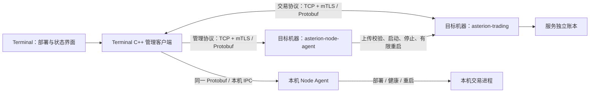

# 默认本机与远程服务管理

Terminal 默认使用本机部署：随桌面包提供 Node Agent，初始化时自动连接 Agent 并部署、启动行情服务，交易会话创建后由 Agent 自动启动交易程序，不要求用户配置地址或证书。跨机器部署统一采用 **Terminal 通过 SSH 安装 Node Agent，后续通过 TCP/mTLS 上传程序、部署和管理服务**，不保留手动安装产品入口。这不是把远程机器当作 Terminal 的普通子进程。

## 进程与职责



- `apps/services/node-agent/`：Node Agent 产品入口，CLI11 参数、部署用例、服务目录、进程监督与状态路由。
- `apps/clients/terminal/native/node_client.*`：管理协议客户端、分块上传、后台节点心跳；`trading_client.*`：交易连接保活和只读重连，不创建或重启交易进程。`local_node.*` / `node_service.*` 负责本机 Agent 引导与 OS 用户服务注册。
- `apps/clients/terminal/src/settings/`：当前产品的部署与状态界面。这是宿主设置，不作为共享 UI 插件。
- `protocol/proto/asterion/v1/node.proto`：状态、上传、发布、部署、启动/停止/重启及业务健康契约；交易协议中的 Health 表示业务就绪状态。
- `core/kernel/ipc` 与 `core/kernel/process`：通用 TCP/TLS、进程所有权、父进程存活检查、SHA-256 和原生程序平台识别。Core 不识别交易服务配置，不执行远程 shell。

当前可部署的业务程序是模拟交易 `asterion-trading` 和行情 `asterion-market-data`。策略和研究独立进程尚未实现，不生成空服务来显示“正常”。实盘模式继续拒绝启动。

## 默认本机 Agent

首次设置和每次打开 Terminal 时，启动流程通过私有本机 IPC 连接 Agent；不存在时安装当前用户的常驻任务。macOS 使用 launchd LaunchAgent，Linux 使用 systemd 用户服务，Windows 使用当前用户的计划任务。Agent 程序复制到独立用户数据目录，不依赖 DMG 持续挂载；交易程序通过同一上传/校验/部署协议发布。

启动顺序是 Core 检查 → Agent → 本机行情服务 → 连接验证 → 工作台。任一步失败均停留在启动页并支持重试，已部署服务不重复创建。行情进程自动启动不代表自动登录 CTP，密码仍仅在用户连接时输入。模拟交易以账本会话为单位创建进程，不提前创建空账户或执行回放。

Agent 持久化各服务的运行意图：已部署且设为运行的行情、模拟交易服务随 Agent 恢复，关闭 Terminal 不停止它们；崩溃或持续无响应会有限重启。用户显式停止的交易服务保持停止，直到再次启动或打开对应会话。本机行情是 Terminal 启动的必要服务，每次进入工作台时确保启动。远程机器仍需显式部署，部署后的服务同样由远程 Agent 托管，不因打开 Terminal 自动安装远程服务。

这是一套**用户会话级服务**：关闭 Terminal 不停止 Agent，用户注销后继续运行不作保证。Linux 需要可用的 systemd 用户管理器；Windows 使用 InteractiveToken 计划任务，因此不保存账户密码、不要求管理员身份。Windows 的失败重启依据 [Task Scheduler RestartOnFailure](https://learn.microsoft.com/en-us/windows/win32/taskschd/taskschedulerschema-restartonfailure-settingstype-element)，不是已经实现的 SCM 服务。安装或配置冲突时明确失败，不退回 Terminal 直接管理交易进程。

Agent 地址随机标识持久保存在私有数据目录，跨进程引导使用文件锁；Unix socket 目录为 0700、socket 0600，Windows 命名管道使用当前用户 ACL。本机不需要用户配置 TLS 证书；远端仍强制 TCP/mTLS，两者共用 Node Protobuf 契约。本机账本沿用用户选择的目录，Agent 确保一个目录只有一个受管实例；远端不接受客户端指定账本路径。

`ASTERION_NODE_DIRECTORY` 是显式开发/测试隔离入口：使用独立 Agent 进程，不注册登录服务；测试包装器退出后清理自己启动的 Agent。`ASTERION_NODE_AGENT_EXECUTABLE` 和 `ASTERION_TRADING_EXECUTABLE` 可指定测试产物。不是生产降级路径。

本机 Agent 二进制变化时要求显式升级，不自动覆盖已安装服务；当前尚无在线升级界面。远端 SSH 系统服务安装与本机用户服务是不同引导场景，见下文。

## SSH 安装远端 Agent

在“设置 → 连接 → 通过 SSH 添加机器”配置机器名称、SSH 地址/端口、用户名、认证方式、已核验的 known_hosts 文件和管理端口，保存后点击“通过 SSH 安装并连接”。只提供这一安装入口。

1. 使用所在系统的 OpenSSH 客户端和 SFTP。Unix 位置为 `/usr/bin/ssh`、`/usr/bin/sftp`；Windows 使用系统 OpenSSH 目录。缺失时安装失败，不隐式下载安装工具。
2. 使用 `StrictHostKeyChecking=yes`、指定的 known_hosts、`BatchMode=yes`、禁用代理转发及隐式 SSH 配置；未知或变化的主机身份拒绝连接。known_hosts 必须经可信渠道核验，不把未经确认的 keyscan 结果自动加入信任。依据 [OpenSSH 配置契约](https://man.openbsd.org/ssh_config)。
3. 默认在 Terminal 本机生成 Ed25519 登录密钥，页面只显示公钥，管理员在目标 Linux 初始化时粘贴授权；私钥由 C++ 从受当前账户权限保护的独立目录加载，不进入页面或连接配置。也可明确选择临时粘贴已有未加密私钥。不会使用 SSH Agent、用户输入的私钥路径或登录密码。密钥保存、复用和当前限制见 [机器初始化](host-initialization.md)。
4. 校验目标 OS、CPU 及系统服务安装权限；Linux 需先由管理员运行[独立机器初始化脚本](host-initialization.md)，使用 `asterion` 专用账户与受限管理助手。Terminal 根据 SSH 检测到的 CPU 自动选择随桌面包内置的 Linux x86_64 Agent。目标 Linux 必须预先启用 SSH/SFTP。
5. 为每个节点生成独立 CA、管理客户端和服务身份，证书有效期一年，服务证书 SAN 绑定节点地址。CA 私钥仅在内存中生成并销毁，不持久化、不上传。只将 CA 公钥及服务端证书/私钥上传到随机私有暂存目录；客户端私钥保留在本机私有目录。

   证书主题的 OU 携带角色（`asterion:<role>`），注册时一次签发全部角色：管理员证书 `client.crt`（admin，Terminal 自用）、业务证书 `trading-client.crt`（client）与节点服务证书 `server.crt`（service）。Agent 只允许任何角色查询状态；上传、部署、更新、启停、防火墙与维护操作要求 admin 证书（或同一用户的本机 IPC），否则返回 `permission_denied`。业务服务（交易、行情、研究、策略）接受 admin、client 与 service 角色，拒绝无角色证书。`trading-client.crt/.key` 位于本机节点注册目录，可交给只需交易访问的其他操作者，它不能在节点上安装或运行程序。CA 私钥不持久化，因此之后无法补签其他证书；此前注册、没有角色字段的节点需要重新注册，旧证书会被明确拒绝，不做兼容。`tls_roles` 测试验证上述授权。
6. 通过 SFTP 上传程序与固定安装脚本，远端检查 SHA-256 后才发布程序。远程 Linux 注册 systemd 系统服务。Linux 上传脚本以 `asterion` 执行，由固定助手注册 User=asterion 的 systemd 服务。节点部署权限仅交给可信管理员；原生插件不构成隔离。
7. 注册并启动后，通过真实 TCP/mTLS 验证 Agent 身份、平台和心跳，成功后加入节点列表。管理端口需由目标网络策略允许；可先使用下文防火墙预览与确认流程，安装命令本身不隐式修改规则。

本机保存 enrollment 配置和身份，重试保持相同身份；同名节点的主机、端口、平台或程序摘要变化会拒绝覆盖。远端安装使用固定的独占节点目录和安装记录；已存在内容必须匹配当前安装身份，不覆盖不明服务或历史账本。连接失败但服务已安装时，可点击“连接已安装节点”继续验证，后续不再使用 SSH。暂存目录尝试清理；SSH 中断时可能留下仅该安装用户可读的暂存目录。

SSH 安装用例在 `apps/clients/terminal/native/node_enrollment.*`，证书生成在 `node_identity.cpp`；SCM 适配在 `apps/services/node-agent/windows_service.hpp`。Core 仅提供通用进程机制和退出码，不加入 SSH 业务分派。`ASTERION_SSH_TOOL_DIRECTORY` 仅用于显式工具路径/测试替身，不使用 PATH 隐式回退。

每个桌面包内置同版本 Linux x86_64 Agent、交易程序和初始化脚本。服务 ZIP 由 `scripts/deployment_bundle.py` 在 Linux 构建环境生成，由 `scripts/remote_resources.py` 校验后嵌入安装包，仅作为 CI 构建材料。用户无需下载、解压或选择程序文件；交易程序根据已认证 Agent 的平台、架构和版本自动选择。初始化脚本可在界面导出。当前没有交互密码认证、证书自动轮换、Agent 自身版本升级或卸载界面。证书到期与版本变更需要后续维护能力，不自动重置身份或删除数据。

## 在 Terminal 部署

1. 先在 **设置 → 连接** 经 SSH 安装并连接目标机器。可以同时监控多个节点；重新打开时选择已保存机器并连接已安装节点。
2. 在“部署模拟交易服务”选择在线节点，填写唯一服务名称与交易端口；Terminal 按 Agent 返回的 Linux 架构和版本选择内置 `asterion-trading`。管理端口和交易端口不同。
3. 点击“上传并部署”。客户端分块上传，Agent 检查大小、顺序、SHA-256 和 ELF/PE/Mach-O 的实际 OS/CPU；通过后发布到不可变的内容地址路径，创建独立账本目录并启动程序。
4. 节点表直接显示 Agent 探测的进程与业务状态；点击“连接交易”附着业务会话，然后在交易工作区初始化模拟会话。进程刚启动时监听可能尚未就绪，可稍后连接。
5. 本机和远程服务均支持启动、停止、重启；主动停止会保存期望停止状态，监督线程不会自动拉起。停止不会删除账本。移除监控或关闭 Terminal 不停止本机或远程 Agent、服务。

已有服务不能被部署请求覆盖。现在提供停止后显式更新程序的独立操作；没有在线热更新、自动回滚、删除服务/账本或迁移账户功能。服务名称、端口与账本目录是该实例的固定配置。上传结果不确定时先查看节点状态，不自动重试部署写操作。

Agent 状态目录：

```text
agent.lock                    # 独占节点目录，禁止第二个 Agent 同时管理
artifacts/<sha256>.bin|.exe    # 通过校验的原生程序
uploads/<sha256>              # 尚未发布的上传；可重新发起同一摘要上传
services/<id>/service.json    # 程序摘要、端口、账本目录、期望运行状态
services/<id>/ledger/         # 远端独占账本；本机使用用户选择的绝对路径
```

服务只允许受限名称，远端路径由 Agent 生成；拒绝托管路径中的符号链接，不接受客户端提供的任意远端执行路径、shell 命令或账本路径。控制请求失败不删除用户历史账本。Agent 重启会读取自己的服务配置并恢复期望运行的实例，未知或损坏配置拒绝启动。

## 心跳、保活与状态

- C++ 后台每 **5 秒**执行专门心跳，页面隐藏、设置页关闭或前端不请求时继续运行。UI 每 2 秒读取状态用于显示，不承担保活。交易心跳包含实例 ID、版本、运行时长、初始化与账本故障状态。
- 心跳网络阶段使用 3 秒期限；普通管理/交易请求使用 10 秒期限。系统 DNS 解析取消仍受 OS 限制。节点状态超过 15 秒未确认即视为失联；缓存的进程列表标注为“最后确认”，不推断服务已停止。
- 关闭本机或远程会话只断开业务连接，Agent 继续监督。只有显式停止服务才保存期望停止状态；显式重启先结束旧实例再从账本启动。
- 远程交易连接失败时每隔 5 秒尝试重新附着，单次故障最多 **3 次**；只请求权威快照和心跳，不自动发送交易命令。此前已有账本而服务返回未初始化时拒绝自动恢复，保留故障状态，等待人工核对。仍可显式重新连接。
- Agent 每 5 秒通过专用私有 IPC 探测业务健康，与交易控制连接互不占用。连续三次探测失败结束无响应进程并按有限重启策略恢复；即使没有 Terminal 也会持续执行。业务线程执行超过 30 秒标记 degraded，存储故障同样标记 degraded，不把业务错误当作传输故障自动反复重启。
- Agent 每 200 毫秒检查受管进程，异常退出后最多自动重启 **3 次**，间隔至少 5 秒；达到上限显示失败，等待用户启动。节点失联不会触发 Terminal 在别处重复创建进程。
- 受管交易进程监测 Agent 所有权。Agent 异常退出后，子进程退出并释放锁；Agent 恢复后从持久账本启动。正常关闭 Terminal 不影响这一所有权。
- **节点在线**表示管理协议响应；**进程运行**表示 OS 进程存活；**业务就绪**表示交易服务回应并已初始化。三者分别显示。进程运行不代表行情已连接、券商可用或实盘获准。

这不是分布式高可用集群。当前没有跨节点选主、自动迁移、硬件故障切换或资源限额。重启后的状态恢复与业务权限仍由各服务负责。

## 原生系统服务验收

常规 CTest 使用隔离目录，不注册系统服务。新增显式启用的验收脚本，仅用于可清理的测试机器：

```sh
python3 tests/ssh_system_service.py --build build/Debug --allow-system-service
```

远程 SSH 验收仅在 Linux 执行，要求免交互 sudo（或 root）及 systemd。脚本生成临时 SSH 身份、独立 loopback sshd 和唯一服务名，调用实际 `node.bootstrap` 完成 SSH/SFTP 安装，验证真实 mTLS、交易部署、Terminal 退出、Agent 系统服务重启和主动停止状态保留，最后卸载自身创建的服务。Linux 用例在一次性主机上创建专用账户及 SSH/sudoers 配置并清理；拒绝复用已有 asterion 账户。它不复用已有节点、不重启机器；服务重启不等同于 OS 重启验收。

Windows 在管理员测试环境运行：

```powershell
python tests/windows_system_service.py --build build/Debug --allow-system-service
```

该脚本验证真实 SCM、LocalService 身份、mTLS、异常退出后的系统服务恢复与主动停止，并清理唯一测试服务。它不覆盖 Windows SSH/SFTP 安装流程。三平台脚本已加入 Core CI；本地保存工作树不会触发远端流水线，实际通过状态以 CI 结果为准。

本机服务注册现在检查命令退出码，失败会明确返回错误。macOS 先检查 launchd 是否已经加载再 bootstrap，避免把重复加载与真正安装失败混为一谈。

无需管理员权限的 OS 用户托管验收入口：

```sh
python3 tests/user_service_acceptance.py --build build/Debug --allow-user-service
```

在已登录的 macOS 或运行 systemd 用户管理器的 Linux 执行；创建唯一临时服务并清理，验证 Agent 异常拉起、客户端退出独立性和主动停止状态保留。本轮两平台均已通过；不覆盖注销、重启机器或远端特权安装。

## 防火墙检查与确认（2026-09-27）

Terminal、Agent、交易及后续服务仍支持 Windows / Linux / macOS，未裁剪 Windows 服务能力。

设置 → 连接 → 部署与服务 → 通过 SSH 添加机器，展开“安装前检查防火墙”：

1. 使用本机粘贴的 SSH 私钥，读取目标看到的 `SSH_CONNECTION` 来源 IP。默认检查 Agent 管理端口，也可显式选择待检查端口。已部署交易服务可在服务行“端口访问”中通过 Agent 的 Protobuf/mTLS 检查，来源取实际 TLS 对端 IP。
2. 展示机器、TCP 端口、单个来源 IP、后端、权限/启用状态及本系统规则标识。检查不会修改防火墙。当前只接受单个主机 IP，不接受网段、任意来源或主机名。
3. 用户点击“确认放行上述来源和端口”后才执行。确认令牌五分钟有效、一次消费；执行前再次检查来源和防火墙状态，变化则拒绝。SSH 私钥不进入预览、规则记录或日志；确认提交后清空 UI 输入。
4. 记录带独立标识的规则，提供“检查规则撤销 → 确认撤销”入口。已存在的第三方规则不接管；本系统规则被外部改动后拒绝覆盖/删除。规则执行失败保留归属记录，供重新检查或清理；规则记录目前不承诺断电事务一致性。尚无 Agent 卸载向导，不能宣称卸载自动清理已完成。
5. 放行后从 Terminal 验证 TCP/mTLS。Agent 尚未安装时显示“等待安装并连接”；已有服务仍不可达时提示监听端口、云安全组、路由器和网络策略。规则执行成功与服务可达分开显示；不以 SSH 隧道替代直连验证。

实现边界：

- Linux 当前自动适配 UFW，使用单个来源 IP、TCP 和目标端口及独立 comment 标识；UFW 未启用时不会自动启用。firewalld / 自定义 nftables / iptables 返回需管理员处理，不混用后端。[UFW 官方说明](https://manpages.ubuntu.com/manpages/focal/man8/ufw.8.html)
- Windows 使用 NetSecurity 的持久规则、显式 RemoteAddress / LocalPort 和独立 Name / Group；不改变全局防火墙开关。需要管理员权限；默认 LocalService Agent 不自行提权，可通过管理员 SSH 入口维护规则。[Microsoft 规则文档](https://learn.microsoft.com/en-us/powershell/module/netsecurity/new-netfirewallrule)
- macOS 返回手动配置提示；尚未自动配置 PF 来源规则或应用防火墙。不会为了统一接口覆盖全局 PF 配置。
- 规则只定义本次新增的允许范围；系统中已有宽泛放行规则不会因此变为严格隔离策略。云安全组、网关与企业网络策略由外部管理员管理。

应用归属：防火墙脚本适配位于 `apps/services/node-agent/firewall.*`，由 Node Agent 和 Terminal SSH 引导共用；规则确认与机器配置在应用层。Core 只新增受控子进程 stdout 捕获和 TLS 对端地址查询机制。Protobuf 的 Firewall / FirewallPlan 描述 Agent 检查与确认操作。

Linux 专用账户初始化及其防火墙只读权限见 [机器初始化](host-initialization.md)。此流程不会自动授予端口修改权限。


## 部署范围（2026-09-27 最新决定）

本机部署支持 Linux、Windows、macOS，使用当前用户的系统托管机制和本机 IPC，不需要 SSH、私钥或目标机器初始化。远程部署目标仅支持 Linux，使用专用 asterion 账户、独立初始化脚本及 SSH 引导，后续通过 mTLS 管理。不再提供远程 macOS/Windows 安装流程；不影响三平台 Terminal、Agent 与业务服务的本机运行。设置中的“本机部署”和“远程 Linux”分开显示，默认本机。

## 实时行情服务

`apps/services/market-data/` 已提供独立只读行情宿主，由 Agent 管理，与交易进程分别部署。连接、订阅、快照推送和心跳使用 `protocol/proto/asterion/v1/market.proto`，支持本机 IPC 与 TCP/mTLS。CTP 供应商代码在数据插件中，详见 [CTP 行情及验收边界](ctp-market-data.md)。

行情接入后，Agent 的受管服务配置使用 version 2，必须显式记录服务类型和可选供应商库摘要。旧配置拒绝加载，不自动补字段、覆盖或删除。部署验收应使用同一构建版本的 Terminal、Agent 和服务；升级旧环境前需单独处理已有服务与数据，不能把旧 Agent 的响应当成新协议成功。

## 研究任务服务

`research` 服务类型部署 Task Service 和匹配的 Backtest 程序，两者均来自内置且通过校验的 Linux 资源。`worker_artifact` 只允许用于研究服务；行情供应商库不能混入研究服务。Agent 每秒通过本机专用 IPC 上报存活工作进程，由 Task Service 决定提交顺序、最多两个并发工作进程和回测/因子/数据程序角色。Agent 根据计划启动已部署且校验通过的程序，保留独立于业务并发策略的进程资源上限。工作进程受 Agent 监督，停止研究服务会停止其工作进程，任务恢复按研究协议处理；进程重启不等于自动重试中断任务。跨机器客户端通过该服务的 TCP/mTLS 端口提交和查询。


## 已停止服务的程序更新

设置 → 连接 → 节点服务状态中的“程序更新”，仅对已停止的服务启用。先停止服务，再从当前桌面包选择同平台程序、上传并验证，更新完成后仍保持停止，由用户显式启动并核对业务状态。本机从本机 sidecar 读取；远程 Linux 从内置 x86_64 资源读取，不接受任意程序路径作为 UI 输入。

Protobuf `Update` 携带服务 ID、expected_revision 与完整程序摘要集合；`Service.revision` 是当前持久配置的 SHA-256，包含类型、端口、目录、运行意愿及所有程序摘要。Agent 在锁内再次检查停止状态和版本，验证全部文件摘要与平台，再原子替换配置文件；之后才发布内存状态。计划过期、缺失程序、错误类型附件或未完成的 service.pending 均拒绝，并保留原文件。部署请求仍不能覆盖已有服务，不设置旧协议转发。

更新不更换服务 ID、类型、端口、目录或账本。研究服务一次选择 Task Service、Backtest、Factor 与 Data Pipeline；行情服务的 SDK 使用摘要命名的私有缓存文件，新版本不覆盖旧的库文件。旧程序制品保留，不自动清理或回退。更新成功仅表示程序引用已经写入，不等于启动或业务健康；新程序不支持现有业务日志时必须报错，不迁移数据。

配置文件的原子发布已实现；本轮未做机器断电注入。残留 service.pending 会阻止后续配置写入及 Agent 重启恢复，需明确检查现场，不能自动丢弃。响应丢失后先查看新版本，不自动重发更新。

验证包含两份不同摘要的真实 Strategy 构建之间替换、正在运行时拒绝、缺失程序/过期版本/错误附件拒绝、保留测试注入的未完成配置、停止意愿保持、重启 Agent 后新制品与原始策略回执一致；Terminal UI 使用真实 C++ 桥验证停止—更新—启动。研究结果恢复、行情 SDK 回环和远程交易/研究更新也纳入集成测试。

这项能力更新的是 Agent 托管的业务程序。Agent 自身的 OS 服务停止、程序替换、恢复和升级界面仍待实现，不能通过本操作更新 Agent，也不能假设已安装的旧 Agent 支持新命令。本轮不修改用户已安装服务。


本轮验收：macOS 全量 109 通过、1 Linux 专属跳过（`build/service-update-full-tests.log`），研究与行情更新定向 2/2（`build/service-update-extra-tests.log`），界面/中英文 4/4（`build/service-update-ui-tests.log`），前端构建通过。Linux x86_64 Ubuntu 容器更新集成 4/4（`build/service-update-linux.log`），含 TCP/mTLS 下交易与研究更新。未完成配置的 Agent 重启拒绝测试在 macOS 与 Linux 各 1/1 通过（`build/service-update-recovery-tests.log`、`build/service-update-recovery-linux.log`）。本轮未重新生成安装包，Windows 原生及已安装 Agent 自身升级尚未验收。

### Agent 系统服务停止的实现进度

本机升级前置接口已增加系统服务身份核验与停止：要求生成的定义内容完全一致，核对系统管理器记录的程序与预期 PID，然后请求停止，并确认 Agent 工作目录锁可以重新取得。此接口尚未接入用户升级操作；调用者在替换程序前仍需持有启动串行锁并重新取得 Agent 工作目录锁，不能将一次停止检查当作持续互斥保证。

macOS 使用唯一临时 launchd 标签完成真实注册、错误 PID/配置拒绝、停止、数据保留与重新启动验收，运行命令为 `python3 tests/node_service_control.py --build build/Debug --allow-user-service`，记录位于 `build/agent-service-control-native.log`。测试使用独立临时目录，不改变已安装 Asterion 服务。Linux systemd 与 Windows 计划任务分支尚未完成本轮原生验收；程序替换、失败恢复及升级界面仍未完成。

本轮 macOS 启动安装、资源与独立心跳回归 3/3 通过（`build/agent-service-control-regression.log`）；Linux x86_64 相关目标编译通过（`build/agent-service-control-linux.log`），不等于 systemd 用户会话验收。macOS 额外确认了从其他路径加载的同标签注册也会被拒绝。

### Agent 程序发布与升级编排（开发中）

本机升级实现位于 `apps/clients/terminal/native/node_program.cpp`，仍是 Terminal 应用编排，不属于内核。程序发布核对当前摘要、目标平台、暂存摘要，持有 Agent 工作目录锁后原子替换。更新记录为 `agent-upgrade.json`，未完成记录、残缺暂存或冲突内容均保留并拒绝普通启动；只有显式调用同一更新事务才能继续，不自动删除异常现场或回退程序。记录发布与程序替换使用文件系统原子重命名；尚未做断电持久性验收。

系统服务编排在 `bootstrap.lock` 内检查在线 Agent 的业务服务均已停止，核验系统注册身份，再停止、替换、重新注册启动和检查健康。Agent 不可达时拒绝升级，不把连接失败当作停止证明。底层发布恢复与系统服务升级是不同环节：后者尚无用户可用的恢复入口。

独立 macOS launchd 测试已用两份不同摘要的真实 Agent 构建验证程序替换、重新启动、健康检查和测试数据/定义保留（`build/agent-program-native.log`）。跨平台 CTest `agent_program_update` 验证运行目录被占用、旧摘要、残缺记录/暂存、冲突恢复意图的拒绝，以及在记录后和发布后中断的显式恢复。其保存的是测试标记数据，不代替真实账户账本升级验收。

此编排已接入 Terminal 本机升级与继续恢复入口。Agent 维护状态已原子地冻结部署/启动等写操作，消除“检查后被其他客户端启动”的竞争；已提供本机程序摘要检查与持久化恢复；远程 Linux Agent 升级、Windows 原生和 Linux systemd 用户服务验证仍待完成。现有安装包未重建，用户已安装 Agent 未改变。

程序发布 CTest 在 macOS 与 Linux x86_64 各 1/1 通过（`build/agent-program-tests.log`、`build/agent-program-linux.log`）；Linux 为容器中的文件发布/进程锁验收，不包含 systemd 注册。


### Agent 维护状态

Protobuf Maintenance 请求携带 Agent 实例 ID、操作 ID 和进入/退出标志。Agent 在派发锁内检查所有服务运行意愿为停止、没有存活进程及工作任务，然后原子进入维护。状态查询继续可用；上传、分块、完成上传、部署、服务操作、程序更新及防火墙请求全部拒绝。相同操作 ID 的进入请求幂等，不同操作 ID 不能接管维护；退出必须匹配当前实例和操作 ID。此机制属于已认证管理客户端间的并发控制，不是新的授权或安全隔离边界。

维护状态归当前 Agent 实例所有，不自动超时，不改变服务配置与停止意愿。进程重启会产生新实例并结束原实例的维护状态；旧实例请求必须拒绝。升级编排在维护成功后使用该实例状态返回的 PID 校验系统托管进程，不能读取一个可能已被新进程改写的 PID 文件作为停止依据。停止/发布失败时不自动解除原实例维护，待显式检查恢复。维护退出的 Terminal 用户入口仍待完成。

Terminal 节点状态已显示“维护中”，禁用节点下服务写操作和远程部署选择。后端拒绝是权威约束，界面禁用仅提供及时反馈；业务连接不因这个标志伪报失联。

真实双客户端并发测试验证启动与进入维护只会成功一个，七类写请求在维护时被拒绝、状态可读、错误实例/操作不能退出维护；macOS 与 Linux x86_64 均通过。macOS 唯一临时 launchd 服务的完整 Agent 替换验收也通过；未触碰用户已安装服务。

本轮证据：macOS 定向回归实际 3 通过、1 Linux 专属跳过（`build/agent-maintenance-regression.log`）；Linux 并发维护与程序发布 2/2（`build/agent-maintenance-linux.log`）；macOS 系统服务升级（`build/agent-maintenance-native.log`）；前端构建及中英文浏览器测试 3/3（`build/agent-maintenance-ui-build.log`、`build/agent-maintenance-ui-tests.log`）。不以跳过项算作远程部署验收，Windows 原生仍未验证。

### 本机 Agent 程序检查入口

设置 → 连接 → 本机部署 → Agent 程序中可手动执行“检查程序更新”，对应 `node.agent.inspect`。结果存入 `agent_program`，只在显式检查时计算程序摘要，不在快照/心跳轮询中读取整个程序。检查复用本机启动的目录和 sidecar 定位规则。

状态为 `not_installed`、`current`、`update_available`、`recovery_required`；开发隔离环境返回 `isolated`，不访问真实系统安装。不同摘要仅表示构建不同，不能推断版本时间先后。界面优先显示简短结果，完整安装/包内摘要放在详情。检查不会创建目录、启动服务、删除残留记录或更改程序；包内程序缺失、平台错误、非法安装路径明确失败。

检查结果现在关联升级/继续恢复操作；没有有效原摘要的异常记录不允许从界面继续，原始内容保持不变。

本轮程序检查/发布测试 macOS 与 Linux x86_64 各 1/1（`build/agent-inspection-tests.log`、`build/agent-inspection-linux.log`），本机启动/心跳回归 2/2（`build/agent-inspection-regression.log`），前端构建通过、真实桥接中英文浏览器测试 3/3（`build/agent-inspection-ui-tests.log`）。Windows 原生、安装包重建和产品升级恢复入口仍未验收。

### 系统服务升级记录与恢复进度

`agent-service-upgrade.json` 记录固定目标程序摘要、原程序摘要、安装路径、端点、系统注册名称与阶段。它独立于程序文件发布记录，跨越系统服务停止、程序替换及重新启动；健康检查成功才删除。任何失败不删除已有记录，不自动回退。普通启动和程序检查均识别此记录，残留 `agent-service-upgrade.pending` 明确要求检查，不能静默覆盖。

| 阶段 | 已确认事实 | 显式继续行为 |
| --- | --- | --- |
| quiesced | 原 Agent 已进入维护 | 必须再次连接并核对当前实例、进入维护后停止系统服务 |
| stopped | 系统服务停止返回且 Agent 目录锁已可获得 | 校验事务、目录锁与程序摘要，继续发布 |
| published | 目标程序已发布 | 校验已安装摘要、注册启动并检查健康；成功后移除记录 |

macOS 独立 launchd 测试验证正常升级，以及注入 stopped 检查点后在系统定义校验失败时保留 published 记录，修复测试定义后按同一目标恢复启动；不同目标不能接管恢复。测试保留标记数据与系统定义，不改用户已有服务。记录/发布测试在两个已知阶段模拟中断，不宣称做过机器断电注入。

仍有未完成边界：系统服务停止后、stopped 记录发布前中断，会留下 quiesced 但 Agent 不可达的状态。现在只有系统管理器停止证明、完全匹配的定义以及可取得的目录锁全部成立时，才推进 stopped；系统查询失败或状态不明确仍拒绝恢复。

证据：macOS 系统服务故障恢复通过（`build/agent-recovery-native.log`），程序发布/检查测试在 macOS、Linux x86_64 各 1/1（`build/agent-recovery-tests.log`、`build/agent-recovery-linux.log`）。Linux 本轮不包含 systemd 注册恢复；Windows 原生和用户升级入口未验收。


### 本机升级与继续恢复入口

设置 → 连接 → 本机部署 → Agent 程序 → 检查程序更新。不同构建显示“升级 Agent”，有效的未完成事务显示“继续恢复”。命令 `node.agent.upgrade` 只接收检查结果中的 `expected_digest`，根目录、程序、端点均由宿主解析；不接收任意源程序或目标路径。后端重新检查摘要和维护前提，不能靠禁用按钮代替拒绝规则。成功后重建节点客户端并刷新程序检查；失败时保留事务并更新检查状态。开发隔离模式明确拒绝系统升级。

停止中断恢复的只读证明：macOS 验证用户 launchd domain 可访问，目标标签查询返回 ESRCH；Linux 验证已加载单元 FragmentPath、MainPID=0、ActiveState=inactive；Windows 验证计划任务已禁用、无运行实例且动作程序/参数一致。三者都要求精确磁盘定义及可获得 Agent 目录锁。不是把任意系统查询失败当成“已停止”。

macOS 独立系统注册验证完整升级与两类恢复，保留测试数据；这不等于对用户现有真实账户做过升级验收。浏览器测试覆盖检查入口、本地化和隔离环境拒绝系统升级；尚未通过已安装桌面的升级按钮修改真实系统安装。Linux 原生 systemd 与 Windows 计划任务恢复仍需实机验收；远程 Linux Agent 升级未接入。

最新验收：macOS 系统升级/停止恢复/发布失败恢复通过（`build/agent-upgrade-final-native.log`）；macOS 维护并发、心跳、发布回归 3/3（`build/agent-upgrade-final-regression.log`）；Linux x86_64 编译及维护/发布测试 2/2（`build/agent-upgrade-final-linux.log`）；前端构建与真实桥接中英文浏览器测试 3/3（`build/agent-upgrade-ui-build.log`、`build/agent-upgrade-ui-tests.log`）。未重新生成安装包，未更新用户已安装 Agent。


### 三平台原生升级验收入口

`python tests/native_agent_upgrade.py --build build/Debug --allow-user-service` 使用唯一测试注册和临时数据，跨平台调用产品的实际安装、维护、替换、停止核验与恢复代码。Linux 要求可访问的 systemd 用户管理器，macOS 要求 GUI launchd domain，Windows 要求当前账户 Task Scheduler 权限；缺少环境直接失败，不按通过或跳过处理。该测试验证保存的是测试标记数据，不代替真实账户升级验收。

CI 的三平台 core 作业已经加入此测试；Linux 作业先启动 runner 账户的用户管理器并设置运行目录和 D-Bus 地址。本轮本机 macOS 共用脚本已通过（`build/native-agent-upgrade-macos.log`），工作流 YAML 已解析校验、脚本语法检查通过。尚未提交或触发远程 CI，因此 Linux/Windows 原生结果仍未获得，不能把添加 CI 步骤说成三平台验收完成。


### 操作确认与状态读取

NodeClient 收到 Agent 对维护、启停、部署或更新的 accepted 响应后，随后的状态读取失败不再把已确认操作报告为失败。客户端保留上次已知快照、标记 unreachable 并记录读取错误，后续心跳重新确认状态，不重发操作。没有收到 accepted 的请求仍报错，不能据此猜测成功；需要端点的新鲜状态时仍执行严格读取，不降级到缓存。

故障注入测试让测试 Agent 先确认维护/启动命令，再断开状态读取通道，验证操作不被错误报告失败且状态不可用。一次 macOS 全量运行中的维护/启动竞态出现过两方异常但实际已进入维护；已增强异常诊断。后续重复运行未稳定复现原始异常，不能把该偶发问题的具体网络原因视为已证实。上述确认后读取失败路径已用确定性测试覆盖。

确认后状态读取故障注入在 macOS 和 Linux 均通过，且最终 macOS 全量 129 通过、1 平台专属跳过；Linux 最终部署/恢复定向 5/5。证据：`build/factor-search-final-full-tests.log`、`build/factor-search-linux-final.log`。


本机 IPC 队列容量等待已在 Core 修正，见 [IPC 连接容量与期限](core-infrastructure.md#ipc-连接容量与期限)。本机已独立复现队列满时立即连接失败，修复前/后测试证据明确；该机制与此前维护竞态的表象相符，但原始失败没有具体底层异常，不能断言历史偶发失败一定由此导致。当时 Agent 仍串行接收请求，后续已完成有界并发接收，见下节。


### 有界并发接收与慢客户端

Agent 现在由单独的监听循环接收连接，使用 8 个工作线程和最多 8 个排队项处理 TLS 握手与完整请求帧。队列满时关闭本次未派发连接，不创建无限线程、不重放请求。TCP 内核监听队列不属于此应用工作队列；此限制也不构成分布式拒绝服务防护或客户端公平性保证。

排队、握手与读完整请求共享自应用接收连接起的 10 秒入站期限。工作线程拿到 Agent 原有业务互斥锁后再次检查期限与停止标记，过期请求在执行之前拒绝。业务处理仍遵守自身生命周期/期限，回复写入最多 10 秒。维护、部署、上传和服务启停继续在同一互斥锁内改变状态，不因接收并发而绕过维护封锁。

Core 新增仅持有 TCP 传输的 TlsPendingConnection，接口只允许移动所有权并完成有界双向 TLS 握手，不暴露收发帧方法。认证成功才得到 TlsChannel。这样慢握手不会占住唯一监听入口，认证失败也不会进入业务路由。每个连接保持独立事件循环；监听器只有一个线程使用。

Agent 退出时先停止/等待连接线程池，再销毁业务状态和受管进程，避免悬空引用；正在等待网络的工作线程依靠剩余入站期限退出，执行中的业务操作仍受原有机制约束，不承诺立即强制中止任意处理。

修复前本机静默连接、TLS 慢握手和已认证半帧三个用例均失败（`build/agent-concurrency-before-tests.log`）。修复后维护与慢客户端专项 5/5 通过（`build/agent-concurrency-tests.log`），新增 32 个未认证连接的过载测试确认至少 16 个超容量连接关闭，释放占用后相同 Agent 实例恢复响应；测试同时验证不可信客户端证书仍被拒绝（`build/agent-overload-tests.log`）。

最终 macOS 全量 138 通过、1 Linux 专属跳过（`build/agent-concurrency-final-full-tests.log`），包含入站慢连接、过载、维护竞态及任务服务延迟认证。此前 Linux 回归暴露研究服务握手期限过短，独立复现与修正见 [研究任务](research-tasks.md#tls-握手与监听轮询期限)。

最终 Linux x86_64 仿真容器全量 139/139 通过（`build/agent-concurrency-linux-final.log`），包含此前失败的远程部署、研究结果读取与恢复。未执行 Windows 原生或物理跨机器测试。


### 传输错误的阶段诊断

NodeClient 的传输异常现在附带 Protobuf 操作名和 connect / send / receive / validate 阶段，便于区分程序上传、更新操作与状态读取。只标记操作类型，不记录请求字段或二进制内容；保留原错误码、标记连接不可用，不推断未确认命令已失败、不自动重发。确认后的状态读取仍遵守上述独立遥测规则。故障注入验证在已确认操作后丢失状态响应时返回 `Agent status receive` 诊断，且不重复执行操作。

### Agent 传输诊断

排查 TCP/mTLS 间歇失败时，可在隔离运行或明确配置的 Agent 命令中增加 `--transport-log /absolute/path/agent-transport.jsonl`。默认不开启。通过 Core Logger / spdlog 写入轮转文件（单文件 5 MiB、保留 3 个轮转文件），不写入标准输出或管道。每条记录包含服务端连接编号、Protobuf 操作名、最后阶段（handshake / receive / parse / peer / dispatch / send）与 completed / rejected / failed。连接编号仅在本次 Agent 运行内有效；completed 表示回复已交给传输层，不等同于客户端已收到或业务成功。

日志不包含请求 ID、正文、参数、地址、证书或异常原文；失败时不自动重发。Linux 部署集成测试启用该日志，失败时输出最后 100 条记录，避免仅剩客户端的 stream truncated 错误。此诊断能力本身不代表间歇截断已修复。

## 最新升级交互

本机启动现改为自动检查并更新空闲 Agent，不再把版本差异和升级按钮作为用户必经步骤。当前事务仍要求业务服务停止；运行中排空、持久化恢复计划及稳定引导协议的后续实现要求见 [Agent 生命周期与自动升级](agent-upgrades.md)。本文较早关于“全部显式升级”的交互描述以该设计为准，保留数据与校验身份的约束不变。
